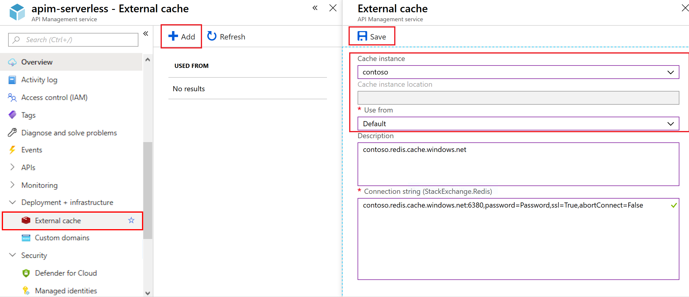

# Use an external Redis-compatible cache in Azure API Management

[!INCLUDE [api-management-availability-all-tiers](../../includes/api-management-availability-all-tiers.md)]

In addition to utilizing the [built-in cache](api-management-howto-cache.md), Azure API Management allows for caching responses in an external Redis-compatible cache, such as Azure Managed Redis.

Using an external cache allows you to overcome a few limitations of the built-in cache:

* Avoid having your cache periodically cleared during API Management updates
* Have more control over your cache configuration
* Cache more data than your API Management tier allows
* Use caching with the Consumption tier of API Management
* Enable caching in the [API Management self-hosted gateway](self-hosted-gateway-overview.md)

For background and scenarios for caching, see [Caching overview](caching-overview.md). 

For more detailed information about caching, see [API Management caching policies](api-management-policies.md#caching) and  [Custom caching in Azure API Management](api-management-sample-cache-by-key.md).

[!INCLUDE [api-management-workspace-availability](../../includes/api-management-workspace-availability.md)]

What you'll learn:

> [!div class="checklist"]
> * Add an external cache in API Management

## Prerequisites

To complete this tutorial, you need to:

+ [Create an Azure API Management instance](get-started-create-service-instance.md)
+ Understand [caching in Azure API Management](api-management-howto-cache.md)
+ Have an [Azure Managed Redis](../redis/quickstart-create-managed-redis.md), [Azure Cache for Redis](../azure-cache-for-redis/quickstart-create-redis.md), or another Redis-compatible cache available.

    > [!IMPORTANT]
    > Azure API Management uses a Redis connection string to connect to the cache. If you use Azure Cache for Redis or Azure Managed Redis, enable access key authentication in your cache to use a connection string. Currently, you can't use Microsoft Entra authentication to connect Azure API Management to Azure Cache for Redis or Azure Managed Redis.

### Redis cache for Kubernetes

For an API Management self-hosted gateway, caching requires an external cache. For caching to be effective, a self-hosted gateway and the cache it relies on must be located close to each other to minimize lookup and store latencies. Deploying a Redis cache into the same Kubernetes cluster or in a separate cluster nearby are the best options. Learn how to [deploy Redis cache to a Kubernetes cluster](https://github.com/kubernetes/examples/tree/master/guestbook).

## Add an external cache

Follow the steps below to add an external Redis-compatible cache in Azure API Management. You can limit the cache to a specific gateway in your API Management instance.

### Use from setting

The **Use from** setting in the configuration specifies the location of your API Management instance that will use the cache. Select one of the following:

* The Azure region where the API Management instance is hosted (or one of the configured locations, if you have a [multi-region](api-management-howto-deploy-multi-region.md) deployment)

* A self-hosted gateway location 

* **Default**, to configure the cache as the default for all gateway locations in the API Management instance

    A cache used for **Default** is overridden by a cache used for a specific matching region or location.

    For example, consider an API Management instance that's hosted in the East US, Southeast Asia, and West Europe regions. There are two caches configured, one for **Default** and one for **Southeast Asia**. In this example, API Management in **Southeast Asia** uses its own cache, while the other two regions use the **Default** cache entry.

> [!NOTE]
> You can configure the same external cache for more than one API Management instance. The API Management instances can be in the same or different regions. When sharing the cache for more than one instance, you must select **Default** in the **Use from** setting. 

### Add an Azure Cache for Redis or Azure Managed Redis instance from the same subscription

1. Browse to your API Management instance in the Azure portal.
1. In the left menu, under **Deployment + infrastructure** select **External cache**.
1. Select **+ Add**.
1. In the **Cache instance** dropdown, select your cache.
1. In the [**Use from**](#use-from-setting) dropdown, select **Default** or specify the desired region. The **Connection string** is automatically populated.
1. Select **Save**.

### Add a Redis-compatible cache hosted outside of the current Azure subscription or Azure in general

1. Browse to your API Management instance in the Azure portal.
1. In the left menu, under **Deployment + infrastructure** select **External cache**.
1. Select **+ Add**.
1. In the **Cache instance** dropdown, select **Custom**.
1. In the [**Use from**](#use-from-setting) dropdown, select **Default** or specify the desired region.
1. Enter your Azure Cache for Redis, Azure Managed Redis, or Redis-compatible cache connection string in the **Connection string** field.
1. Select **Save**.

### Add a Redis cache to a self-hosted gateway

1. In the left menu, under **Deployment + infrastructure** select **External cache**.
1. Select **+ Add**.
1. In the **Cache instance** dropdown, select **Custom**.
1. In the [**Use from**](#use-from-setting) dropdown, select **Default** or specify the desired region.
1. Enter your Redis cache connection string in the **Connection string** field.
1. Select **Save**.

## Use the external cache

After adding a Redis-compatible cache, configure [caching policies](api-management-policies.md#caching) to enable response caching, or caching of values by key, in the external cache.

For a detailed example, see [Add caching to improve performance in Azure API Management](api-management-howto-cache.md).

## Related content

* For more information about caching policies, see [Caching policies][Caching policies] in the [API Management policy reference][API Management policy reference].
* To cache items by key using policy expressions, see [Custom caching in Azure API Management](api-management-sample-cache-by-key.md).
* Learn how to [enable semantic caching for Azure OpenAI APIs](azure-openai-enable-semantic-caching.md).

[API Management policy reference]: ./api-management-policies.md
[Caching policies]: ./api-management-policies.md#caching
