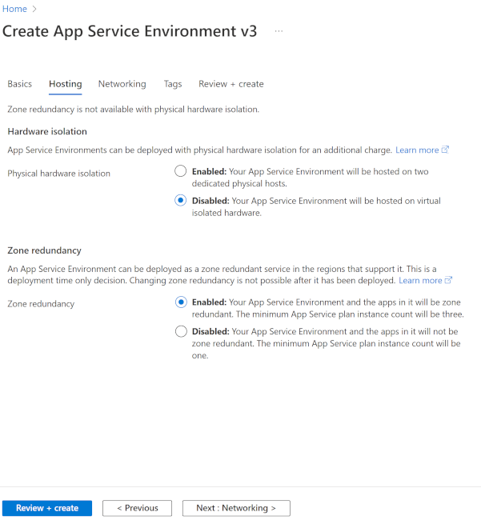
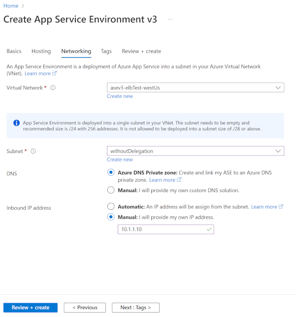
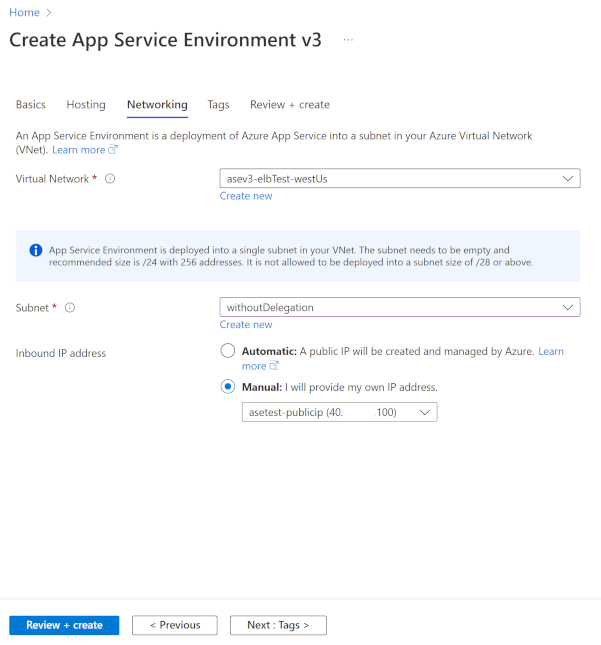

# Create an App Service Environment

[App Service Environment][Intro] is a single-tenant deployment of Azure App Service that integrates with an Azure virtual network. Each App Service Environment deployment requires a dedicated subnet, which you can't use for other resources.

## Before you create your App Service Environment

After you create your App Service Environment, you can't change the following settings:

- Location
- Subscription
- Resource group
- Azure virtual network
- Subnets
- Subnet size
- The name of your App Service Environment

Ensure that your subnet is large enough to accommodate the maximum scale of your App Service Environment. The recommended size is a /24 with 256 addresses.

## Deployment considerations

Before you deploy your App Service Environment, consider the virtual IP (VIP) type and the deployment type.

With an *internal VIP*, your apps are accessible through an address within your App Service Environment subnet and aren’t listed in a public Domain Name System (DNS). When you create your App Service Environment in the Azure portal, you can set up an Azure private DNS zone for your App Service Environment.  

With an *external VIP*, your apps use an address that faces the public internet and are listed in a public DNS. For both *internal VIP* and *external VIP*, you can specify an *Inbound IP address* and select either the *Automatic* or *Manual* option. If you select the *Manual* option for *external VIP*, you must first create a standard *Public IP address* in Azure. 

You can select *single zone*, *zone redundant*, or *host group* for the deployment type. The single zone is available in all regions where App Service Environment v3 is available. With the single-zone deployment type, you have a minimum charge in your App Service plan of one instance of Windows Isolated v2. When you use one or more instances, the charge is removed. This fee isn't additive.

In a zone-redundant App Service Environment, your apps are distributed across the maximum number of available zones, up to three, within the same region. Zone redundancy is available in regions that support availability zones. With this deployment type, your App Service plan must include at least two instances to ensure redundancy across zones. You can scale up App Service plans by adding one or more instances at a time. Scaling doesn't have to be in units of two or three. However, the app is only balanced across all availability zones when the total number of instances are multiples of two or three, depending on the number of available zones. To view the number of available zones for your App Service Environment, see the *Maximum available zones* property in the **Configuration** blade of the Azure portal. If the value is two or three, your App Service Environment is zone redundant.

A zone-redundant deployment provides three or four times the infrastructure, depending on the maximum number of available zones. This redundancy ensures that workloads remain available even if one zone experiences an outage. There's no added charge to have a zone-redundant App Service Environment. For more information about zone redundancy, see [Regions and availability zones](../../reliability/reliability-app-service.md?pivots=isolated).

In a host group deployment, your apps are deployed onto a dedicated host group. The dedicated host group isn't zone redundant. In a host group deployment, you can install and use your App Service Environment on dedicated hardware. There's no minimum instance charge for using App Service Environment on a dedicated host group. However, you must pay for the host group when you provision the App Service Environment. You also pay a discounted App Service plan rate as you create your plans and scale out.

A dedicated host group deployment allocates a finite number of cores, which both the App Service plans and the infrastructure roles use. This type of deployment can't reach the 200 total instance count normally available in App Service Environment. The number of total possible instances is related to the total number of App Service plan instances, plus the load-based number of infrastructure roles.

## Create an App Service Environment in the portal

To create an App Service Environment in the Azure portal, complete the following steps.

1. Search Azure Marketplace for *App Service Environment v3*.

1. From the **Basics** tab, for **Subscription**, select the subscription. For **Resource Group**, select or create the resource group, and enter the name of your App Service Environment. For **Virtual IP**, select **Internal** if you want your inbound address to be an address in your subnet. Select **External** if you want your inbound address to face the public internet. For **App Service Environment Name**, enter a name. The name must be no more than 36 characters. The name that you choose will also be used for the domain suffix. For example, if the name that you choose is *contoso*, and you have an internal VIP, the domain suffix is `contoso.appserviceenvironment.net`. If the name that you choose is *contoso*, and you have an external VIP, the domain suffix is `contoso.p.azurewebsites.net`. 

   

1. From the **Hosting** tab, for **Physical hardware isolation**, select **Enabled** or **Disabled**. If you enable this option, you can deploy on dedicated hardware. When you create an App Service Environment v3 with a dedicated host deployment, you're billed for two dedicated hosts based on our pricing. As you scale, extra resources incur charges at the specialized Isolated v2 rate for each vCore. I1v2 uses two vCores, I2v2 uses four vCores, and I3v2 uses eight vCores for each instance. For **Zone redundancy**, select **Enabled** or **Disabled**.

   

1. From the **Networking** tab, for **Virtual Network**, select or create your virtual network. For **Subnet**, select or create your subnet. If you create an App Service Environment with an internal VIP, you can configure Azure DNS private zones to point your domain suffix to your App Service Environment. For more information, see the DNS section in [Use an App Service Environment][UseAppServiceEnvironment]. If you create an App Service Environment with an internal VIP, you can specify a private IP address by using the **Manual** option for **Inbound IP address**.

   

   If you create an App Service Environment with an external VIP, you can select a public IP address by using the **Manual** option for **Inbound IP address**.

   

1. From the **Review + create** tab, check that your configuration is correct, then select **Create**. Your App Service Environment can take more than one hour to create. 

After your App Service Environment is successfully created, you can select it as a location when you create your apps.

To learn how to create an App Service Environment from an Azure Resource Manager template, see [Create an App Service Environment by using a Resource Manager template](how-to-create-from-template.md).

<!--Links-->
[Intro]: ./overview.md
[UseAppServiceEnvironment]: ./using.md
