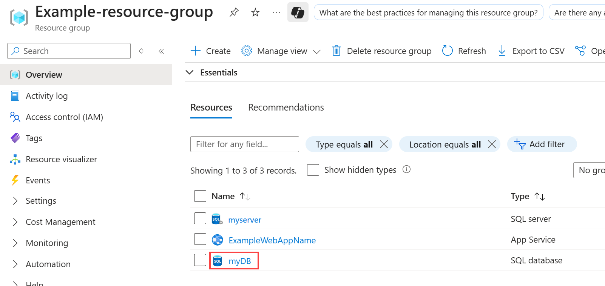

# Scale up an app in Azure App Service

This article shows how to scale your app in Azure App Service. There are two workflows for scaling, scale up and scale out. This article explains the scale up workflow.

* [Scale up](https://en.wikipedia.org/wiki/Scalability#Horizontal_and_vertical_scaling): Get more CPU, memory, or disk space, or extra features
  like dedicated virtual machines (VMs), custom domains and certificates, staging slots, autoscaling. You scale up by changing the pricing tier of the
  App Service plan that your app belongs to.
* [Scale out](https://en.wikipedia.org/wiki/Scalability#Horizontal_and_vertical_scaling): Increase the number of VM instances that run your app.
  Basic, Standard, and Premium service plans scale out to as many as 3, 10, and 30 instances, respectively. [App Service Environments](environment/intro.md)
  in the Isolated tier further increase your scale-out count to 100 instances. For more information about scaling out, see
  [Scale instance count manually or automatically](/azure/azure-monitor/autoscale/autoscale-get-started). In that article, you find out how
  to use autoscaling, which is scaling instance count automatically based on predefined rules and schedules.

>[!IMPORTANT]
> App Service provides an [automatic scale-out option to handle varying incoming HTTP requests.](./manage-automatic-scaling.md)
>

The scale settings take only seconds to apply and affect all apps in your [App Service plan](../app-service/overview-hosting-plans.md).
They don't require you to change your code or redeploy your application.

For information about the pricing and features of individual App Service plans, see [Azure App Service on Windows pricing](https://azure.microsoft.com/pricing/details/web-sites/).  

> [!NOTE]
> Before you switch an App Service plan from the Free tier, you must first remove the [spending limits](https://azure.microsoft.com/pricing/spending-limits/) in place for your Azure subscription. To view or change options for your App Service subscription, see [Cost Management + Billing][azuresubscriptions] in the Azure portal.
> 
> 

## Scale up your pricing tier

> [!NOTE]
> For information about scaling up to the Premium V4 tier, see [Configure Premium V4 tier for App Service](app-service-configure-premium-v4-tier.md).

1. In your browser, open the [Azure portal](https://portal.azure.com).

1. In the left pane of your App Service app page, under **App Service plan**, select **Scale up**.

    :::image type="content" source="media/manage-scale-up/scale-up-tier-portal.png" alt-text="Screenshot showing how to scale up your app service plan.":::

1. Select one of the pricing tiers and then select **Select**.

    :::image type="content" source="media/manage-scale-up/explore-pricing-plans.png" alt-text="Screenshot showing a plan selected on the Scale up page.":::

    When the operation is complete, you see a notification that has a green success check mark.

## Scale related resources

If your app depends on other services, such as Azure SQL Database or Azure Storage, you can scale up these resources separately. These resources aren't managed by the App Service plan.

1. On the **Overview** page for your app, select the link to the resource group.
 
    :::image type="content" source="./media/web-sites-scale/RGEssentialsLink.png" alt-text="Screenshot that shows the first step for scaling up your app's related resources.":::

2. On the **Overview** page for the resource group, select a resource that you want to scale. The following screenshot
   shows a SQL Database resource.
   
    

    To scale up the related resource, see the documentation for the specific resource type. For example, for information about scaling up a single SQL database, see [Scale single database resources in Azure SQL Database](/azure/azure-sql/database/single-database-scale). For information about scaling up an Azure Database for MySQL resource, see [Scale Azure Database for MySQL resources](/azure/mysql/concepts-pricing-tiers#scale-resources).

## Compare pricing tiers

For detailed information, such as VM sizes for each pricing tier, see [Azure App Service on Windows pricing](https://azure.microsoft.com/pricing/details/app-service/windows/).

For a table of service limits, quotas, and constraints, and supported features in each tier, see [App Service limits](../azure-resource-manager/management/azure-subscription-service-limits.md#azure-app-service-limits).

## Related content

* [Get started with autoscale in Azure](/azure/azure-monitor/autoscale/autoscale-get-started)
* [Configure Premium V3 tier for App Service](app-service-configure-premium-tier.md)
* [Tutorial: Run a load test to identify performance bottlenecks in a web app](../app-testing/load-testing/tutorial-identify-bottlenecks-azure-portal.md)
<!-- LINKS -->
[vmsizes]:https://azure.microsoft.com/pricing/details/app-service/
[SQLaccountsbilling]:https://go.microsoft.com/fwlink/?LinkId=234930
[azuresubscriptions]:https://ms.portal.azure.com/#view/Microsoft_Azure_Billing/BillingMenuBlade/~/Overview

<!-- IMAGES -->
[ChooseWHP]: ./media/web-sites-scale/scale1ChooseWHP.png
[ResourceGroup]: ./media/web-sites-scale/scale10ResourceGroup.png
[ScaleDatabase]: ./media/web-sites-scale/scale11SQLScale.png
[GeoReplication]: ./media/web-sites-scale/scale12SQLGeoReplication.png
