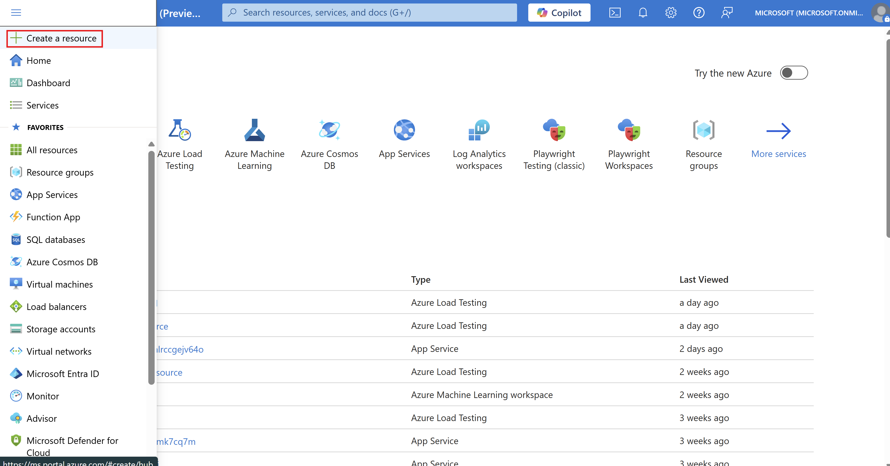
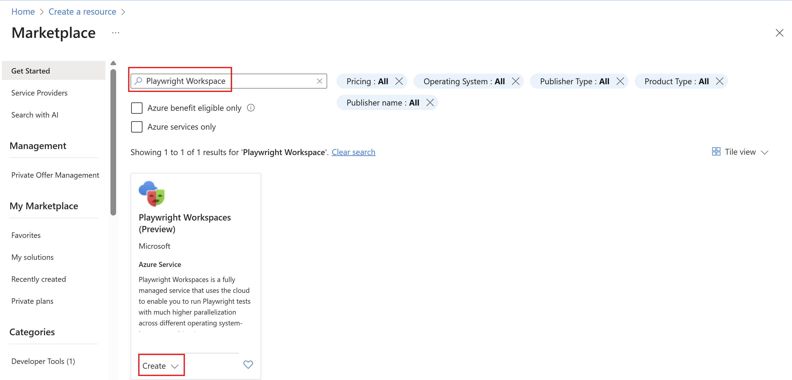

# Tutorial: Run end-to-end Playwright tests with Playwright Workspaces

In this tutorial, you learn how to integrate your Playwright test suite with Playwright Workspaces and run tests faster using cloud-hosted browsers. You simulate a Playwright test suite and connect it to Playwright Workspaces for faster execution.

In this tutorial, you:

> [!div class="checklist"]
> * Set up a Playwright test suite.
> * Integrate the Playwright test suite with Playwright Workspaces.
> * Run the test suite with the service for faster execution. 

## Prerequisites

* An Azure account with an active subscription. If you don't have an Azure subscription, create a [free account](https://azure.microsoft.com/free/?WT.mc_id=A261C142F) before you begin.
* The [Azure CLI](/cli/azure/install-azure-cli) installed on your local computer.
* Azure CLI version 2.2.0 or later. Run `az --version` to check the installed version on your computer. If you need to install or upgrade the Azure CLI, see [How to install the Azure CLI](/cli/azure/install-azure-cli).
* Visual Studio Code. If you don't have it, [download and install it](https://code.visualstudio.com/Download).
* Git. If you don't have it, [download and install it](https://git-scm.com/download).

### Prerequisites check

Before you start, validate your environment:

1. Sign in to the Azure portal and check that your subscription is active.

1. Check your version of the Azure CLI in a terminal or command window by running `az --version`. For the latest version, see the [latest release notes](/cli/azure/release-notes-azure-cli?tabs=azure-cli).

  If you don't have the latest version, update your installation by following the [installation guide for your operating system or platform](/cli/azure/install-azure-cli).


## Set up Playwright test suite

In this step, you are creating a Playwright test suite which is integrated with the service. 

1. Clone the sample repository and navigate to test folder. 

```powershell
git clone https://github.com/microsoft/playwright-testing-service
cd playwright-testing-service/samples/get-started
```

2. Install dependencies.

```powershell
npm install
```
3. Run Playwright tests.

Run this command to execute tests locally, outside of the service, to identify any problems before integrating with the service. This project is used in the next steps to integrate with the service. 

```powershell
npx playwright test
```

## Integrate Playwright test suite with Playwright Workspaces

Integrate the Playwright test suite you created in the previous tutorial with Playwright Workspaces service. 

Follow these steps to set up the service and integrate the test suite. 

### Create a Playwright workspace

To get started with running your Playwright tests on cloud browsers, you first need to create a Playwright workspace.

1. Sign in to the [Azure portal](https://portal.azure.com/).

1. Select the menu button in the upper-left corner of the portal, and then select **Create a resource** a resource.

    

1. Enter *Playwright Workspaces* in the search box.
1. Select the **Playwright Workspaces** card, and then select **Create**.

    

1. Provide the following information to configure a new Playwright workspace:

    |Field  |Description  |
    |---------|---------|
    |**Subscription**     | Select the Azure subscription that you want to use for this Playwright workspace. |
    |**Resource group**     | Select an existing resource group. Or select **Create new**, and then enter a unique name for the new resource group.        |
    |**Name**     | Enter a unique name to identify your workspace.<BR>The name can only consist of alphanumerical characters, and have a length between 3 and 64 characters. |
    |**Location**     | Select a geographic location to host your workspace. <BR>This location also determines where the test execution results are stored. |

    > [!NOTE]
    > Optionally, you can configure more details on the **Tags** tab. Tags are name/value pairs that enable you to categorize resources and view consolidated billing by applying the same tag to multiple resources and resource groups.

1. After you're finished configuring the resource, select **Review + Create**.

1. Review all the configuration settings and select **Create** to start the deployment of the Playwright workspace.

    When the process has finished, a deployment success message appears.

1. To view the new workspace, select **Go to resource**.

    

### Install Playwright Workspaces package

To install service package, navigate to the location of your test suite you created in the previous tutorial and run this command:

```npm
npm init @azure/playwright@latest
```

This command generates `playwright.service.config.ts` file which serves to direct and authenticate Playwright to Playwright Workspaces.

### Configure the service region endpoint

In your setup, you have to provide the region-specific service endpoint. The endpoint depends on the Azure region you selected when creating the workspace.

To get the service endpoint URL, navigate to your workspace in the Azure portal. Then, in **Add region endpoint in your setup**, copy the region endpoint for your workspace. The endpoint URL matches the Azure region that you selected when creating the workspace. Ensure this URL is available in `PLAYWRIGHT_SERVICE_URL` environment variable.


### Set up your environment

To set up your environment, you have to configure the `PLAYWRIGHT_SERVICE_URL` environment variable with the value you obtained in the previous steps.

We recommend that you use the `dotenv` module to manage your environment. With `dotenv`, you define your environment variables in the `.env` file.

1. Add the `dotenv` module to your project:

    ```shell
    npm i --save-dev dotenv
    ```

1. Create a `.env` file alongside the `playwright.config.ts` file in your Playwright project:

    ```
    PLAYWRIGHT_SERVICE_URL={MY-REGION-ENDPOINT}
    ```

    Make sure to replace the `{MY-REGION-ENDPOINT}` text placeholder with the value you copied earlier.


### Set up authentication

To run your Playwright tests in your Playwright workspace, you need to authenticate the Playwright client where you're running the tests with the service. Authenticate with the dev workstation where you are running the Playwright tests.  

Microsoft Entra ID is the default and recommended authentication for the service. Use [Azure CLI](/cli/azure/install-azure-cli) to sign-in

```CLI
az login
```

> [!NOTE]
> If you're a part of multiple Microsoft Entra tenants, make sure you sign in to the tenant where your workspace belongs. You can get the tenant ID from Azure portal. See [Find your Microsoft Entra Tenant](/azure/azure-portal/get-subscription-tenant-id#find-your-microsoft-entra-tenant). Once you get the ID, sign-in using the command `az login --tenant <TenantID>`


## Run your tests at scale

You've now prepared the configuration for running your Playwright tests in the cloud with Playwright Workspaces.

### Run Playwright tests with the service

With Playwright Workspaces, you get charged based on the number of total test minutes. If you're a first-time user or [getting started with a free trial](./how-to-try-playwright-workspaces-free.md), you may run a single test at scale instead of your full test suite to avoid exhausting your free trial limits.

Follow these steps to run Playwright tests with Playwright Workspaces:

1. Open a terminal window.

1. Enter the following command to run your Playwright test suite on remote browsers and publish test results to your workspace.

    ```bash
    npx playwright test --config=playwright.service.config.ts --workers=20
    ```

    After the test completes, you can view the test status in the terminal.

    ```output
    Running 600 tests using 20 workers
        600 passed (3m)
    ```


## Next steps

> [!div class="nextstepaction"]

- [Set up continuous end-to-end testing in CI/CD](./quickstart-automate-end-to-end-testing.md)
- [Explore service configuration options](./how-to-use-service-config-file.md)
- [Determine the optimal test suite configuration](./concept-determine-optimal-configuration.md)