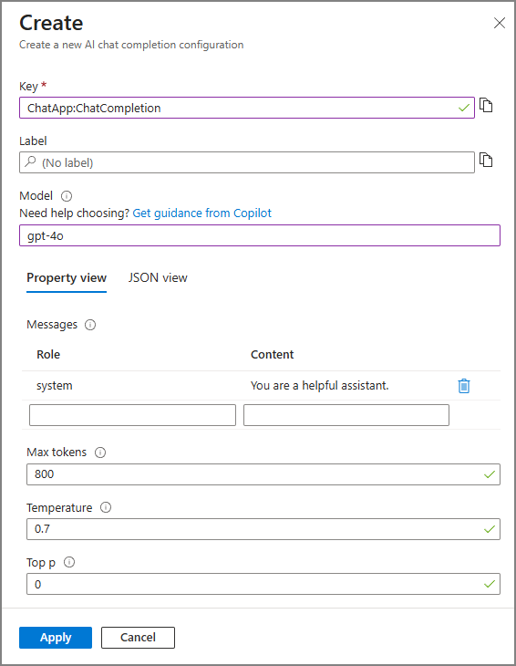

# Chat Completion configuration in Azure App Configuration

Chat completion is an AI capability that enables models to generate conversational responses based on a series of messages. Unlike simple text completion, chat completion maintains context across multiple exchanges, simulating a natural conversation. With chat completion configuration, you can define and manage how AI models respond within your application. A typical configuration includes model selection, system and user prompts, and model-specific settings such as temperature or token limits.

## Prerequisites
- An Azure account with an active subscription. [Create one for free](https://azure.microsoft.com/free)
- An App Configuration store. [Create a store](./quickstart-azure-app-configuration-create.md#create-an-app-configuration-store).

## Create a chat completion configuration

In this section, you will create a chat completion configuration in Azure Portal using the GPT-4o model as an example.

 1. In Azure portal, navigate to your App configuration store. From the **Operations** menu, select **Configuration explorer** > **Create**. Then select **AI configuration**.

 1. Specify the following values:
    - **Key**: Type **ChatApp:Model**.
    - **Label**: Leave this value blank.
    - **Model**: Select **gpt-4o**.
    - **Message**: Add a new message.
        - **Role**: Select **user**
        - **Content**: Type "What is the capial of France?"
    
    > [!div class="mx-imgBorder"]
    > 
    
1. Leave the rest of the values as default then select **Apply**.

## Add model connection configuration

You've added your chat completion configuration named  **ChatApp:Model** in the previous section. In this section, you'll add your model connection details such as the model's API key and endpoint to App configuration. You can store the model API key as a Key Vault reference.

> [!NOTE]
> This tutorial demonstrates how to use chat completion configuration with an Azure OpenAI model. However, the chat completion configuration demonstrated in the tutorial can be applied to any AI model you choose to work with in your application.
>

1. Follow the [Get started with Azure OpenAI Service](/azure/ai-services/openai/overview#get-started-with-azure-openai-service) to create and deploy an Azure OpenAI service resource with following settings:

    | Field           | value   |
    |-----------------|---------|
    | Select a model  | gpt-4o  |
    | Deployment name | gpt-4o  |

1. In your Azure OpenAI resource, from the **Resource Management** menu, select **Keys and Endpoint** and copy your Azure OpenAI resource endpoint. It should follow the format: `https://<open-ai-resource-name>.openai.azure.com`.

1. Navigate to your App Configuration store and add the following key-value. Leave **Label** and **Content Type** with their default values. For more information about how to add key-values to a store using the Azure portal or the CLI, go to [Create a key-value](./quickstart-azure-app-configuration-create.md#create-a-key-value).

    | **Key**                          | **Value**                                                      |
    |----------------------------------|----------------------------------------------------------------|
    |  _ChatApp:AzureOpenAI:Endpoint_  | _Paste the resource endpoint you copied in the previous step_  |
 
1. Refer to [Add a Key Vault reference to App Configuration](./use-key-vault-references-dotnet-core.md#add-a-key-vault-reference-to-app-configuration) guide to add your Azure OpenAI resource API key as a Key Vault reference with the key _ChatApp:AzureOpenAI:ApiKey_.

1. Continue to the following instructions to implement the chat completion configuration into your application for the language or platform you are using.

    - [.NET](./quickstart-chat-completion-dotnet.md)