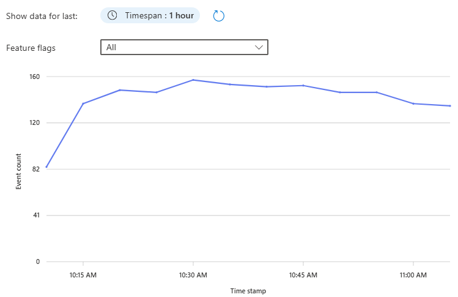
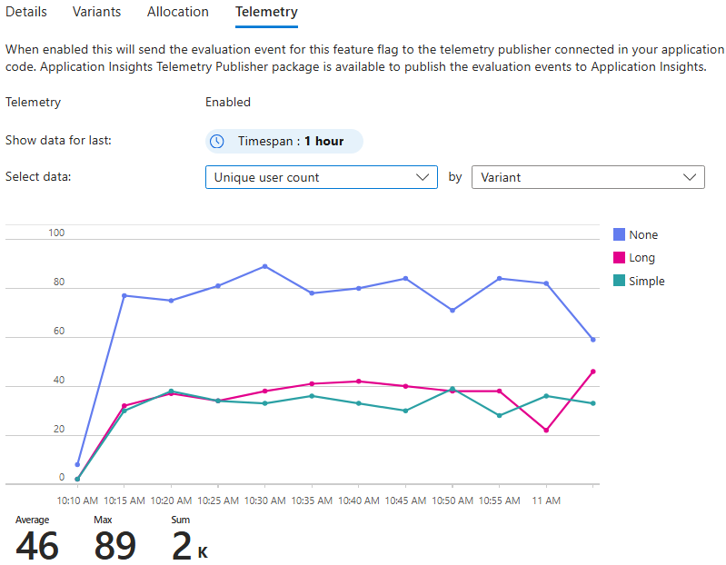
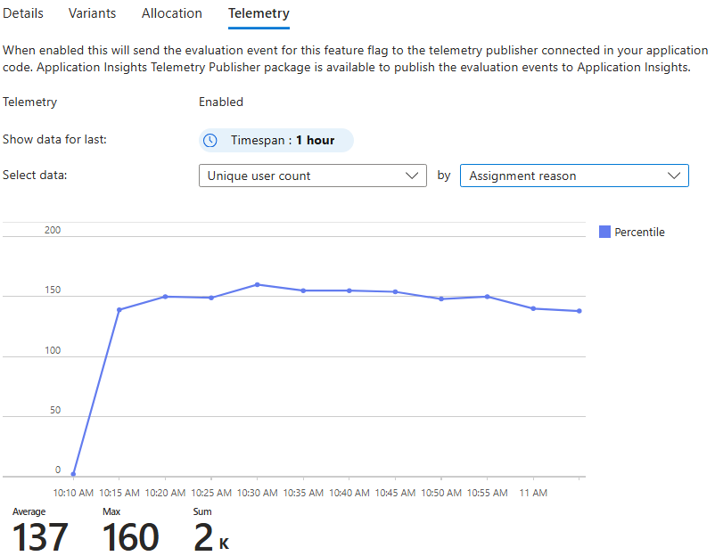
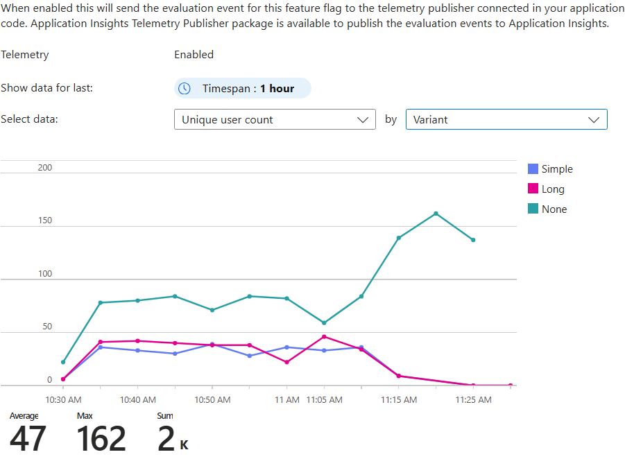
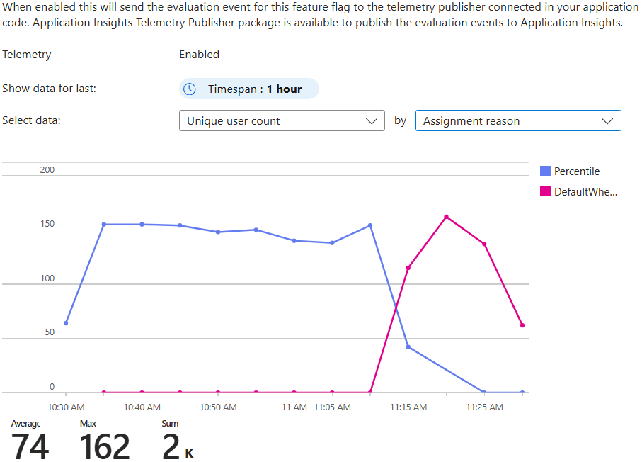

# Enable telemetry for feature flags

Telemetry is the process of collecting, transmitting, and analyzing data about the usage and performance of your application. It helps you monitor feature flag behavior and make data-driven decisions. When a feature flag change is deployed, it's often important to analyze its effect on an application. For example, here are a few questions that may arise:

- Are my flags enabled/disabled as expected?
- Are targeted users getting access to a certain feature as expected?
- How does a variant affect customer engagement?

These types of questions can be answered through the emission and analysis of feature flag evaluation events.

## Prerequisites

- The feature flag created in [Use variant feature flags](./howto-variant-feature-flags.md).

## Connect to Application Insights

1. Open your App Configuration store in the Azure portal.
1. In the **Telemetry** section, select the **Application Insights (preview)** blade.
1. Select the subscription, resource group. Then either select your existing Application Insights resource you want to connect to your App Configuration store to, or select **Create new** to create a new Application Insights resource.
1. Select the **Connect** button.

    > [!div class="mx-imgBorder"]
    > 

## Enable telemetry for a feature flag

1. Open your App Configuration store in the Azure portal and select the **Feature manager** blade under the **Operations** section.
1. Select the feature flag named Greeting. If you don't have it, follow the [instructions to create it](./manage-feature-flags.md). Then, right-click on the feature flag and select **Edit**.

    > [!div class="mx-imgBorder"]
    > 

1. In the new view, select the **Telemetry** tab.
1. Check the **Enable Telemetry** box and then select the **Review + update** button at the bottom of the page.

    > [!div class="mx-imgBorder"]
    > 

1. Continue to the following instructions to use telemetry in your application for the language or platform you're using.

    * [Python](./howto-telemetry-python.md)
    * [JavaScript](./howto-telemetry-javascript.md)

## Review telemetry for the feature flag

1. Navigate to the **Application Insights** blade in the App Configuration portal. You'll see a graph displaying all events from your application. This provides an initial overview of activity patterns.
    > [!div class="mx-imgBorder"]
    > 

1. Use the time range selector to focus on specific periods. This helps identify trends or investigate particular timeframes of interest.

1. Filter by feature Flag
    - Click on the dropdown menu above the event graph
    - Under **Feature flags with events** select your feature flag
    - The graph will now display only events related to the feature flag's evaluations
    > [!div class="mx-imgBorder"]
    > 

1. To access more detailed telemetry, click **View details** to open the telemetry tab.
    > [!div class="mx-imgBorder"]
    > 

    You can also access this tab by going to the **Feature manager** and clicking **View events** in the telemetry column for the feature flag of interest.
    > [!div class="mx-imgBorder"]
    > 


    In the telemetry tab, you can view:

    - **Total events**: Total number of evaluation events emitted by your application
    - **Unique users**: Number of distinct users who were targeted and for whom events were emitted.
    


    **Verify variant assignments**
    
    In order to show the distribution of users and number of evaluations across Simple, Long, and None variants, group the metrics by Variant. This will enable you see whether the configured allocations are working as expected, and that all expected variants are being served to users. 

    > [!div class="mx-imgBorder"]
    > 

    In this example, we see that the number of users assigned the "None" variant is almost twice that of the "Simple" and "Long" variants given the configured 50-25-25 percentile split between "None", "Simple" and "Long" respectively. 


    **Confirm overrides and behaviour based on flag state**
    - Users may be assigned a variant for different reasons so you would want to ensure that your variant assignments are not only in the right proportion, but also for the right reason. You can view this by grouping metrics by assignment reason. In this example, we will see that the only assignment reason is solely due to Percentile allocations.

    > [!div class="mx-imgBorder"]
    > 

    - Disable the feature flag by going to the feature manager and toggling the feature flag "Enable" switch. 
    - In the  telemetry column click "View events" to go to telemetry tab in read-only mode. 
    - View Unique user count by Variant. You will see that all assignments for Long and Simple go to zero, and only the default variant (which is None in our case) is the only variant being assigned to users.
    > [!div class="mx-imgBorder"]
    > 

    - Switch to group by unique user count by assignment reason.
    Confirm from the graph that the Percentile allocations fall to zero and DefaultWhenDisabled is the only reason for which users are being assigned variants.
    - Other possible reasons include "Group Override" or "User Override" if configured.
    > [!div class="mx-imgBorder"]
    > 


## Analyze in Application Insights

Now that we have confirmed the feature flag allocations are working as expected, we would want to dive deeper into the telemetry events to see how different variants are performing based on the likes emitted for users.

1. Open your Application Insights resource in the Azure portal and select **Logs** under **Monitoring**. In the query window, run the following query to see the telemetry events:

    ```kusto
    // Step 1: Get distinct users and their Variant from FeatureEvaluation
    let evaluated_users =
        customEvents
        | where name == "FeatureEvaluation"
        | extend TargetingId = tostring(customDimensions.TargetingId),
                Variant = tostring(customDimensions.Variant)
        | summarize Variant = any(Variant) by TargetingId;

    // Step 2: Get distinct users who emitted a "Like"
    let liked_users =
        customEvents
        | where name == "Liked"
        | extend TargetingId = tostring(customDimensions.TargetingId)
        | summarize by TargetingId;

    // Step 3: Join them to get only the evaluated users who also liked
    let hearted_users =
        evaluated_users
        | join kind=inner (liked_users) on TargetingId
        | summarize HeartedUsers = dcount(TargetingId) by Variant;

    // Step 4: Total evaluated users per variant
    let total_users =
        evaluated_users
        | summarize TotalUsers = dcount(TargetingId) by Variant;

    // Step 5: Combine results
    let combined_data =
        total_users
        | join kind=leftouter (hearted_users) on Variant
        | extend HeartedUsers = coalesce(HeartedUsers, 0)
        | extend PercentageHearted = strcat(round(HeartedUsers * 100.0 / TotalUsers, 1), "%")
        | project Variant, TotalUsers, HeartedUsers, PercentageHearted;

    // Step 6: Add total row
    let total_sum =
        combined_data
        | summarize Variant="All", TotalUsers = sum(TotalUsers), HeartedUsers = sum(HeartedUsers);

    // Step 7: Output
    combined_data
    | union (total_sum)
    ```
    > [!div class="mx-imgBorder"]
    > 

You see one "FeatureEvaluation" event for each time the quote page was loaded and one "Liked" event for each time the like button was clicked. The "FeatureEvaluation" event have a custom property called `FeatureName` with the name of the feature flag that was evaluated. Both events have a custom property called `TargetingId` with the name of the user that liked the quote.

In this example, we can see that, even though there were roughly the same number of users getting the Long variant vs Simple, the Simple variant appears to be performing better by a margin of 22%. 