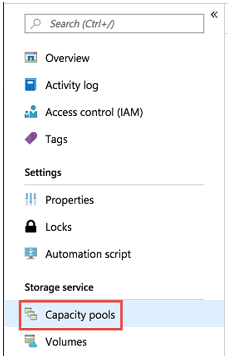

# Create a capacity pool for Azure NetApp Files

Creating a capacity pool enables you to create volumes within it. 

## Before you begin 

* You need a [NetApp account](azure-netapp-files-create-netapp-account.md).   
* If you're using Azure CLI, ensure that you're using the latest version. For more information, see [How to update the Azure CLI](/cli/azure/update-azure-cli).
* To enable cool access, ensure you are registered to use [cool access](manage-cool-access.md).
* If you're using PowerShell, ensure that you're using the latest version of the Az.NetAppFiles module. To update to the latest version, use the 'Update-Module Az.NetAppFiles' command. For more information, see [Update-Module](/powershell/module/powershellget/update-module).
* If you're using the Azure REST API, ensure that you specify the latest version.
    >[!IMPORTANT]
    >To create a 1-TiB capacity pool with a tag, you must use API versions `2023-07-01_preview` to `2024-01-01_preview` or stable releases from `2024-01-01`.
* The Standard, Premium, and Ultra service levels are generally available (GA). No registration is required. 
* The **Flexible** service level is currently in preview and supported in all Azure NetApp Files regions. You must register the feature before using it for the first time:

    1. Register the feature: 

    ```azpowershell-interactive
    Register-AzProviderFeature -ProviderNamespace Microsoft.NetApp -FeatureName ANFFlexibleServiceLevel
    ```

    2. Check the status of feature registration with the command:

    ```azurepowershell-interactive
    Get-AzProviderFeature -ProviderNamespace Microsoft.NetApp -FeatureName ANFFlexibleServiceLevel
    ```
    
    You can also use [Azure CLI commands](/cli/azure/feature) `az feature show` to register the feature and display the registration status. 
    
## Considerations

* If you're using the **Flexible** service level:
    * The Flexible service level is only available for manual QoS capacity pools. 
    * The Flexible service level is only available on newly created capacity pools. You can't convert an existing capacity pool to use the Flexible service level. 
        * Flexible service level capacity pools can't be converted to the Standard, Premium, or Ultra service level. 
    * The minimum throughput for Flexible service level capacity pools is 128 MiB/second. Maximum throughput is calculated based on the size of the capacity pool using the formula 5 x 128 MiB/second/TiB  x capacity pool size in TiB. If your capacity pool is 1 TiB, the maximum is 640 MiB/second (5 x 128 x 1). For more examples, see [Service levels for Azure NetApp Files](azure-netapp-files-service-levels.md#flexible-examples).
    * You can increase the throughput of a Flexible service level pool at any time. Decreases to throughput on Flexible service level capacity pools can only occur following a 24-hour cool-down period. The 24-hour cool-down period initiates after any change to the throughput of the Flexible service level capacity pool.
    * Cool access isn't currently supported with the Flexible service level. 
    * Only single encryption is currently supported for Flexible service level capacity pools. 
    * Volumes in Flexible service level capacity pools can't be moved to capacity pools of a different service level. Similarly, you can't move volumes from capacity pools with different service levels into a Flexible service level capacity pool.

## Steps 

1. In the Azure portal, go to your NetApp account. From the navigation pane, select **Capacity pools**.  
    
    

2. Select **+ Add pools** to create a new capacity pool.   
    The New Capacity Pool window appears.

3. Provide the following information for the new capacity pool:  
   * **Name**  
     Specify the name for the capacity pool.  
     The capacity pool name must be unique for each NetApp account.

   * **Service level**   
     This field shows the target performance for the capacity pool.  
     Specify the service level for the capacity pool: [**Ultra**](azure-netapp-files-service-levels.md#Ultra), [**Premium**](azure-netapp-files-service-levels.md#Premium), [**Standard**](azure-netapp-files-service-levels.md#Standard), or [**Flexible**](azure-netapp-files-service-levels.md#Flexible).

    >[!NOTE]
    >The **Flexible** service level is only supported for manual QoS capacity pools.

    * **Size**     
     Specify the size of the capacity pool that you're purchasing.        
     The minimum capacity pool size is 1 TiB. You can change the size of a capacity pool in 1-TiB increments.
    
    >[!NOTE]
    >[!INCLUDE [Limitations for capacity pool minimum of 1 TiB](includes/2-tib-capacity-pool.md)]

    * **Throughput** 
        This option is only available for Flexible service level capacity pools. The minimum value is 128 MiB/second. Maximum throughput depends on the size of the capacity pool. For calculation details, see [Considerations](#considerations).  

    * **Enable cool access**
        This option specifies whether volumes in the capacity pool support cool access. For details about using this option, see [Manage Azure NetApp Files storage with cool access](manage-cool-access.md). Cool access isn't currently supported on Flexible service level. 

    * **QoS**   
        Specify whether the capacity pool should use the **Manual** or **Auto** QoS type.  See [Storage Hierarchy](azure-netapp-files-understand-storage-hierarchy.md) and [Performance Considerations](azure-netapp-files-performance-considerations.md) to understand the QoS types.  

        > [!IMPORTANT] 
        > Setting **QoS type** to **Manual** is permanent. You cannot convert a manual QoS capacity pool to use auto QoS. However, you can convert an auto QoS capacity pool to use manual QoS. See [Change a capacity pool to use manual QoS](manage-manual-qos-capacity-pool.md#change-to-qos).   

    * **Encryption type** <a name="encryption_type"></a>      
        Specify whether you want the volumes in this capacity pool to use **single** or **double** encryption. See [Azure NetApp Files double encryption at rest](double-encryption-at-rest.md) for details.   
        
        > [!IMPORTANT] 
        > Azure NetApp Files double encryption at rest supports [Standard network features](azure-netapp-files-network-topologies.md#configurable-network-features), but not Basic network features. See [considerations](double-encryption-at-rest.md#considerations) for using Azure NetApp Files double encryption at rest.  
        >
        > After the capacity pool is created, you can’t modify the setting (switching between `single` or `double`) for the encryption type.  

    :::image type="content" source="./media/azure-netapp-files-set-up-capacity-pool/flexible-service.png" alt-text="Screenshot showing the New Capacity Pool window.":::

4. Select **Create**.

    The **Capacity pools** page shows the configurations for the capacity pool.  
    
## Next steps 

- [Storage Hierarchy](azure-netapp-files-understand-storage-hierarchy.md) 
- [Service levels for Azure NetApp Files](azure-netapp-files-service-levels.md)
- [Azure NetApp Files pricing page](https://azure.microsoft.com/pricing/details/storage/netapp/)
- [Manage a manual QoS capacity pool](manage-manual-qos-capacity-pool.md)
- [Delegate a subnet to Azure NetApp Files](azure-netapp-files-delegate-subnet.md)
- [Azure NetApp Files double encryption at rest](double-encryption-at-rest.md)
