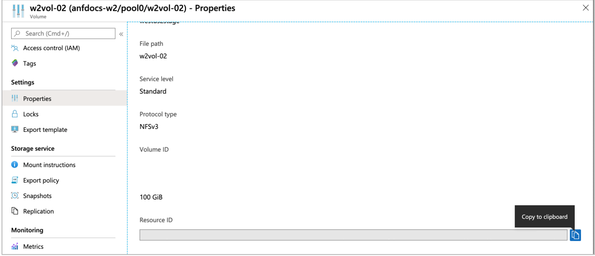
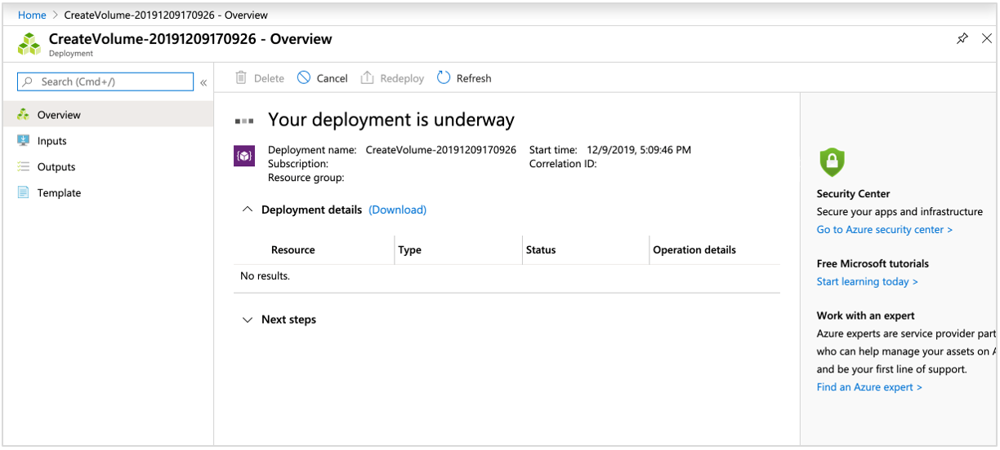
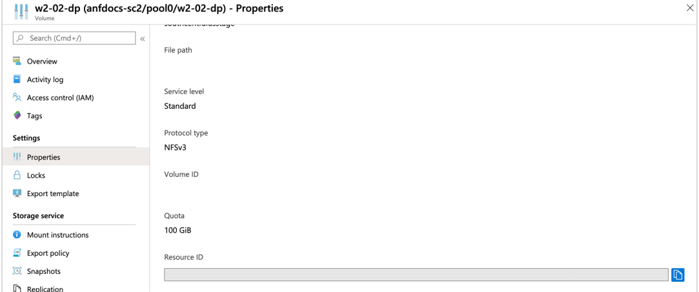
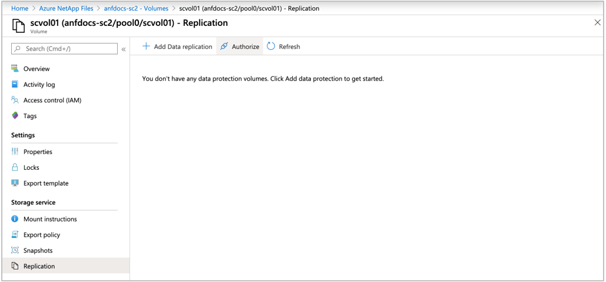

# Create volume replication for Azure NetApp Files

Azure NetApp Files supports [cross-region](cross-region-replication-introduction.md) and [cross-zone replication](cross-zone-replication-introduction.md).

Setting up replication peering enables you to asynchronously replicate data from an Azure NetApp Files volume (source) to another Azure NetApp Files volume (destination). You can create volume replication between regions (the source and destination volumes reside in different regions, this is known as cross-region replication), or within a region where the replication is established to a different zone in the same region (this is known as cross-zone replication).  

>[!NOTE] 
>During normal operation, the destination volume in an Azure NetApp Files replication relationship is available for read-only access. The destination volume becomes available for read-write operations when the replication is stopped. Any subsequent changes to the destination volume need to be synchronized with the source volume with a [reverse-resync operation](cross-region-replication-manage-disaster-recovery.md#resync-replication), after after which the normal replication can be resumed. 

Replication is permitted between different subscriptions under the same tenant ID. Replication across tenants isn't supported. Replication is supported with capacity pools of the same and different service levels. For example, the source volume can be in an Ultra service level capacity pool, and the destination volume can be in a Standard service level capacity pool. You can use this flexibility to reduce cost for the recovery volume if a lower service level is acceptable. If the recovery volume requires a higher service level, you can dynamically move the volume to a capacity pool with a higher service leve without interruption to the service. 

Before you begin, review the [requirements and considerations for cross-region replication](cross-region-replication-requirements-considerations.md) and [cross-zone replication](cross-zone-replication-requirements-considerations.md).

## Register for cross-subscription replication 

Cross-subscription replication is supported in all regions that support [availability zones](../reliability/regions-list.md) and is subject to the regional pairings for [cross-region replication](cross-region-replication-introduction.md#supported-region-pairs).

Before using cross-subscription replication, you must register for the feature. Feature registration can take up to 60 minutes to complete.

1. Register the feature

    ```azurepowershell-interactive
    Register-AzProviderFeature -ProviderNamespace Microsoft.NetApp -FeatureName ANFCrossSubscriptionReplication
    ```

2. Check the status of the feature registration: 

    > [!NOTE]
    > The **RegistrationState** might remain in the `Registering` state for up to 60 minutes before changing to `Registered`. Wait until the status is `Registered` before continuing.

    ```azurepowershell-interactive
    Get-AzProviderFeature -ProviderNamespace Microsoft.NetApp -FeatureName ANFCrossSubscriptionReplication
    ```

You can also use [Azure CLI commands](/cli/azure/feature) `az feature register` and `az feature show` to register the feature and display the registration status. 

## Locate the source volume resource ID  

You need to obtain the resource ID of the source volume that you want to replicate. 

1. Go to the source volume, and select **Properties** under Settings to display the source volume resource ID.   
    
 
2. Copy the resource ID to the clipboard.  You will need it later.

## Create the data replication volume (the destination volume)

You need to create a destination volume where you want the data from the source volume to be replicated to. Before you can create a **cross-region** destination volume, you need to have a NetApp account and a capacity pool in the destination region. 

For **cross-zone replication**, begin with step four. 

1. If necessary, create a NetApp account in the Azure region to be used for replication by following the steps in [Create a NetApp account](azure-netapp-files-create-netapp-account.md).   
You can also select an existing NetApp account in this region.  

2. If necessary, create a capacity pool in the newly created NetApp account by following the steps in [Create a capacity pool](azure-netapp-files-set-up-capacity-pool.md).   

    You can also select an existing capacity pool to host the replication destination volume.  

    The service level for the destination capacity pool can match that of the source capacity pool, or you can select a different service level.

3. Delegate a subnet in the region to be used for replication by following the steps in [Delegate a subnet to Azure NetApp Files](azure-netapp-files-delegate-subnet.md).

4. Create the data replication volume by selecting **Volumes** under Storage Service in the destination NetApp account. Then select the **+ Add data replication** button.  

    
 
5. In the Create a Volume page that appears, complete the following fields under the **Basics** tab:
    * Volume name
    * Capacity pool
    * Volume quota
        > [!NOTE] 
        > The volume quota (size) for the destination volume should mirror that of the source volume. If you specify a size that is smaller than the source volume, the destination volume is automatically resized to the source volume's size. 
    * Virtual network 
    * Subnet

    For details about the fields, see [Create an NFS volume](azure-netapp-files-create-volumes.md#create-an-nfs-volume). 

6. Under the **Protocol** tab, select the same protocol as the source volume.  
For the NFS protocol, ensure that the export policy rules satisfy the requirements of any hosts in the remote network that will access the export.  

7. Under the **Tags** tab, create key/value pairs as necessary.  

8. Under the **Replication** tab, paste in the source volume resource ID that you obtained in [Locate the source volume resource ID](#locate-the-source-volume-resource-id), and then select the desired replication schedule. There are three options for the replication schedule: every 10 minutes, hourly, and daily.

    

9. Select **Review + Create**, then select **Create** to create the data replication volume.   

    

## Authorize replication from the source volume  

To authorize the replication, you need to obtain the resource ID of the replication destination volume and paste it to the Authorize field of the replication source volume. 

1. In the Azure portal, navigate to Azure NetApp Files.

2. Go to the destination NetApp account and destination capacity pool where the replication destination volume is located.

3. Select the replication destination volume, go to **Properties** under Settings, and locate the **Resource ID** of the destination volume. Copy the destination volume resource ID to the clipboard.

     
 
4. In Azure NetApp Files, go to the replication source account and source capacity pool. 

5. Locate the replication source volume and select it. Navigate to **Replication** under Storage Service then select **Authorize**.

     

6. In the Authorize field, paste the destination replication volume resource ID that you obtained in Step 3, then select **OK**.

    > [!NOTE]
    > Due to various factors, such as the state of the destination storage at a given time, there’s likely a difference between the used space of the source volume and the used space of the destination volume. <!-- ANF-14038 --> 

## Next steps  

* [Cross-region replication](cross-region-replication-introduction.md)
* [Requirements and considerations for using cross-region replication](cross-region-replication-requirements-considerations.md)
* [Cross-zone replication](cross-zone-replication-introduction.md)
* [Requirements and considerations for cross-zone replication](cross-zone-replication-requirements-considerations.md)
* [Display health status of replication relationship](cross-region-replication-display-health-status.md)
* [Volume replication metrics](azure-netapp-files-metrics.md#replication)
* [Manage disaster recovery](cross-region-replication-manage-disaster-recovery.md)
* [Delete volume replications or volumes](cross-region-replication-delete.md)
* [Troubleshoot cross-region-replication](troubleshoot-cross-region-replication.md)
* [Manage default and individual user and group quotas for a volume](manage-default-individual-user-group-quotas.md)
* [Manage Azure NetApp Files volume replication with the CLI](/cli/azure/netappfiles/volume/replication)
