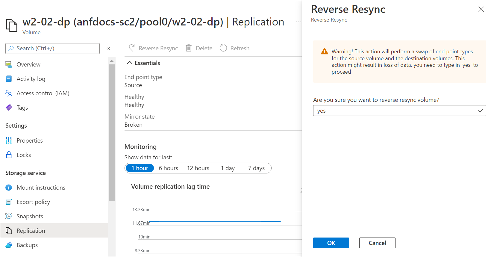

# Manage disaster recovery using Azure NetApp Files 

An ongoing replication (with [cross-zone](create-cross-zone-replication.md) or [cross-region replication](cross-region-replication-create-peering.md)) between the source and the destination volumes prepares you for a disaster recovery event. 

When such an event occurs, you can [fail over to the destination volume](#fail-over-to-destination-volume), enabling the client to read and write to the destination volume. 

After disaster recovery, you can perform a [resync](#resync-replication) operation to fail back to the source volume. You then [reestablish the source-to-destination replication](#reestablish-source-to-destination-replication) and remount the source volume for the client to access. 

## Fail over to destination volume

Failover is a manual process. When you need to activate the destination volume (for example, when you want to fail over to the destination region), you need to break replication peering then mount the destination volume.

1. To break replication peering, select the destination volume. Select **Replication** under Storage Service.  

2.	Check the following fields before continuing:  
    * Ensure that Mirror State shows ***Mirrored***.   
        Do not attempt to break replication peering if Mirror State shows *Uninitialized*.
    * Ensure that Relationship Status shows ***Idle***.   
        Do not attempt to break replication peering if Relationship Status shows *Transferring*.   

    See [Display health status of replication relationship](cross-region-replication-display-health-status.md). 

3.	Select **Break Peering**.  

4.	Type **Yes** when prompted and then select **Break**.

    

5.	Mount the destination volume by following the steps in [Mount or unmount a volume for Windows or Linux virtual machines](azure-netapp-files-mount-unmount-volumes-for-virtual-machines.md).   
    This step enables a client to access the destination volume.

## Resync volumes after disaster recovery

After disaster recovery, you can reactivate the source volume by performing a reverse resync operation.  The reverse resync operation reverses the replication process and synchronizes data from the destination volume to the source volume.  

> [!IMPORTANT] 
> The reverse resync operation synchronizes the source and destination volumes by incrementally updating the source volume with the latest updates from the destination volume, based on the last available common snapshots. This operation avoids the need to synchronize the entire volume in most cases because only changes to the destination volume *after* the most recent common snapshot will have to be replicated to the source volume.  
> 
> ***The reverse resync operation overwrites any newer data (than the most common snapshot) in the source volume with the updated destination volume data. The UI warns you about the potential for data loss. You will be prompted to confirm the resync action before the operation starts.***  
> 
> In case the source volume didn't survive the disaster and therefore no common snapshot exists, all data in the destination will be resynchronized to a newly created source volume.

>[!NOTE]
>Reverse resync is not supported with [cross-zone-region replication](cross-zone-region-replication.md). To perform a reverse resync with cross-zone-region replication, you must break the secondary relationship then perform the reverse resync as described. 
> 
> To restore the cross-zone-region replication, delete the secondary DP volume then [reconfigure replication](cross-zone-region-replication-configure.md).

1. To perform a reverse resync, select the *source* volume. Select **Replication** under Storage Service. Then select **Reverse Resync**.  

2. Type **Yes** when prompted then select **OK**. 
 
    

3. Monitor the source volume health status by following steps in [Display health status of replication relationship](cross-region-replication-display-health-status.md).   
    When the source volume health status shows the following values, the reverse resync operation is complete, and changes made at the destination volume are now captured on the source volume:   

    * Mirrored State: *Mirrored*  
    * Transfer State: *Idle*  

## Reestablish source-to-destination replication

After the resync operation from destination to source is complete, you need to break replication peering again to reestablish source-to-destination replication. You should also remount the source volume so that the client can access it.  

1. Break the replication peering:  
    a. Select the *destination* volume. Select **Replication** under Storage Service.  
    b. Check the following fields before continuing:   
    * Ensure that Mirror State shows ***Mirrored***.   
    Do not attempt to break replication peering if Mirror State shows *uninitialized*.  
    * Ensure that Relationship Status shows ***Idle***.   
    Do not attempt to break replication peering if Relationship Status shows *transferring*.    

        See [Display health status of replication relationship](cross-region-replication-display-health-status.md). 

    c. Select **Break Peering**.   
    d. Type **Yes** when prompted then select **Break**.  

2. Resync the source volume with the destination volume:  
    a. Select the *destination* volume. Select **Replication** under Storage Service. Then select **Reverse Resync**.   
    b. Type **Yes** when prompted then select **OK**.

3. Remount the source volume by following the steps in [Mount a volume for Windows or Linux virtual machines](azure-netapp-files-mount-unmount-volumes-for-virtual-machines.md).  
    This step enables a client to access the source volume.

## Next steps  

* [Cross-region replication](cross-region-replication-introduction.md)
* [Requirements and considerations for using cross-region replication](cross-region-replication-requirements-considerations.md)
* [Display health status of replication relationship](cross-region-replication-display-health-status.md)
* [Resize a cross-region replication destination volume](azure-netapp-files-resize-capacity-pools-or-volumes.md#resize-a-cross-region-replication-destination-volume)
* [Volume replication metrics](azure-netapp-files-metrics.md#replication)
* [Delete volume replications or volumes](cross-region-replication-delete.md)
* [Troubleshoot cross-region replication](troubleshoot-cross-region-replication.md)
