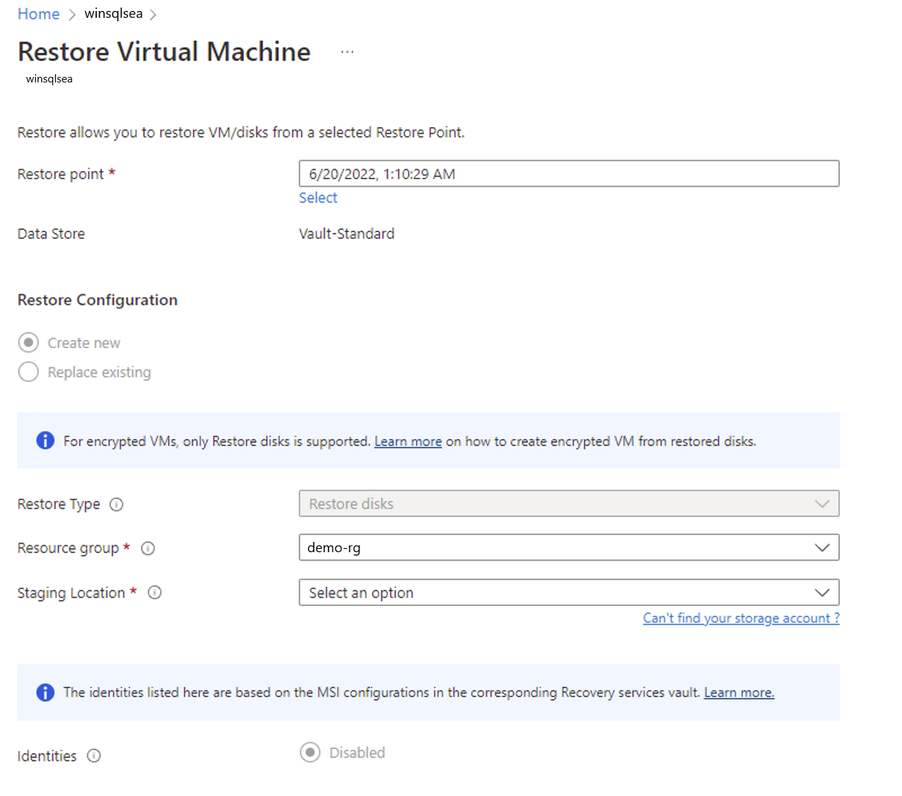

# Restore encrypted Azure virtual machines

This article describes how to restore Windows or Linux Azure virtual machines (VMs) with encrypted disks using the [Azure Backup](backup-overview.md) service. For more information, see [Encryption of Azure VM backups](backup-azure-vms-introduction.md#encryption-of-azure-vm-backups).

> [!Note]
> This article is applicable to virtual machines encrypted with Azure Disk encryption. For more information on ADE and how it differs from other disk encryption types in Azure, see [Disk Encryption Overview](/azure/virtual-machines/disk-encryption-overview).

## Before you start

Review the known limitations before you start restore of an encrypted VM

- You can back up and restore ADE encrypted VMs within the same subscription.
- Azure Backup supports VMs encrypted using standalone keys. Any key that's a part of a certificate used to encrypt a VM isn't currently supported.
- ADE encrypted VMs can’t be recovered at the file/folder level. You need to recover the entire VM to restore files and folders.
- When restoring a VM, you can't use the [replace existing VM](backup-azure-arm-restore-vms.md#restore-options) option for ADE encrypted VMs. This option is only supported for unencrypted managed disks.
- - During Azure VM restore, the encryption settings appear only when the vault is CMK encryption enabled.

## Restore an encrypted VM

Encrypted VMs can only be restored by restoring the VM disk and creating a virtual machine instance as explained below. **Replace existing disk on the existing VM**, **creating a VM from restore points** and **files or folder level restore** are currently not supported.
 
Follow below steps to restore encrypted VMs:

### Step 1: Restore the VM disk

1. In **Restore configuration** > **Create new** > **Restore Type** select **Restore disks**.
1. In **Resource group**, select an existing resource group for the restored disks, or create a new one with a globally unique name.
1. In **Staging location**, specify the storage account to which the VHDs should be copied. [Learn more](backup-azure-arm-restore-vms.md#storage-accounts).

    

1. Select **Restore** to trigger the restore operation.

When your virtual machine uses managed disks and you select the **Create virtual machine** option, Azure Backup doesn't use the specified storage account. In the case of **Restore disks** and **Instant Restore**, the storage account is used only for storing the template. Managed disks are created in the specified resource group.
When your virtual machine uses unmanaged disks, they're restored as blobs to the storage account.

   > [!NOTE]
   > After you restore the VM disk, you can manually swap the OS disk of the original VM with the restored VM disk without re-creating it. [Learn more](/azure/virtual-machines/windows/os-disk-swap).

### Step 2: Recreate the virtual machine instance 

Do one of the following actions:

- Use the template that's generated during the restore operation to customize VM settings and trigger VM deployment. [Learn more](backup-azure-arm-restore-vms.md#use-templates-to-customize-a-restored-vm).
  >[!NOTE]
   >While deploying the template, verify the storage account containers and the public/private settings.
- Create a new VM from the restored disks using PowerShell. [Learn more](backup-azure-vms-automation.md#create-a-vm-from-restored-disks).

### Step 3: Restore an encrypted Linux VM

Reinstall the ADE extension so the data disks are open and mounted.

## Cross Region Restore for an encrypted Azure VM

Azure Backup supports Cross Region Restore of encrypted Azure VMs to the [Azure paired regions](../reliability/cross-region-replication-azure.md). Learn how to [enable Cross Region Restore](backup-create-rs-vault.md#set-cross-region-restore) for an encrypted VM.

## Move an encrypted Azure VM

Moving an encrypted VM across vault or resource group is same as moving a backed-up Azure Virtual machine. See,

- [Steps to move an Azure virtual machine to a different recovery service vault](backup-azure-move-recovery-services-vault.md#move-an-azure-virtual-machine-to-a-different-recovery-service-vault)
- [Steps to move an Azure virtual machine to different resource group or subscription](../azure-resource-manager/management/move-resource-group-and-subscription.md)

## Next steps

If you run into any issues, review these articles:

- [Common errors](backup-azure-vms-troubleshoot.md) when backing up and restoring encrypted Azure VMs.
- [Azure VM agent/backup extension](backup-azure-troubleshoot-vm-backup-fails-snapshot-timeout.md) issues.

