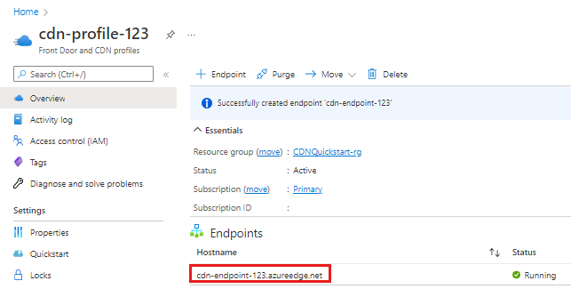

# Create an Azure Content Delivery Network endpoint

[!INCLUDE [Azure CDN from Microsoft (classic) retirement notice](../../includes/cdn-classic-retirement.md)]

> [!IMPORTANT]
> Starting August 15, 2025, Azure CDN from Microsoft (classic) will no longer support new domain onboarding or profile creation. Migrate to [AFD Standard and Premium](https://ms.portal.azure.com/#"https://ms.portal.azure.com/#") to create new domains or profiles and avoid service disruption. [Learn more](https://ms.portal.azure.com/verifyLink?href=https%3A%2F%2Faka.ms%2Fcdn%2Fmigration&id=Microsoft_Azure_Cdn"https://ms.portal.azure.com/verifylink?href=https%3a%2f%2faka.ms%2fcdn%2fmigration&id=microsoft_azure_cdn")
> Switch from Azure-managed certificates on existing domains to Bring Your Own Certificate (BYOC) or migrate to [AFD Standard and Premium](https://ms.portal.azure.com/#%22https://ms.portal.azure.com/#%22) by August 15, 2025 to avoid service disruption. Existing managed certificates will be auto renewed before August 15, 2025, and remain valid until April 14, 2026. [Learn more](/azure/cdn/cdn-custom-ssl?toc=%2Fazure%2Ffrontdoor%2Ftoc.json&tabs=option-1-default-enable-https-with-a-cdn-managed-certificate)
This article describes all the settings for creating an [Azure Content Delivery Network](cdn-overview.md) endpoint in an existing content delivery network profile. After you've created a profile and an endpoint, you can start delivering content to your customers. For a quickstart on creating a profile and endpoint, see [Quickstart: Create an Azure Content Delivery Network profile and endpoint](cdn-create-new-endpoint.md).

## Prerequisites

Before you can create a content delivery network endpoint, you must have created at least one content delivery network profile, which can contain one or more content delivery network endpoints. To organize your content delivery network endpoints by internet domain, web application, or some other criteria, you can use multiple profiles. Because content delivery network pricing is applied at the content delivery network profile level, you must create multiple content delivery network profiles if you want to use a mix of Azure Content Delivery Network pricing tiers. To create a content delivery network profile, see [Create a new content delivery network profile](cdn-create-new-endpoint.md#create-a-new-cdn-profile).

## Sign in to the Azure portal

Sign in to the [Azure portal](https://portal.azure.com) with your Azure account.

## Create a new content delivery network endpoint

1. In the [Azure portal](https://portal.azure.com), navigate to your content delivery network profile. You might have pinned it to the dashboard in the previous step. If not, you can find it by selecting **All services**, then selecting **CDN profiles**. In the **CDN profiles** pane, select the profile to which you plan to add your endpoint.

    The content delivery network profile pane appears.

2. Select **Endpoint**.

    The **Add an endpoint** page appears.

3. For **Name**, enter a unique name for the new content delivery network endpoint. This name is used to access your cached resources at the domain *\<endpointname>*.azureedge.net.

4. For **Origin type**, choose one of the following origin types:
   - **Storage** for Azure Storage
   - **Storage static website** for Azure Storage static websites
   - **Cloud service** for Azure Cloud Services
   - **Web App** for Azure Web Apps
   - **Custom origin** for any other publicly accessible origin web server (hosted in Azure or elsewhere)

5. For **Origin hostname**, select or enter your origin server domain. The dropdown lists all available origin servers of the type you specified in step 4. If you selected **Custom origin** as your origin type, enter the domain of your custom origin server.

6. For **Origin path**, enter the path to the resources that you want to cache. To allow caching of any resource at the domain you specified in step 5, leave this setting blank.

7. For **Origin host header**, enter the host header you want Azure Content Delivery Network to send with each request, or leave the default.

   > [!NOTE]
   > Some types of origins, such as Azure Storage and Web Apps, require the host header to match the domain of the origin. Unless you have an origin that requires a host header different from its domain, you should leave the default value.
   >

8. For **Protocol** and **Origin port**, specify the protocols and ports to use to access your resources at the origin server. At least one protocol (HTTP or HTTPS) must be selected. Use the content delivery network-provided domain (*\<endpointname>*.azureedge.net) to access HTTPS content.

   > [!NOTE]
   > The **Origin port** value determines only the port the endpoint uses to retrieve information from the origin server. The endpoint itself is available only to end clients on the default HTTP and HTTPS ports (80 and 443), regardless of the **Origin port** value.

9. For **Optimized for**, select an optimization type that best matches the scenario and type of content that you want the endpoint to deliver. For more information, see [Optimize Azure Content Delivery Network for the type of content delivery](cdn-optimization-overview.md).

    The following optimization type settings are supported, according to profile type:
    - **Azure CDN Standard from Microsoft** profiles:
       - [**General web delivery**](cdn-optimization-overview.md#general-web-delivery)

1. Select **Add** to create the new endpoint.

    After the endpoint is created, it appears in the list of endpoints for the profile.

   
   
         It may take up to 10 minutes for the endpoint registration to propagate and become available for use.

         If you attempt to use the content delivery network domain name before the endpoint configuration has propagated to the point of presence (POP) servers, you might receive an HTTP 404 response status. If it has been several hours since you created your endpoint and you're still receiving a 404 response status, see [Troubleshooting Azure Content Delivery Network endpoints that return a 404 status code](cdn-troubleshoot-endpoint.md).

## Clean up resources

To delete an endpoint when it's no longer needed, select it and then select **Delete**.

## Next steps

To learn about custom domains, continue to the tutorial for adding a custom domain to your content delivery network endpoint.

> [!div class="nextstepaction"]
> [Add a custom domain](cdn-map-content-to-custom-domain.md)
