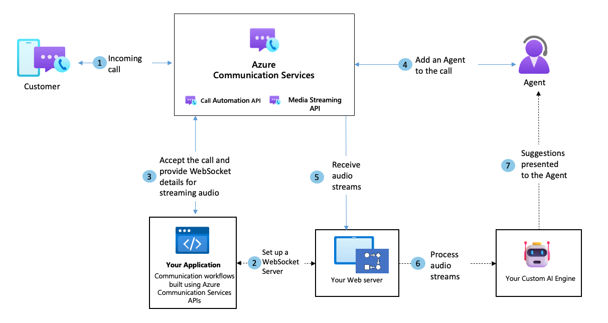

# Audio streaming overview - audio subscription

[!INCLUDE [Public Preview Disclaimer](../../includes/public-preview-include-document.md)]

Azure Communication Services provides developers with Audio Streaming capabilities to get real-time access to audio streams to capture, analyze, and process audio content during active calls. In today's world consumption of live audio and video is prevalent, this content could be in the forms of online meetings, online conferences, customer support, etc.  With audio streaming access, developers can now build server applications to capture and analyze audio streams for each of the participants on the call in real-time. Developers can also combine audio streaming with other call automation actions or use their own AI models to analyze audio streams. Use cases include NLP for conversation analysis or providing real-time insights and suggestions to agents while they are in an active interaction with end users. 

This public preview supports the ability for developers to get access to real-time audio streams over a WebSocket to analyze the call's audio in mixed and unmixed formats.

## Common use cases
Audio streams can be used in many ways. Some examples of how developers may wish to use the audio streams in their applications include:

### Real-time call assistance

**Improved AI powered suggestions** - Use real-time audio streams of active interactions between agents and customers to gauge the intent of the call and how your agents can provide a better experience to their customer through active suggestions using your own AI model to analyze the call.

### Authentication

**Biometric authentication** – Use the audio streams to carry out voice authentication, by running the audio from the call through your voice recognition/matching engine/tool.

## Sample architecture for subscribing to audio streams from an ongoing call - live agent scenario

## Supported formats

### Mixed format
Contains mixed audio of all participants on the call.  All audio is flattened into one stream.
	
### Unmixed
Contains audio per participant per channel, with support for up to four channels for the four most dominant speakers at any point in a call. You'll also get a participantRawID that you can use to determine the speaker. 

## Additional information
The table below describes information that will help developers convert the audio packets into audible content that can be used by their applications.
- Framerate: 50 frames per second
- Packet stream rate: 20 ms rate
- Data packet: 64 Kbytes
- Audio metric: 16-bit PCM mono at 16000 hz
- Public string data is a base64 string that should be converted into a byte array to create raw PCM file.

## Next Steps
Check out the [audio streaming quickstart](../../how-tos/call-automation/audio-streaming-quickstart.md) to learn more.
