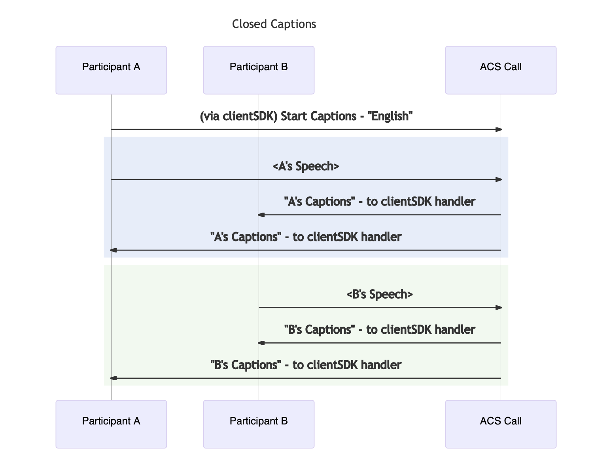

# Closed Captions overview

Closed captions are a textual representation of a voice or video conversation that is displayed to users in real-time. Azure Communication Services Closed captions offer developers the ability to allow users to select when they wish to toggle captions on or off. These captions are only available during the call/meeting for the user that has selected to enable captions, Azure Communication Services does **not** store these captions anywhere. Here are main scenarios where Closed Captions are useful:

## Common use cases

### Building accessible experiences
Accessibility – For people with hearing impairments or who are new to the language to participate in calls and meetings. A key feature requirement in the Telemedical industry is to help patients communicate effectively with their health care providers. This can also be useful when you have scenarios where users might be joining from a PSTN phone number, this will allow your application to receive the captioning data for those users too so that everyone's input is available during these interactions.

### Teams interoperability 
Use Teams – Organizations using Azure Communication Services and Teams can use Teams closed captions to improve their applications by providing closed captions capabilities to users. Those organizations can keep using Microsoft Teams for all calls and meetings without third party applications providing this capability. Learn more about how you can use captions in [Teams interoperability](../interop/enable-closed-captions.md) scenarios.

### Global inclusivity 
Provide translation – Use the translation functions provided to provide translated captions for users who may be new to the language or for companies that operate at a global scale and have offices around the world, their teams can have conversations even if some people might not be familiar with the spoken language.

## When to use Closed Captions

- Closed Captions help maintain concentration and engagement, which can provide a better experience for viewers with learning disabilities, a language barrier, attention deficit disorder, or hearing impairment. 
- Closed Captions allow participants to be on the call in loud or sound-sensitive environments.

## Privacy concerns

Closed captions are only available during the call or meeting for the participant that has selected to enable captions, Azure Communication Services doesn't store these captions anywhere. Many countries/regions and states have laws and regulations that apply to storing of data. It is your responsibility to use the closed captions in compliance with the law should you choose to store any of the data generated through closed captions. You must obtain consent from the parties involved in a manner that complies with the laws applicable to each participant. 
 
Interoperability between Azure Communication Services and Microsoft Teams enables your applications and users to participate in Teams calls, meetings, and chats. It is your responsibility to ensure that the users of your application are notified when closed captions are enabled in a Teams call or meeting and being stored.
 
Microsoft indicates to you via the Azure Communication Services API that recording or closed captions has commenced, and you must communicate this fact, in real-time, to your users within your application's user interface. You agree to indemnify Microsoft for all costs and damages incurred due to your failure to comply with this obligation.

## Next steps

- Get started with a [Closed Captions Quickstart](../../quickstarts/voice-video-calling/get-started-with-closed-captions.md)
- Learn more about using closed captions in [Teams interop](../interop/enable-closed-captions.md) scenarios.
