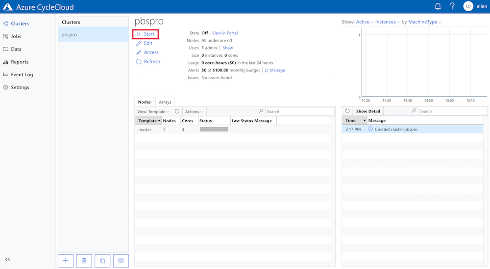
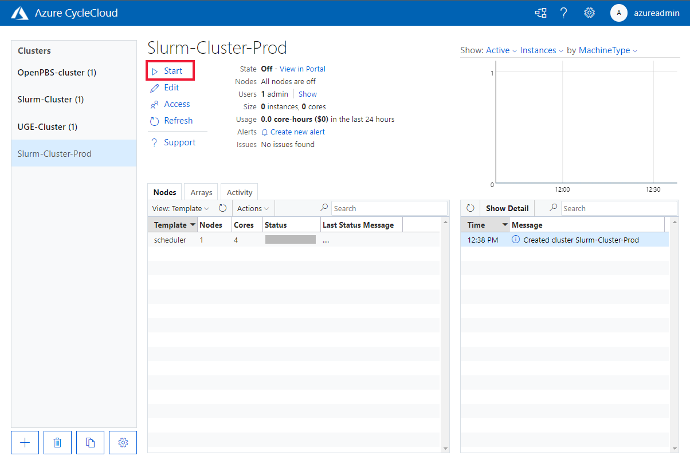

# Start a cluster

After you create or import a cluster through the UI, you can start it through the UI or the CycleCloud CLI. When you start a cluster, it gets instances from Azure, sets up the instances as defined in the cluster template, and notifies CycleCloud when the node is ready for use.

## Starting via CycleCloud GUI

Select the cluster you want to start in the sidebar, select **Start**, and then confirm. The cluster nodes move into the *Acquiring* state and work through the orchestration phases. If a node encounters an error during orchestration and fails, the error is logged in
the event log on the Clusters page. You can edit your node settings and retry the operation.

::: moniker range="=cyclecloud-7"

:::

::: moniker range=">=cyclecloud-8"

:::

## Starting via CycleCloud CLI

The CycleCloud CLI can also [start clusters](~/articles/cyclecloud/cli.md#cyclecloud-start_cluster):

```bash
cyclecloud start_cluster my_cluster_name
```

## Node orchestration

When you start the cluster, CycleCloud runs through the orchestration sequence for each node defined in the cluster. It requests a virtual machine from the cloud provider, waits for the VM to be acquired, configures the VM as defined in the cluster template, and executes the initialization sequence specified in the project. When the orchestration sequence completes, the node is in the `Started` state. If an unhandled or unknown error happens during this process, the node goes into the `Error` state.

There are several intermediate states a node moves through once started:

- *Off*: No virtual machine is active or being acquired.
- *Acquiring*: The virtual machine is being requested from the cloud provider.
- *Preparing*: The virtual machine is being configured.
- *Ready*: The virtual machine is running.
- *Deallocated*: The virtual machine is stopped and deallocated.
- *Terminated*: The virtual machine is deleted.
- *Failed*: An orchestration phase failed during starting or terminating the node.

Azure doesn't start billing you for a VM while it's being acquired. If a VM that meets your requirements isn't available, you might wait indefinitely for one to be provisioned. Billing for resources typically begins when the instance enters the `Preparing` phase, while CycleCloud installs your software and configures the instance to run your workloads. You can [connect to a node](connect-to-node.md) that is in the `Preparing` or `Ready` phase.
