# Quickstart - Deploy Azure CycleCloud Workspace for Slurm using the Marketplace

Azure CycleCloud Workspace for Slurm is a free Marketplace application that provides a simple, secure, and scalable way to manage compute and storage resources for HPC and AI workloads. In this quickstart, you install CycleCloud Workspace for Slurm using the Marketplace application.

The main steps to deploy and configure CycleCloud Workspace for Slurm including Open OnDemand are:
1. Before starting review these instructions [Plan your CycleCloud Workspace for Slurm Deployment.](./how-to/ccws/plan-your-deployment.md).
1. Deploy a CycleCloud Workspace for Slurm environment using the Azure marketplace (this quickstart).
1. Register an Entra ID application for Open OnDemand authentication, see instructions [Register an Entra ID application for Open OnDemand](./how-to/ccws/register-entra-id-app.md)
1. Configure Open OnDemand to use the Entra ID application [Configure Open OnDemand with CycleCloud](./how-to/ccws/configure-ood.md)
1. Add users in CycleCloud [Add users for Open OnDemand](./how-to/ccws/ood-add-users.md)

## Prerequisites

For this quickstart, you need:

1. An Azure account with an active subscription
1. The **Contributor** and **User Access Administrator** roles at the subscription level
1. If deploying Open OnDemand, direct connectivity with a VPN to the Virtual Network, to be built or used, is required
1. Permission to register an application in Entra ID if you want to use Open OnDemand

## How to deploy?

* Sign in to the [Azure portal.](https://portal.azure.com)
* Click on the upper left `+ Create a Resource` option
* In the `Search services and marketplace` box, enter **Slurm** and then select **Azure CycleCloud Workspace for Slurm**.
* On the **Azure CycleCloud Workspace for Slurm** page, select **Create**.


### Basics
* On the **New Azure CycleCloud Workspace for Slurm account** page, enter or select the following details.
   - **Subscription**: Select the subscription to use if not already selected.
   - **Region**: Select the Azure region in which you want to deploy your CycleCloud Workspace for Slurm environment.
   - **Resource group**: Select the resource group for the Azure CycleCloud Workspace for Slurm account, or create a new one.
   - **CycleCloud VM Size**: Choose a new VM Size or keep the default one. 
   - **Admin User**: Enter a name and a password for the CycleCloud administrator account.
   - **Admin SSH Public Key**: Select the public SSH key of the administrator account directly or if stored in an SSH key resource in Azure.
 
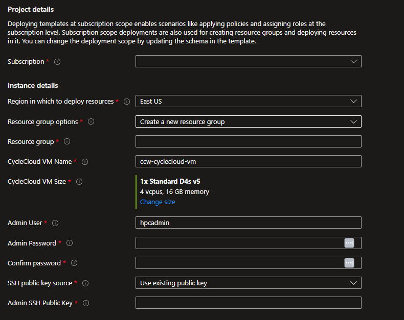

### File-system
#### Users' home directory - Create New
Specify where the users' home directory should be located. Create a new **Builtin NFS** uses the scheduler VM as an NFS server with an attached datadisk.
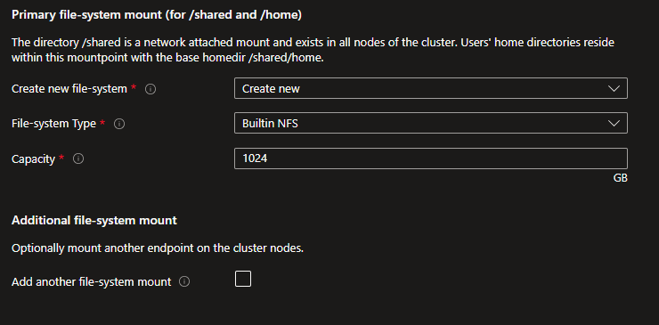

Create a new **Azure NetApp Files** creates an ANF account, pool and, volume of the specified capacity and service level.
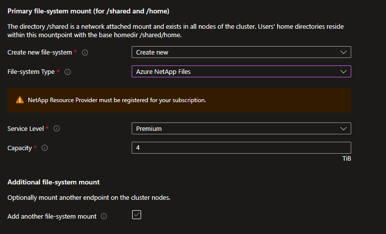

#### Users' home directory - Use Existing

If you have an existing NFS mount point, then select the **Use Existing** option and specify the settings to mount it.
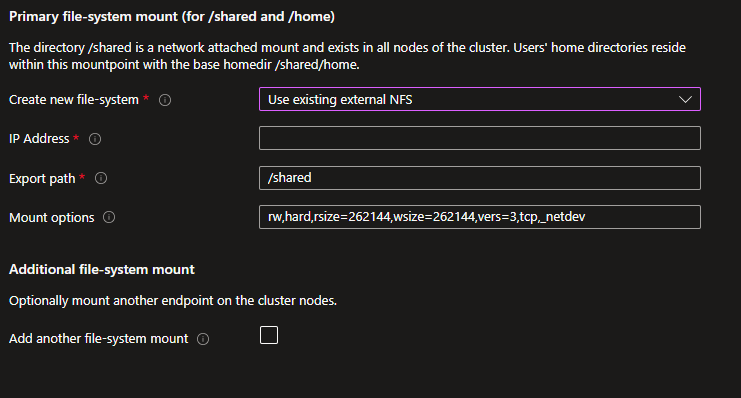

#### Supplemental file-system mount - Create New

If you need to mount another file-system for your project data, you can either create a new one or specify an existing one. You can create a new Azure NetApp Files volume or an Azure Managed Lustre Filesystem.

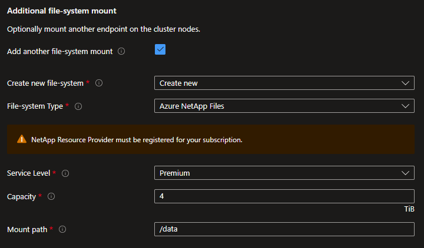

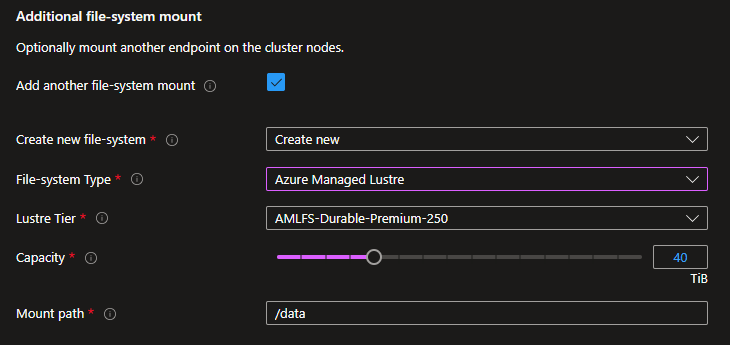

#### Supplemental file-system mount - Use Existing

If you have an existing external NFS mount point or an Azure Managed Lustre Filesystem, you can specify the mount options.

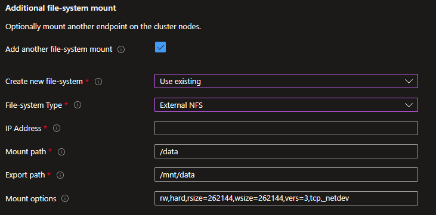

### Networking

Specify here if you want to create a new Virtual Network and subnets or use an existing one.

#### Create a new Virtual Network

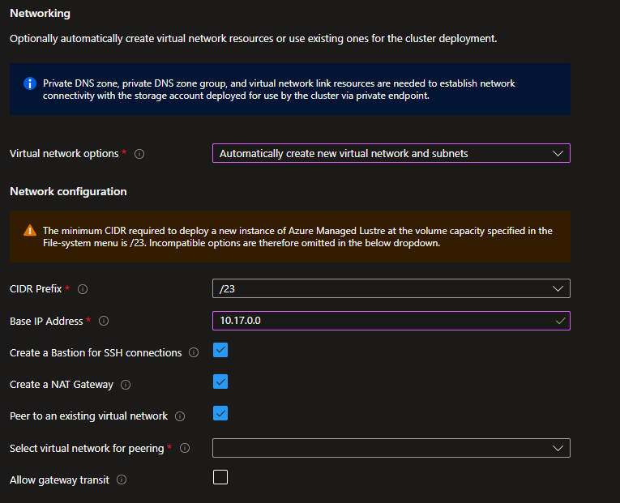

- Select the CIDR that corresponds to the number of compute nodes you're targeting and specify a base IP address.
- Creating a Bastion is recommended if direct connectivity isn't provided by your corporate IT.
- Creating a NAT Gateway is required to provide outbound connectivity to internet. 
- Peer to an existing Virtual Network if you already have a HUB that can deliver services like Bastion and a VPN gateway. Ensure that you select a base IP address compatible with your peered VNET. If the peered VNET has a gateway, check the **Allow** gateway transit option.

#### Use existing Virtual Network

Before using an existing virtual network, check for the prerequisites in [Plan your CycleCloud Workspace for Slurm Deployment.](./how-to/ccws/plan-your-deployment.md#brownfield-deployment)

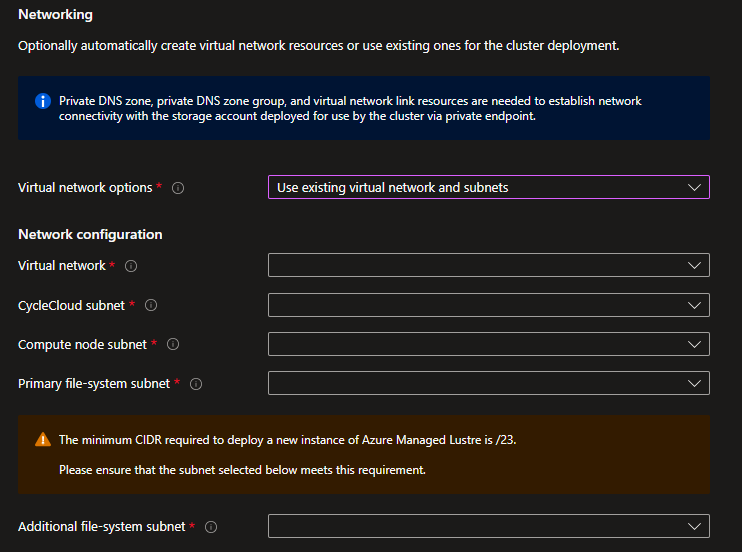

Please specify how you would like to manage the registration of the Private Endpoint used for the storage account created to store CycleCloud projects in a Private DNS zone. You can choose to use an existing Private DNS zone, create a new one, or opt not to register it.

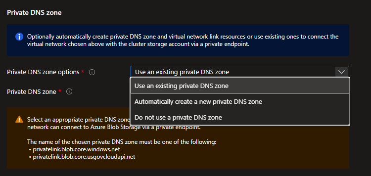


### Slurm Settings

Specify the virtual machine size and image to use for the Scheduler and the Login nodes. Images are the HPC Images provided in the Azure Marketplace with the associated URIs:

| Image Name | URI |
|------------|-----|
| Alma Linux 8.10 | almalinux:almalinux-hpc:8_10-hpc-gen2:latest |
| Ubuntu 20.04 | microsoft-dsvm:ubuntu-hpc:2004:latest |
| Ubuntu 22.04 | microsoft-dsvm:ubuntu-hpc:2204:latest |
| Custom Image | You have to specify an image URN or image ID |

If you choose a `Custom Image`, you must then specify an image URN for an existing marketplace image or and image ID for an image in an Azure Compute Gallery.

You can also check the `Use image on all nodes` if you want the Scheduler, Login Nodes, and compute nodes to use the same image.

Specify the number of login nodes you want to provision initially and the maximum number allowed. 
Enabling health checks automatically executes node health checks for the HPC and GPU partitions, removing any unhealthy nodes when they start.
You can postpone the start of the cluster if you need additional configuration throught the CycleCloud portal.

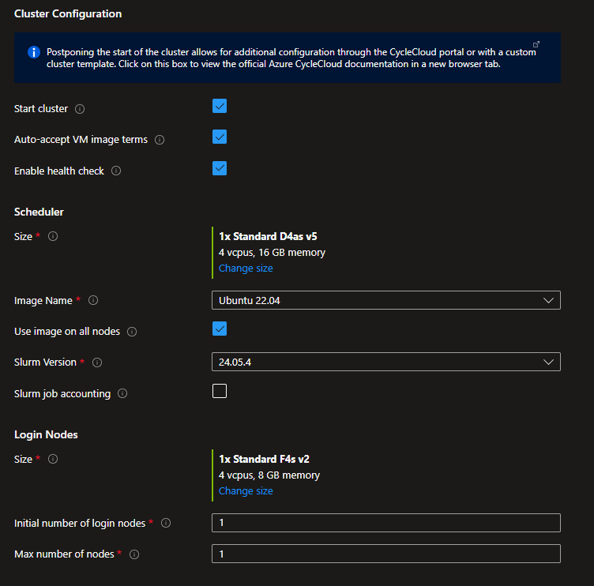

To enable Slurm Job Accounting, check the box to display connectivity options. Ensure you have an Azure Database for MySQL flexible server resource that was deployed earlier.

You can connect using an FQDN or private IP if you supply your own virtual network or use VNET peering when creating a new virtual network as part of your deployment. Connection via private endpoint is also available if you choose to create a new virtual network.

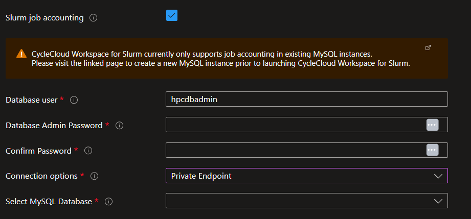


### Partition Settings

Azure CycleCloud Workspace for Slurm comes with 3 defined Slurm partitions:
- HTC : For embarrassingly parallel non-MPI jobs.
- HPC : For tightly coupled MPI jobs mostly using VM types with InfiniBand support.
- GPU : For MPI and non-MPI GPU jobs.

You can configure the image and the maximum number of nodes for each partition that CycleCloud dynamically provisions. Only the HTC partition allows the use of spot instances, as spot instances aren't suitable for HPC and GPU jobs.

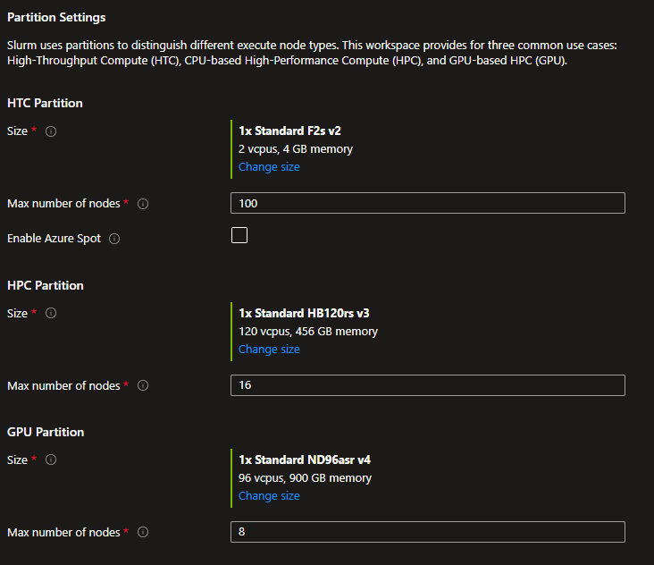

### Open OnDemand
To utilize Open OnDemand, please select the checkbox and provide the required details: 
- the image name, 
- the domain name (`contoso.com`) used to extract the user name (`user@contoso.com`) to match linux local account (`user`) managed by CycleCloud and used for authentication, 
- the fully qualified domain name (FQDN) of the Open OnDemand web server (leave blank if you intend to use the private IP), 
- indicate whether you plan to use an existing Entra ID application or register one manually at a later stage. `Automatically register Entra ID application` will only appear when doing CLI deployment.

>[!NOTE]
>An Entra ID application is necessary for user authentication. If an application has not been previously created by our scripts, please create one manually. See [How to register an Entra ID application for Open OnDemand](./how-to/ccws/register-entra-id-app.md) for more information.

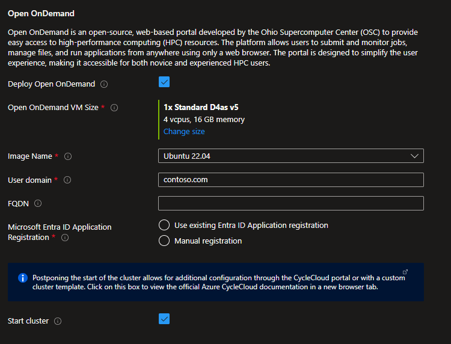

### Tags

Assign the appropriate tags to the necessary resources. CycleCloud dynamically provisions Virtual Machines and applies Node Array tags to them.

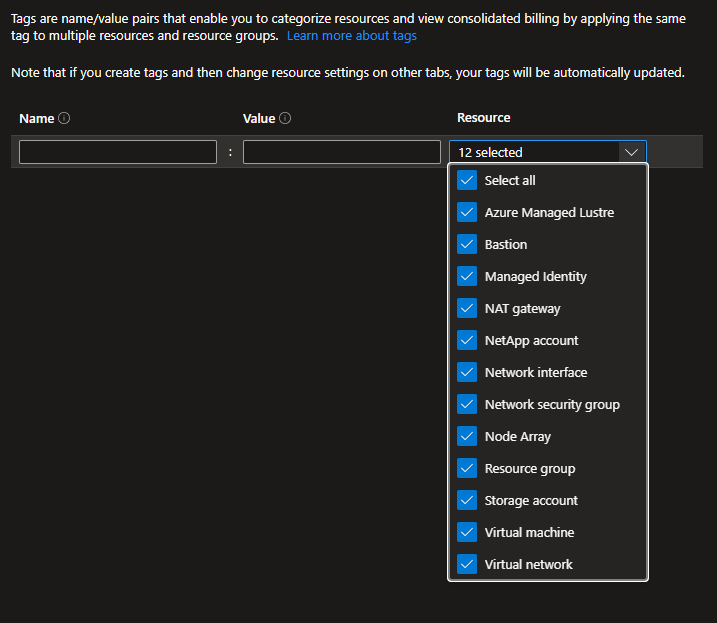


### Review and create

Review your options as this step also includes some validations. 


After the validations are complete, click **Create** to initialize the deployment.


Follow the deployment status and steps.

## Check your deployment

Connect to the `ccw-cyclecloud-vm` using Bastion with the username and SSH keys specified during the deployment.


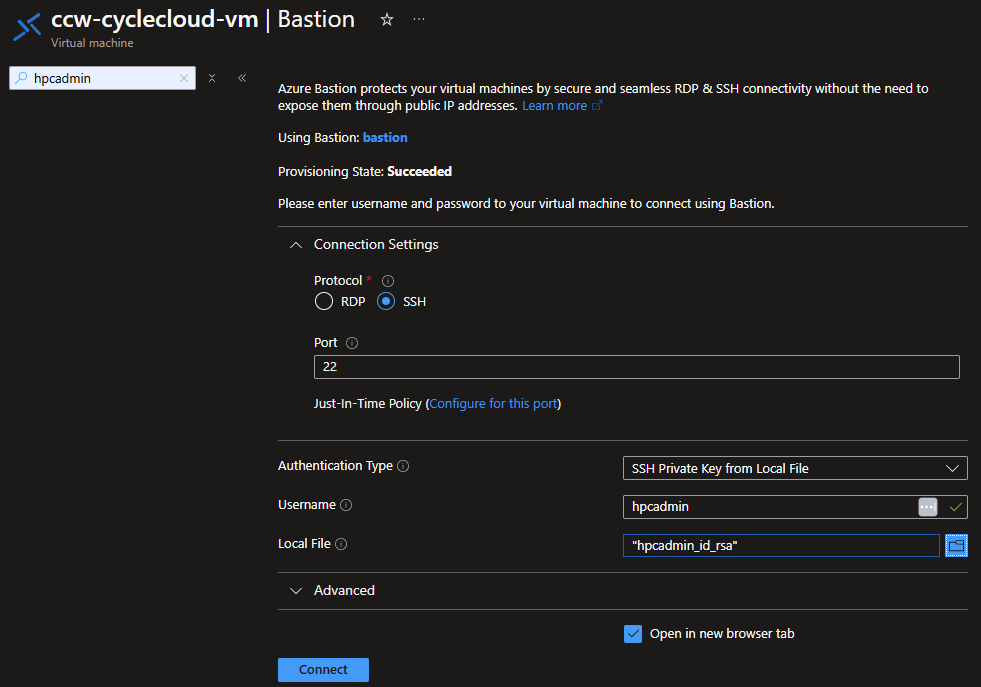

After connected, check the cloud-init logs to verify everything is correct.

```bash
$tail -f -n 25 /var/log/cloud-init-output.log
Waiting for Azure.MachineType to be populated...
Waiting for Azure.MachineType to be populated...
Waiting for Azure.MachineType to be populated...
Waiting for Azure.MachineType to be populated...
Waiting for Azure.MachineType to be populated...
Waiting for Azure.MachineType to be populated...
Waiting for Azure.MachineType to be populated...
Waiting for Azure.MachineType to be populated...
Waiting for Azure.MachineType to be populated...
Waiting for Azure.MachineType to be populated...
Waiting for Azure.MachineType to be populated...
Waiting for Azure.MachineType to be populated...
Starting cluster ccws....
----------------------------
ccws : allocation -> started
----------------------------
Resource group: 
Cluster nodes:
    scheduler: Off -- --  
Total nodes: 1
CC start_cluster successful
/
exiting after install
Cloud-init v. 23.4-7.el8_10.alma.1 running 'modules:final' at Wed, 12 Jun 2024 10:15:53 +0000. Up 11.84 seconds.
Cloud-init v. 23.4-7.el8_10.alma.1 finished at Wed, 12 Jun 2024 10:28:15 +0000. Datasource DataSourceAzure [seed=/dev/sr0].  Up 754.29 seconds
```

Next, establish connectivity between your client machine and the CycleCloud VM. It is achieved through your corporate IT, a VPN, Bastion tunneling, or an attached public IP if permitted by your company. Access the web interface by browsing to https://<cyclecloud_ip>, and authenticate using the username and password provided during deployment. Verify that both the Scheduler and the Login node are running.

## Resources

* [Register an Entra ID application for Open OnDemand](./how-to/ccws/register-entra-id-app.md)
* [Configure Open OnDemand with CycleCloud](./how-to/ccws/configure-ood.md)
* [Add users for Open OnDemand](./how-to/ccws/ood-add-users.md)
* [How to connect to the CycleCloud Portal through Bastion.](/azure/cyclecloud/how-to/ccws/connect-to-portal-with-bastion)
* [How to connect to a Login Node through Bastion.](/azure/cyclecloud/how-to/ccws/connect-to-login-node-with-bastion)
* [How to deploy a CycleCloud Workspace for Slurm environment using the CLI.](/azure/cyclecloud/how-to/ccws/deploy-with-cli)
