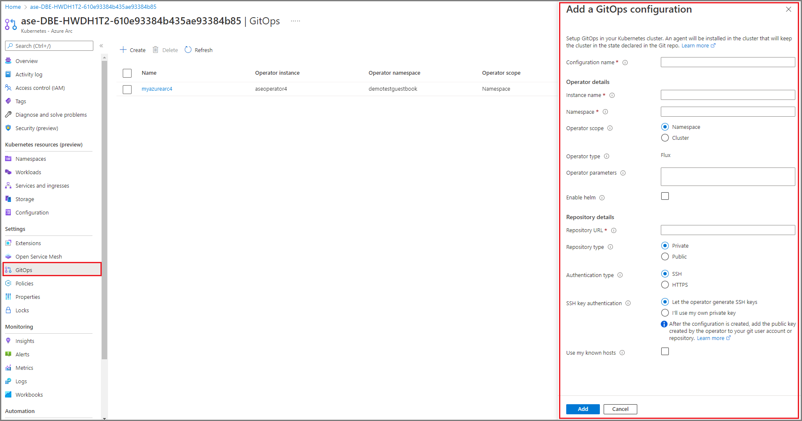
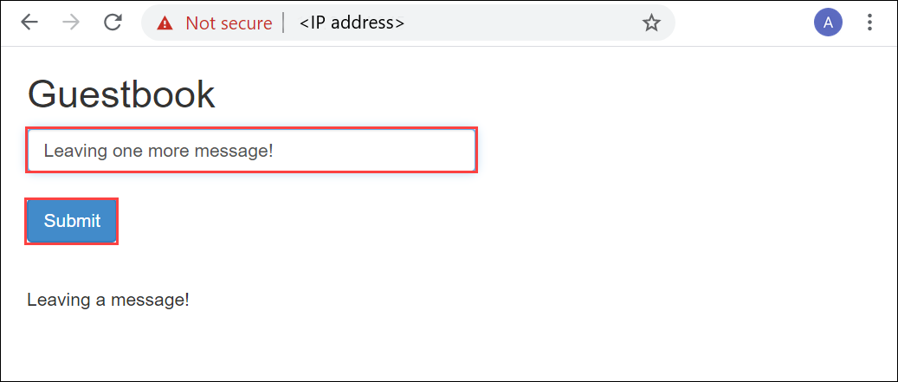

# Deploy a PHP `Guestbook` stateless application with Redis on Azure Arc-enabled Kubernetes cluster on Azure Stack Edge Pro GPU

[!INCLUDE [applies-to-GPU-and-pro-r-and-mini-r-skus](../../includes/azure-stack-edge-applies-to-gpu-pro-r-mini-r-sku.md)]

This article shows you how to build and deploy a simple, multi-tier web application using Kubernetes and Azure Arc. This example consists of the following components:

- A single-instance Redis master to store `guestbook` entries
- Multiple replicated Redis instances to serve reads
- Multiple web frontend instances

The deployment is done using GitOps on the Azure Arc-enabled Kubernetes cluster on your Azure Stack Edge Pro device. 

This procedure is intended for people who have reviewed the [Kubernetes workloads on Azure Stack Edge Pro device](azure-stack-edge-gpu-kubernetes-workload-management.md) and are familiar with the concepts of [What is Azure Arc-enabled Kubernetes (Preview)](/azure/azure-arc/kubernetes/overview).

> [!NOTE]
> This article contains references to the term *slave*, a term that Microsoft no longer uses. When the term is removed from the software, we’ll remove it from this article.

## Prerequisites

Before you can deploy the stateless application, make sure that you have completed the following prerequisites on your device and the client that you will use to access the device:

### For device

1. You have sign-in credentials to a 1-node Azure Stack Edge Pro device.
    1. The device is activated. See [Activate the device](azure-stack-edge-gpu-deploy-activate.md).
    1. The device has the compute role configured via Azure portal and has a Kubernetes cluster. See [Configure compute](azure-stack-edge-gpu-deploy-configure-compute.md).

1. You have enabled Azure Arc on the existing Kubernetes cluster on your device and you have a corresponding Azure Arc resource in the Azure portal. For detailed steps, see [Enable Azure Arc on Azure Stack Edge Pro device](azure-stack-edge-gpu-deploy-arc-kubernetes-cluster.md).

### For client accessing the device

1. You have a  Windows client system that will be used to access the Azure Stack Edge Pro device.
  
    - The client is running Windows PowerShell 5.0 or later. To download the latest version of Windows PowerShell, go to [Install Windows PowerShell](/powershell/scripting/install/installing-windows-powershell).
    
    - You can have any other client with a [Supported operating system](azure-stack-edge-gpu-system-requirements.md#supported-os-for-clients-connected-to-device) as well. This article describes the procedure when using a Windows client. 
    
1. You have completed the procedure described in [Access the Kubernetes cluster on Azure Stack Edge Pro device](azure-stack-edge-gpu-create-kubernetes-cluster.md). You have:
    
    - Installed `kubectl` on the client. <!--and saved the `kubeconfig` file with the user configuration to C:\\Users\\&lt;username&gt;\\.kube. -->
    
    - Make sure that the `kubectl` client version is skewed no more than one version from the Kubernetes master version running on your Azure Stack Edge Pro device. 
      - Use `kubectl version` to check the version of kubectl running on the client. Make a note of the full version.
      - In the local UI of your Azure Stack Edge Pro device, go to **Overview** and note the Kubernetes software number. 
      - Verify these two versions for compatibility from the mapping provided in the Supported Kubernetes version. <!--insert link-->

1. You have a [GitOps configuration that you can use to run an Azure Arc deployment](https://github.com/kagoyal/dbehaikudemo). In this example, you will use the following `yaml` files to deploy on your Azure Stack Edge Pro device.

    - `frontend-deployment.yaml`<!-- - The guestbook application has a web frontend serving the HTTP requests written in PHP. It is configured to connect to the redis-master Service for write requests and the redis-slave service for Read requests. This file describes a deployment that runs the frontend of the guestbook application.-->
    - `frontend-service.yaml` <!-- - This allows you to configure an externally visible frontend Service that can be accessed from outside the Kubernetes cluster on your device.-->
    - `redis-master-deployment.yaml` <!-- - This deployment file runs a single replica Redis master Pod. The guestbook application uses Redis to store its data. It writes its data to a Redis master instance and reads data from multiple Redis slave instances.-->
    - `redis-master-service.yaml` <!-- - The guestbook application needs to communicate to the Redis master to write its data. You need to apply a Service to proxy the traffic to the Redis master Pod. A Service defines a policy to access the Pods.-->
    - `redis-slave-deployment.yaml` <!-- - Although the Redis master is a single pod, you can make it highly available to meet traffic demands by adding replica Redis slaves. The Redis Slave Deployment specifies two replicas.-->
    - `redis-slave-service.yaml` <!-- - The guestbook application needs to communicate to Redis slaves to read data. To make the Redis slaves discoverable, you need to set up a Service. A Service provides transparent load balancing to a set of Pods.-->

<!-- az cli version requirements-->


## Deploy configuration

Follow these steps to configure the Azure Arc resource to deploy a GitOps configuration via the Azure portal: 

1. In your Azure portal, go to the Azure Arc resource that you have created when you enabled Azure Arc on the Kubernetes cluster on your device. 

    

1. Go to **Configurations** and select **+ Add configuration**.

    

1. Specify the **Flux version 1 Extension**.

1. In **Add a GitOps configuration**, enter the appropriate values for the fields, and then select **Add**.

    |Parameter  |Description |
    |---------|---------|
    |Configuration name     | Name for the configuration resource.        |
    |Operator instance name     |Instance name of the operator to identify a specific configuration. Name is a string of maximum 253 characters that must be lowercase, alphanumeric, hyphen, and period only.         |
    |Operator namespace     | Set to **demotestguestbook** to match the namespace specified in the deployment `yaml`. <br> The field defines the namespace where the operator is installed. Name is a string of maximum 253 characters that must be lowercase, alphanumeric, hyphen, and period only.         |
    |Repository URL     |<br>Path to the git repository in `http://github.com/username/repo` or `git://github.com/username/repo` format where your GitOps configuration is located.         |
    |Operator scope     | Select **Namespace**. <br>This parameter defines the scope at which the operator is installed. Select Namespace to install your operator in the namespace specified in the deployment yaml files.       |
    |Operator type     | Leave at default. <br>This parameter specifies the type of the operator - by default, set as flux.        |
    |Operator params     | Leave this blank. <br>This parameter contains parameters to pass to the flux operator.        |
    |Helm     | Leave this checkbox **Unchecked**. <br>Enable this option if you will do chart-based deployments.        |


    


1. The configuration deployment starts and the **Operator state** shows as **Pending**. 

    

1. The deployment takes a couple minutes. When the deployment completes, the **Operator state** shows as **Installed**.

    

## Verify deployment

The deployment via the GitOps configuration creates a `demotestguestbook` namespace as specified in the deployment `yaml` files located in the git repo.

1. After you have applied the GitOps configuration, [Connect to the PowerShell interface of the device](azure-stack-edge-gpu-connect-powershell-interface.md#connect-to-the-powershell-interface).
1. Run the following command to list the pods running in the `demotestguestbook` namespace corresponding to the deployment.

    `kubectl get pods -n <your-namespace>`
  
    Here is a sample output.
  
    ```powershell
    [10.128.44.240]: PS>kubectl get pods -n demotestguestbook
    NAME                            READY   STATUS    RESTARTS   AGE
    aseoperator1-5569658644-cqtb5   1/1     Running   0          91m
    frontend-6cb7f8bd65-4xb4f       1/1     Running   0          91m
    frontend-6cb7f8bd65-q9cxj       1/1     Running   0          91m
    frontend-6cb7f8bd65-xpzs6       1/1     Running   0          91m
    memcached-86bdf9f56b-5l2fq      1/1     Running   0          91m
    redis-master-7db7f6579f-2z29w   1/1     Running   0          91m
    redis-slave-7664787fbc-lgr2n    1/1     Running   0          91m
    redis-slave-7664787fbc-vlvzn    1/1     Running   0          91m
    [10.128.44.240]: PS>
    ```  

1. In this example, the frontend service was deployed as type:LoadBalancer. You will need to find the IP address of this service to view the `guestbook`. Run the following command.

    `kubectl get service -n <your-namespace>`
    
    ```powershell
    [10.128.44.240]: PS>kubectl get service -n demotestguestbook
    NAME           TYPE           CLUSTER-IP       EXTERNAL-IP     PORT(S)        AGE
    frontend       LoadBalancer   10.96.79.38      10.128.44.245   80:31238/TCP   85m
    memcached      ClusterIP      10.102.47.75     <none>          11211/TCP      85m
    redis-master   ClusterIP      10.104.32.99     <none>          6379/TCP       85m
    redis-slave    ClusterIP      10.104.215.146   <none>          6379/TCP       85m
    [10.128.44.240]: PS>
    ```
1. The frontend service of `type:LoadBalancer` has an external IP address. This IP is from the IP address range that you specified for external services when configuring the Compute network settings on the device. Use this IP address to view the `guestbook` at URL: `https://<external-IP-address>`.

    

## Delete deployment

To delete the deployment, you can delete the configuration from the Azure portal. Deleting the configuration will delete the objects that were created, including deployments and services.

1. In the Azure portal, go the Azure Arc resource > Configurations. 
1. Locate the configuration you want to delete. Select the ... to invoke the context menu and select **Delete**.
    

It may take up several minutes for the configuration to be deleted.
 
<!--```powershell
kubectl delete deployment <deployment-name> -n <your-namespace>
kubectl delete service <service-name> -n <your-namespace>
```

Here is a sample output of when you delete the deployments and the services.

```powershell
C:\Users\user>kubectl delete deployment,svc mysql -n userns1
deployment.apps "mysql" deleted
service "mysql" deleted
C:\Users\user>
```-->


## Next steps

Learn how to [Use Kubernetes Dashboard to monitor deployments on your Azure Stack Edge Pro device](azure-stack-edge-gpu-monitor-kubernetes-dashboard.md)
