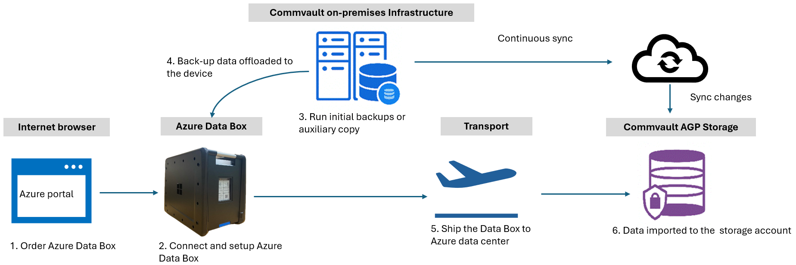

<!--
Initial score: 68 (770/28)
Curremnt score: 100 (826/0)
-->

# Commvault and Azure Data Box integration scenarios

**Commvault** provides support for Microsoft Azure Data Box, enabling enterprise customers to accelerate data movement to and from Azure with optimal security, speed, and control. Whether migrating data to Azure for backup or recovering from it during a disaster scenario, Commvault's tight integration with Azure Data Box delivers unmatched flexibility in bandwidth-constrained or high-volume environments. This article contains information about Commvault Air Gap Protect, a fully managed service. This article is also relevant for use cases in which you bring your own subscription and storage account, though some changes might apply.

**Common scenarios**: Although every migration scenario has its own unique requirements, the following examples illustrate three common use cases in which Commvault and Azure Data Box are used in tandem.

## Azure migration using Commvault Air Gap Protect and Data Box offline seeding

### Scenario Details

When bandwidth limitations make initial cloud seeding impractical, Commvault enables customers to use Azure Data Box to securely transport large volumes of backup data to Azure. This approach is especially useful during the onboarding phase of Commvault Air Gap Protect (AGP), Commvault's Backup-as-a-Service offering for Azure workloads. Instead of waiting weeks or months to transmit initial backups over WAN, customers can utilize the offline physical transfer capability of Azure Data Box to rapidly complete their copy seeding process.

### Solution flow overview

1. Sign in to the Azure portal and order an appropriately sized Azure Data Box.

2. Set up and configure the Azure Data Box device after it arrives.

3. Create initial backups using Commvault on-premises infrastructure.

4. Offload the selected backup data to an Azure Data Box device using Commvault's built-in integration. Configure Azure Storage as a cloud library, and redirect all write operations to your Data Box device. After configuration is complete, you can either run a full backup or an auxiliary copy operation. For more details on the required steps, visit Commvault's article on [offline seeding using Commvault Air Gap Protect](https://documentation.commvault.com/2024e/essential/seeding_air_gap_protect.html).

You can also utilize this process when bringing your own subscription and storage account. Detailed information is available within Commvault's [solution overview](https://documentation.commvault.com/2023e/expert/migrating_data_to_microsoft_azure_using_azure_data_box.html).

5. Return the Data Box device to Microsoft. Your data is uploaded directly into the target AGP storage account.

6. Commvault indexes the seeded data and continues incremental protection over the network.

**Benefits:**

- **Time:** Drastically reduces onboarding time for cloud backups.
- **Performance:** Bypasses internet bottlenecks with high-throughput offline transfer.
- **Cost:** Eliminates costly network upgrades or overage fees.
- **Security:** End-to-end encryption from Commvault to Azure via the Data Box.
- **Reliability:** Automated validation and indexing ensure data consistency and continuity.

## Cyber recovery acceleration, restoring on-premises data

### Scenario Details

When you recover from a ransomware attack or a total site failure, the speed to reach full recovery is critical. Commvault enables cyber recovery by using Azure Data Box to bring data stored in AGP back to an on-premises recovery environment. This approach bypasses the delays and risks of streaming massive datasets over compromised or insufficient WAN links.

### Solution flow overview

1. Identify clean recovery points stored within Commvault AGP in Azure.

2. [Create a Data Box export order](data-box-deploy-export-ordered.md) to export the data from the Commvault AGP storage account to Azure Data Box. Ship the device securely to the customer site.

3. Commvault restores data from the Data Box device directly into the local infrastructure.

You can read more details about how [Commvault Air Gap Protect and Data Box work together](https://documentation.commvault.com/2024e/essential/seeding_air_gap_protect.html).

**Benefits:**

- **Time:** Faster recovery from cloud with no bandwidth dependency.
- **Performance:** Physical transfer outpaces most WAN download capabilities.
- **Cost:** No need to keep high-performance links idle "just in case."
- **Security:** Data is fully encrypted both at rest and in transit.
- **Reliability:** Ideal for Cyber Resiliency planning in either disconnected or regulated environments.

## Cloud copy exit, retaining backup data on-premises

### Scenario Details

Some organizations choose to exit cloud storage for various strategic reasons. Commvault supports this workflow by enabling export of long-term backup copies from AGP to on-premises infrastructure using Azure Data Box. Instead of incurring high egress costs or waiting months for network transfers, customers can repatriate their backup datasets efficiently and securely.

### Solution flow overview

1. A customer identifies the Storage Pools within Commvault AGP to be retained locally.

2. The customer [creates an export order](/azure/databox/data-box-deploy-export-ordered) and an Azure Data Box is provisioned. Data is copied from Azure to the Data Box device.

3. Commvault ingests the data back into its on-premises backup infrastructure for continued retention or for operational use after the device is received.

You can read more details about how [Commvault Air Gap Protect and Data Box work together](https://documentation.commvault.com/2024e/essential/seeding_air_gap_protect.html).

**Benefits:**

- **Time:** Shortens cloud exit timelines.
- **Performance:** Moves tebibytes of data in days, not weeks.
- **Cost:** Avoids prolonged egress charges and operational downtime.
- **Security:** Maintains compliance with secure physical and digital transfer.
- **Reliability:** Ensures post-transfer data integrity and usability.

> [!NOTE]
> For complete, step by step guidance, refer to Commvault documentation or contact your Commvault representative.
