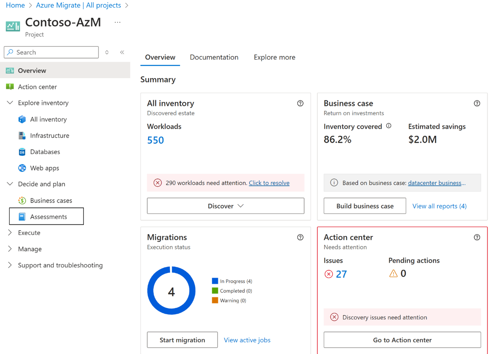
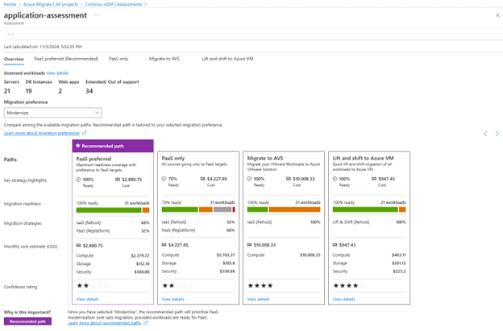
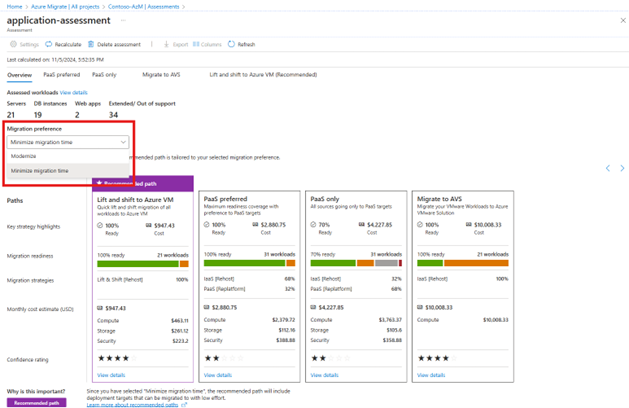

# Review an application assessment

In this article, you will learn about the concepts of an application/cross-workload assessment. This article will briefly talk about the characteristics of application assessment, how to review an application/cross-workload assessment, and different migration strategies.

## Overview

An Azure Migrate assessment evaluates your on-premises workloads or workloads hosted on other public clouds for migration to Azure, analyzing Azure readiness for different Azure targets, right-sizing, and cost. The application/cross-workload assessment enables you to assess all the constituent workloads of an application(s) together and identify a strategy(s) to migrate all the constituent workloads to Azure. Each migration strategy is complete in itself and tries to maximize the migration coverage. You can add any type of workload to the scope of an application/cross-workload assessment. You this article for a guided walkthrough of an application assessment.  

## Review an assessment

To review an application/cross-workload assessment follow the steps: 

1. On the Azure Migrate project **Overview** page, under **Decide and Plan**, select **Assessments**.

   
   
1. Search for the assessment with the **Applications** filter and select it.

   

1. Each application assessment if created on workloads discovered by the appliance will indicate a confidence rating. The confidence rating is a measure of quality of the data that was available to create the assessment. Explore the details about [confidence ratings](confidence-ratings.md) and ways to improve them.
1. Review the **Overview** page to get the summary of assessed workloads and different migration paths. You can check the recommended migration path that is selected based on your migration preference.  

   

   Each migration path provides you the assessment insights for all the workloads in the scope of the assessment and thus each path can help you identify the migration insights for each workload based on the targets associated with the migration path. There are four migration paths for each application assessment:

  | **Migration Strategy** | **Details**  |
  |----------|------|
  | PaaS preferred  | PaaS preferred migration path identifies the right-sized Azure targets for your workloads in such a way that you can maximize the PaaS coverage for your workloads. Workloads are assessed for PaaS targets (selected while creating the assessment) and if found ready are recommended as targets and the workloads that are not ready fall back to Azure VM lift and shift.   |
  | PaaS Only      | PaaS Only migration path identifies the right-sized Azure targets and readiness of your discovered workloads for PaaS targets (selected while creating the assessment) and if found ready are recommended as targets, if the workloads are not ready, they are not recommended for fallback targets. All the unidentified workloads are assessed for Azure VM lift and shift.   |
  | Lift and Shift to Azure VM  | The lift and shift to Azure VM migration path can be used to identify the readiness, right-sized targets and cost if you want to migrate your workloads to Azure VM   |
  | Migrate to AVS (Azure VMware Solution)  | The Migrate to AVS migration path can be used to identify the readiness, right-sized targets and cost to migrate and host your workloads on Azure VMware Solution   |

1. The recommended migration path is selected based on migration preference. If your migration preference is “Modernize”, the recommended migration path will try to maximize the PaaS coverage and if your preference is the minimize migration time the recommended strategy will be the one that takes minimum time to migrate. You can change the migration preference to change the migration strategy.

   

1. You can review the details of each strategy by navigating through the strategy tabs on the top or by clicking on View details on the migration path card.  
1. On the migration path tab, you can review the workload to Azure Service mapping, each mapping indicates how the source workloads fare against the target Azure service, you can review the readiness coverage, Targets, number of sources and mapped number of targets and the migration strategy.  
1. You can click on the Workload to Azure Service mapping to analyze each of them in detail. The detailed drilldowns can be used to identify readiness, right-sized targets, source properties, migration tools, estimated cost of hosting the source on the Azure, migration guidance and recommendation reasoning for each workload.
1. Review the drill-down details for [servers](review-assessment.md), [databases](review-sql-assessment.md), and [web apps](review-web-app-assessment.md).