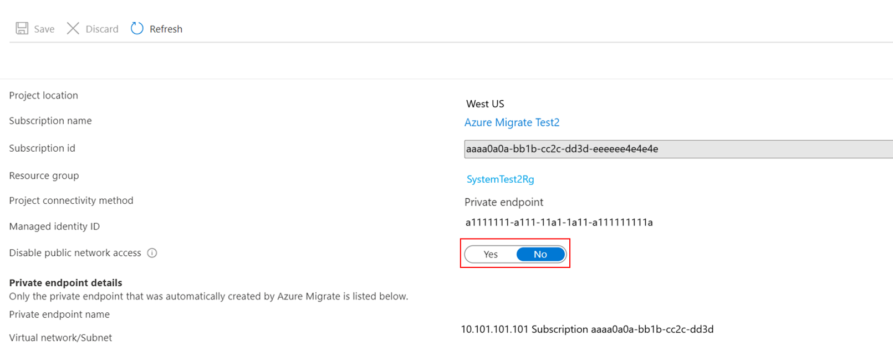

# Support requirements and considerations for private endpoint connectivity

The article series describes how to use Azure Migrate to discover, assess, and migrate servers over a private network by using [Azure Private Link](../private-link/private-endpoint-overview.md). You can use the Azure Migrate Discovery and Assessment tool and the Azure Migrate and Modernize tool to connect to Azure Migrate over an Azure ExpressRoute private peering connection or a site-to-site (S2S) VPN connection by using Private Link. For more information about these tools, see [What is Azure Migrate?](migrate-services-overview.md).

We recommend the method of private endpoint connectivity when there's an organizational requirement to access Azure Migrate and other Azure resources without traversing public networks. By using Private Link, you can use your existing ExpressRoute private peering circuits for better bandwidth or latency requirements.

## Supported geographies

The functionality is now in general availability in supported [public cloud](supported-geographies.md#public-cloud) and [government cloud](supported-geographies.md#azure-government) geographies.

## Required permissions

You must have Contributor + User Access Administrator or Owner permissions on the subscription.

## Supported scenarios and tools

Deployment | Details | Tools
--- | --- | ---
Discovery and assessment | Perform an agentless, at-scale discovery and assessment of your servers running on any platform. Examples include hypervisor platforms such as [VMware vSphere](./tutorial-discover-vmware.md) or [Microsoft Hyper-V](./tutorial-discover-hyper-v.md), public clouds such as [AWS](./tutorial-discover-aws.md) or [GCP](./tutorial-discover-gcp.md), or even [bare-metal servers](./tutorial-discover-physical.md). | Azure Migrate Discovery and Assessment
Software inventory | Discover apps, roles, and features running on VMware VMs. | Azure Migrate Discovery and Assessment
Dependency visualization | Use dependency analysis to identify and understand dependencies across servers.    [Agentless dependency visualization](./how-to-create-group-machine-dependencies-agentless.md) is supported natively with Azure Migrate support for Private Link.   [Agent-based dependency visualization](./how-to-create-group-machine-dependencies.md) requires internet connectivity. [Learn how to use private endpoints for agent-based dependency visualization](/azure/azure-monitor/logs/private-link-security). | Azure Migrate Discovery and Assessment
Migration | Perform [agentless VMware migrations](./tutorial-migrate-vmware.md), perform [agentless Hyper-V migrations](./tutorial-migrate-hyper-v.md), or use the agent-based approach to migrate your [VMware VMs](./tutorial-migrate-vmware-agent.md), [Hyper-V VMs](./tutorial-migrate-physical-virtual-machines.md), [physical servers](./tutorial-migrate-physical-virtual-machines.md), [VMs running on AWS](./tutorial-migrate-aws-virtual-machines.md), [VMs running on GCP](./tutorial-migrate-gcp-virtual-machines.md), or VMs running on a different virtualization provider. | Azure Migrate and Modernize

### Other integrated tools

Other migration tools might not be able to upload usage data to the Azure Migrate project if public network access is turned off. The Azure Migrate project should be configured to allow traffic from all networks so that it can receive data from other Microsoft or external offerings.

To turn on public network access for the Azure Migrate project:

1. Sign in to the Azure portal and go to **Azure Migrate**.
1. Under **Manage**, select **Properties**.
1. Select **No** > **Save**.

## Other considerations

Consideration | Details
--- | ---
Pricing | See [Azure page blobs pricing](https://azure.microsoft.com/pricing/details/storage/page-blobs/) and [Azure Private Link pricing](https://azure.microsoft.com/pricing/details/private-link/).
Virtual network requirements | The ExpressRoute/VPN gateway endpoint should reside in the selected virtual network or a virtual network connected to it. You might need about 15 IP addresses in the virtual network.
PowerShell support | PowerShell isn't supported. We recommend using the Azure portal or REST APIs for Azure Migrate Private Link support.

## Related content

- [Discover and assess servers for migration using Private Link](discover-and-assess-using-private-endpoints.md)
- [Migrate Hyper-V servers to Azure using Private Link](migrate-servers-to-azure-using-private-link.md)
- [Troubleshoot network connectivity](troubleshoot-network-connectivity.md)
