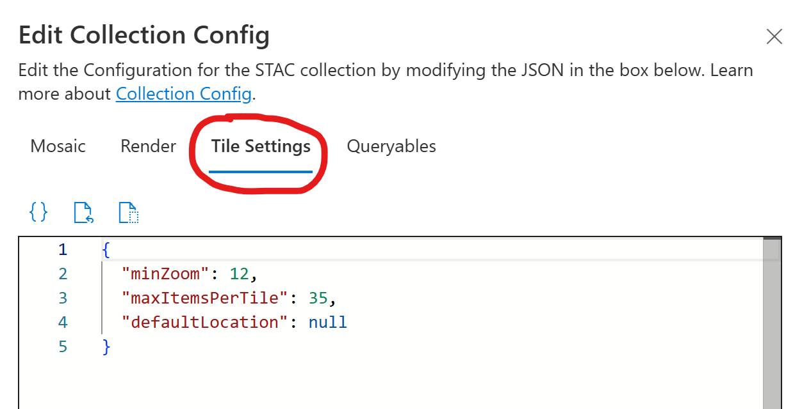

# Tile settings in Microsoft Planetary Computer Pro

For each collection in Microsoft Planetary Computer Pro, you can configure the tile settings, which determine mosaic behavior such as the default location, and minimum zoom level.

In this article, see where to find and modify tile settings for Microsoft Planetary Computer Pro.

## Prerequisites

- You have a [STAC collection with Microsoft Planetary Computer Pro GeoCatalog](./create-stac-collection.md)

## Find tile settings

The tile settings are found by going to the Collection page and selecting the Configuration button.



The settings are in the form of a JSON object.

### Example tile settings

```JSON
{
  "minZoom": 12,
  "maxItemsPerTile": 35,
  "defaultLocation": {
    "zoom": 12,
    "coordinates": [
      8.9637,
      -79.5437
    ]
  }
}
```

### Zoom level

High resolution imagery should have a high min zoom level to avoid experiencing latency when using the explorer. Low resolution imagery can have lower min zoom levels without issue.

> [!NOTE]
> Currently, zoom needs to be an integer, even though the UX supports zoom levels between integers.
 
### Default location

The `defaultLocation` field allows specifying the default zoom level and coordinates. For example:

```JSON
{
  "defaultLocation": {
    "zoom": 12,
    "coordinates": [
      8.9637,
      -79.5437
    ]
  }
}
```

> [!NOTE]
> In the list of items, there's a menu item called "Set view as default location".  This isn't currently enabled.


