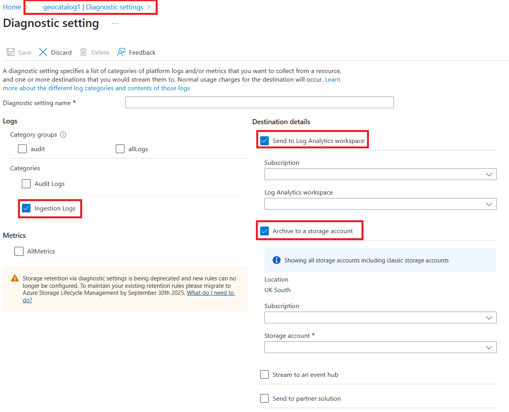
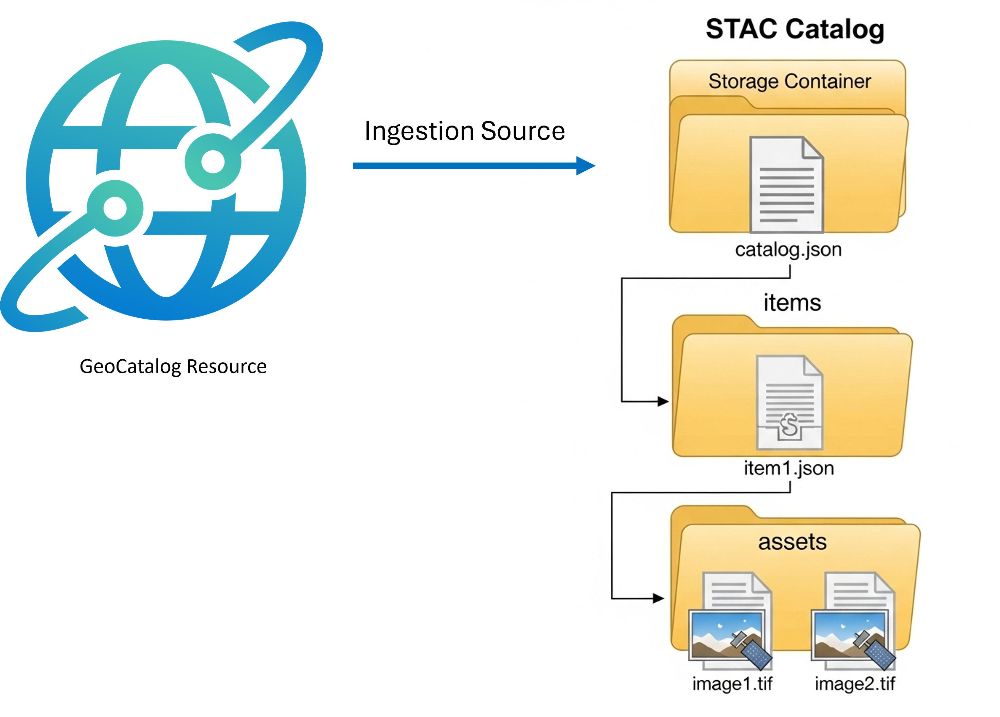

# Troubleshooting data ingestion in Microsoft Planetary Computer Pro

Data ingestion issues in Microsoft Planetary Computer Pro GeoCatalog typically fall into two categories: access permission problems and STAC (SpatioTemporal Asset Catalog) validation errors. This article helps you identify and resolve these common ingestion failures.

## Prerequisites

- An active [Microsoft Planetary Computer Pro GeoCatalog](./deploy-geocatalog-resource.md)
- [Azure CLI](/cli/azure/install-azure-cli) installed and authenticated
- Access to the storage account containing your geospatial data
- STAC-compliant metadata for your geospatial assets

## Symptoms

Data ingestion workflows fail with specific [error codes](./error-codes-ingestion.md). You might encounter two main categories of problems:

1.  **Access and Permission Errors:** The ingestion process fails because the GeoCatalog service can't read the source data. You might see error codes like `IngestionAuthenticationFailed`, `IngestionResourceForbidden`, or `IngestionResourceUriNotFound`.
2.  **STAC Validation Errors:** The ingestion fails because the provided STAC metadata doesn't conform to the STAC standard or service-specific rules. You might see error codes like `StacValidationFailed`, `InvalidStacCatalog`, or `InvalidInputData`.

## Identifying Errors during Ingestion

For [Single Item Ingestion](./ingestion-overview.md#single-item-ingestion), if an ingestion error occurs, the API response or user interface returns the error code.

   

For [Bulk Ingestion](./ingestion-overview.md#bulk-ingestion), the errors can be different for each of the individual STAC Items. To see the individual errors, navigate to the Azure portal and locate the **Diagnostic Settings** for your GeoCatalog resource. Here, you can enable **Ingestion Logs.**

   

Once logging is enabled, attempt your ingestion again. If the ingestion fails, go to the location you specified in diagnostic settings to review the errors. 

## Cause 1: GeoCatalog can't access source data

The GeoCatalog service lacks the necessary permissions to read your STAC metadata (for example, `catalog.json`) and the associated data assets (for example, GeoTIFF files). This error is because a valid [ingestion source](./ingestion-source.md) isn't configured for the storage location. Ingestion sources must be configured for both the metadata files and the asset files if they're configured in different locations.

### Solution 1: Configure ingestion source permissions

1. **Verify ingestion source exists**
   - Navigate to your GeoCatalog's **Settings** tab
   - Check if an ingestion source is configured for your storage container
   - If not, [create an ingestion source](./ingestion-source.md)

2. **Validate credentials**
   
   For [managed identity](./set-up-ingestion-credentials-managed-identity.md):
   - Ensure the managed identity has the **Storage Blob Data Reader** role
   - Verify the role assignment is at the correct scope (storage account or container level)
   - Check that the managed identity is associated with your GeoCatalog
   
   For [SAS tokens](./set-up-ingestion-credentials-managed-identity.md):
   - Verify the token isn't expired
   - Ensure the token has `read` and `list` permissions
   - Confirm the token is scoped to the correct container

3. **Check access to all required locations**

   

   Bulk Ingestion supports static STAC catalogs that reference assets located in storage beyond the container the `catalog.json` file is stored in. However, every storage container requires an ingestion source for GeoCatalog to maintain permissions to ingest data. 
   
   Ensure GeoCatalog has permissions to:
   - STAC catalog JSON file
   - All STAC item JSON files
   - All asset files referenced in the STAC items

4.  **Retry Ingestion:** 
After verifying and correcting the ingestion source configuration, try the ingestion again.

## Cause 2: STAC metadata validation failed

The ingestion service strictly enforces the [STAC specification](./stac-overview.md). Your ingestion fails if your STAC Catalog, Collection, or Item JSONs don't conform to the standard or meet specific GeoCatalog requirements.

### Solution 2.1: Fix invalid STAC format and values

1.  **Validate Locally:** Before ingesting, use a library like `pystac` to validate your STAC objects. This approach can catch many common formatting issues before ingesting data.
2.  **Check Required Fields:**
    *   Ensure all mandatory STAC fields are present in your metadata.
    *   For single-item ingestion, the STAC Item JSON **must** include the `collection` field, with its value set to the ID of the target collection in your GeoCatalog.
3.  **Format Datetime:** Verify that all `datetime` fields conform to the [ISO 8601](https://en.wikipedia.org/wiki/ISO_8601) standard (for example, `YYYY-MM-DDTHH:MM:SSZ`). The `pystac` library provides utilities to format datetimes correctly.
4.  **Check for Invalid Characters and Lengths:**
    *   STAC `Collection IDs`, `Item IDs`, and `Asset keys` must not contain the following characters: `-`, `_`, `+`, `(`, `)`, and `.`.
    *   `Item IDs` must be fewer than 150 characters.
    *   `Asset keys` must be fewer than 256 characters.
5.  **Retry Ingestion:** After correcting the STAC metadata, try the ingestion again.

### Solution 2.2: Simplify STAC extensions

1.  **Identify Extensions:** Check if your STAC Items use any [STAC extensions](https://stac-extensions.github.io/). While powerful, they add complexity to validation, and many aren't in a finalized status.
2.  **Remove Non-Essential Extensions:** If you suspect an extension is causing a `StacValidationFailed` error, try removing it from your STAC Item's `stac_extensions` list and any associated fields.
3.  **Re-validate and Retry:** Validate the simplified STAC Item locally, then retry the ingestion.

## Related content

- [Error codes: Microsoft Planetary Computer Pro ingestion](./error-codes-ingestion.md)
- [Configure an ingestion source using managed identity](./set-up-ingestion-credentials-managed-identity.md)
- [Create a STAC Item](./create-stac-item.md)
- [Ingest data into GeoCatalog with the Bulk Ingestion API](./bulk-ingestion-api.md)
- [STAC overview](./stac-overview.md)