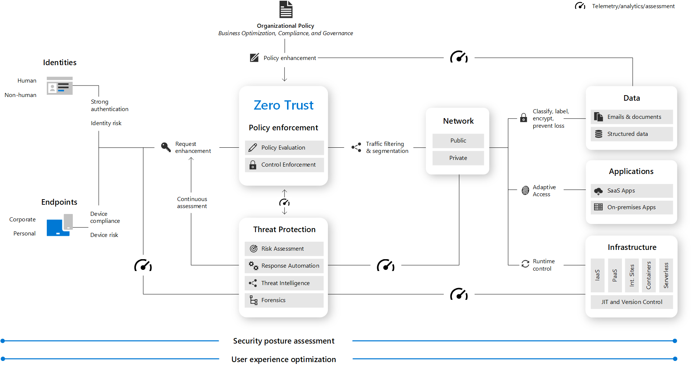
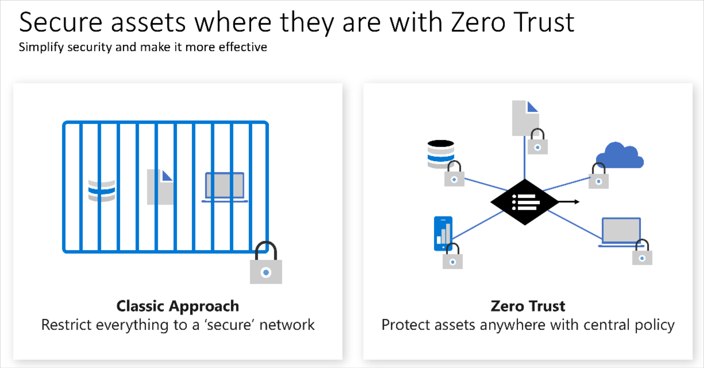

# Zero Trust security

Zero Trust is a security model that assumes breach and verifies each request as though it originated from an uncontrolled network. In this article, you'll learn about the guiding principles of Zero Trust and find resources to help you implement Zero Trust.

## Guiding principles of Zero Trust

Today, organizations need a new security model that effectively adapts to the complexity of the modern environment, embraces the mobile workforce, and protects people, devices, applications, and data wherever they are located.

To address this new world of computing, Microsoft highly recommends the Zero Trust security model, which is based on these guiding principles:

- **Verify explicitly** - Always authenticate and authorize based on all available data points, including user identity, location, device health, and service or workload.
- **Use least privilege access** - Limit user access with Just-In-Time and Just-Enough-Access (JIT/JEA), risk-based adaptive policies, and data protection.
- **Assume breach** - Minimize blast radius and segment access. Verify end-to-end encryption and use analytics to get visibility, drive threat detection, and improve defenses.

For more information about Zero Trust, see [Microsoft's Zero Trust Guidance Center](/security/zero-trust).

## Zero Trust architecture

A Zero Trust approach extends throughout the entire digital estate and serves as an integrated security philosophy and end-to-end strategy.

This illustration provides a representation of the primary elements that contribute to Zero Trust.

In the illustration:

- Security policy enforcement is at the center of a Zero Trust architecture. This includes multifactor authentication with conditional access that takes into account user account risk, device status, and other criteria and policies that you set.
- [Identities](/security/zero-trust/deploy/identity), [devices](/security/zero-trust/deploy/endpoints) (also called endpoints), [data](/security/zero-trust/deploy/data), [applications](/security/zero-trust/deploy/applications), [network](/security/zero-trust/deploy/networks), and other [infrastructure](/security/zero-trust/deploy/infrastructure) components are all configured with appropriate security. Policies that are configured for each of these components are coordinated with your overall Zero Trust strategy. For example, device policies determine the criteria for healthy devices and conditional access policies require healthy devices for access to specific apps and data.
- Threat protection and intelligence monitors the environment, surfaces current risks, and takes automated action to remediate attacks.

For more information about deploying technology components of the Zero Trust architecture, see Microsoft's [Deploying Zero Trust solutions](/security/zero-trust/deploy/overview).

As an alternative to deployment guidance that provides configuration steps for each of the technology components protected by Zero Trust principles, [Rapid Modernization Plan (RaMP)](/security/zero-trust/zero-trust-ramp-overview) guidance is based on initiatives and gives you a set of deployment paths to more quickly implement key layers of protection.

## From security perimeter to Zero Trust

The traditional approach of access control for IT has been based on restricting access to a corporate network and then supplementing it with more controls as appropriate. This model restricts all resources to a corporate owned network connection and has become too restrictive to meet the needs of a dynamic enterprise.

Organizations must embrace a Zero Trust approach to access control as they embrace remote work and use cloud technology to digitally transform their business model, customer engagement model, employee engagement, and empowerment model.

Zero Trust principles help establish and continuously improve security assurances, while maintaining flexibility to keep pace with this new world. Most zero trust journeys start with access control and focus on identity as a preferred and primary control while they continue to embrace network security technology as a key element. Network technology and the security perimeter tactic are still present in a modern access control model, but they aren't the dominant and preferred approach in a complete access control strategy.

For more information on the Zero Trust transformation of access control, see the Cloud Adoption Framework's [access control](/azure/cloud-adoption-framework/secure/access-control).

## Conditional access with Zero Trust

The Microsoft approach to Zero Trust includes [Conditional Access](../../active-directory/conditional-access/overview.md) as the main policy engine. Conditional Access is used as the policy engine for a Zero Trust architecture that covers both policy definition and policy enforcement. Based on various signals or conditions, Conditional Access can block or give limited access to resources.

To learn more about creating an access model based on Conditional Access that's aligned with the guiding principles of Zero Trust, see [Conditional Access for Zero Trust](/azure/architecture/guide/security/conditional-access-design).

## Develop apps using Zero Trust principles

Zero Trust is a security framework that does not rely on the implicit trust afforded to interactions behind a secure network perimeter. Instead, it uses the principles of explicit verification, least privileged access, and assuming breach to keep users and data secure while allowing for common scenarios like access to applications from outside the network perimeter.

As a developer, it is essential that you use Zero Trust principles to keep users safe and data secure. App developers can improve app security, minimize the impact of breaches, and ensure that their applications meet their customers' security requirements by adopting Zero Trust principles.

For more information on best practices key to keeping your apps secure, see:

- [Microsoft's Building apps with a Zero Trust approach to identity](/security/zero-trust/develop/identity#top-recommendations-for-zero-trust)
- [Build Zero Trust-ready apps using Microsoft identity platform features and tools](../../active-directory/develop/zero-trust-for-developers.md)

## Zero Trust and Microsoft 365

Microsoft 365 is built with many security and information protection capabilities to help you build Zero Trust into your environment. Many of the capabilities can be extended to protect access to other SaaS apps your organization uses and the data within these apps. See [deploying Zero Trust for Microsoft 365](/microsoft-365/security/microsoft-365-zero-trust#deploying-zero-trust-for-microsoft-365) to learn more.

To learn about recommendations and core concepts for deploying secure email, docs, and apps policies and configurations for Zero Trust access to Microsoft 365, see [Zero Trust identity and device access configurations](/microsoft-365/security/office-365-security/microsoft-365-policies-configurations).

## Next steps

- To learn how to enhance your security solutions by integrating with Microsoft products, see [Integrate with Microsoft's Zero Trust solutions](/security/zero-trust/integrate/overview)