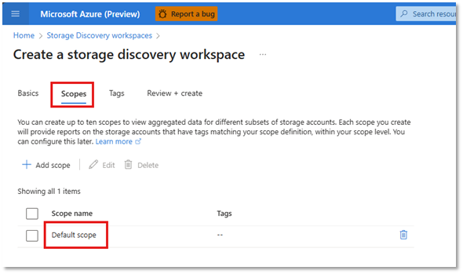

# Create and manage a storage discovery workspace

The Azure Storage Discovery Workspace (ASDW) is a central resource within the Azure Storage Discovery platform designed to help users manage and visualize storage data across various scopes—such as tenants, subscriptions, and resource groups.

This article helps you create an ASDW resource.

## [Portal](#tab/azure-portal)

### Create an ASDW from Portal

Click on **Create**

> [!div class="mx-imgBorder"]
> 

Choose a **Subscription** and **Resource group** to create the discovery workspace

The following table describes each element.

| Element | Description |
|---|--|
| `Name` | The name of the Discovery workspace resource. |
| `Description` | Optional. Description of the Discovery workspace resource. |
| `Region` | Azure region where the Discovery resource is created.1|
| `Pricing plan` | Storage Discovery pricing plan.2|

1 For information on regions covered, see [Storage Discovery workspace regions](includes/control-plane-regions.md) and for storage account regions covered by Discovery, see [Storage Discovery regions](includes/data-plane-regions.md)  
2 For information on Storage Discovery pricing plan, see [Understand Storage Discovery Pricing](pricing.md).

### Define WorkspaceRoots
WorkspaceRoots specifies the top-level Azure resource identifiers - such as subscriptions or resource groups - where Storage Discovery initiates its scan for storage accounts. These identifiers serve as the root of the discovery process, defining the overall scope and boundaries of your Azure estate that is analyzed. Select the subscriptions and/or resource groups that need to be included in the workspace.

> [!NOTE]
> - Ensure that the user or service principal deploying the workspace has at least **Reader** access to each specified root.
> - Up to 100 resources - subscriptions and/or resource groups can be included in one ASDW.

> [!div class="mx-imgBorder"]
> 

Once the subscriptions, resource groups or tenant is added to the workspace, an access check is run to verify if the user has Microsoft.Storage/storageAccounts/read on the added resources. As the checks are running, status of the run is as shown:

> [!div class="mx-imgBorder"]
> 

If you do not have Microsoft.Storage/storageAccounts/read on any of the resources added, remove the resource from the workSpaceRoots to proceed with the creation of workspace or resolve the access issue and try again.

### Create Scope
Scopes are logical groupings of storage accounts within the defined workspaceRoots.They allow you to filter and organize data using tags and resource types. Scope enables targeted insights - you can create scopes for different departments, environments, or compliance zones.

> [!div class="mx-imgBorder"]
> 

> [!IMPORTANT]
> **Default Scope** is added automatically, which would include all storage accounts within the subscriptions or resource groups added in the **workspaceRoots**

Add tags, if needed on the ASDW resource and click on Review and Create.

If the access check for the workspaceRoots resources hasn’t finished yet, the Review and Create tab shows a message saying the check is still in progress. You won’t be able to deploy the resource until the check is complete.

> [!div class="mx-imgBorder"]
> 

> [!NOTE]
> Note that Discovery resource creation fails if the access checks on any added subscription or resource group or tenant is not successful.

When the access checks completes successfully, resource can be deployed.

> [!div class="mx-imgBorder"]
> 

> [!NOTE]
> Note that it will take upto 24 hours for the metrics to start appearing in the Reports after the scope is created.