# Deploy Azure File Sync

Use Azure File Sync to centralize your organization's file shares in Azure Files, while keeping the flexibility, performance, and compatibility of an on-premises file server. Azure File Sync transforms Windows Server into a quick cache of your Azure file share. You can use any protocol that's available on Windows Server to access your data locally, including SMB, NFS, and FTPS. You can have as many caches as you need across the world.

We strongly recommend that you read [Plan to deploy Azure Files](../files/storage-files-planning.md) and [Plan for an Azure File Sync deployment](file-sync-planning.md) before you complete the steps described in this article.

## Prerequisites

# [Portal](#tab/azure-portal)

- You need an Azure file share in the same region where you want to deploy Azure File Sync. We recommend provisioned v2 file shares for all new deployments. For more information, see:

  - [Azure File Sync region availability](file-sync-planning.md#azure-file-sync-region-availability)
  - [Create an SMB Azure file share](../files/storage-how-to-create-file-share.md?toc=/azure/storage/filesync/toc.json)
  - [Provisioned v2 model](../files/understanding-billing.md#provisioned-v2-model)

- You must enable the following storage account settings to allow Azure File Sync access to the storage account:  

  - SMB security settings must allow the SMB 3.1.1 protocol version, NTLM v2 authentication, and AES-128-GCM encryption. To check the SMB security settings on the storage account, see [SMB security settings](../files/files-smb-protocol.md#smb-security-settings).
  - **Allow storage account key access** must be set to **Enabled**. To check this setting, go to your storage account and select **Configuration** in the **Settings** section.

- You need at least one supported instance of Windows Server to sync with Azure File Sync. For more information about supported versions of Windows Server and recommended system resources, see [Considerations for Windows file servers](file-sync-planning.md#considerations-for-windows-file-servers).

- The following Windows updates must be installed on the Windows Server instance:

  - Windows Server 2012 R2: [KB5021653](https://support.microsoft.com/topic/kb5021653-out-of-band-update-for-windows-server-2012-r2-november-17-2022-8e6ec2e9-6373-46d7-95bc-852f992fd1ff)
  - Windows Server 2016: [KB5040562](https://support.microsoft.com/topic/kb5040562-servicing-stack-update-for-windows-10-version-1607-and-server-2016-july-9-2024-281c97b9-c566-417e-8406-a84efd30f70c)
  - Windows Server 2019: [KB5005112](https://support.microsoft.com/topic/kb5005112-servicing-stack-update-for-windows-10-version-1809-august-10-2021-df6a9e0d-8012-41f4-ae74-b79f1c1940b2) and [KB5040430](https://support.microsoft.com/topic/july-9-2024-kb5040430-os-build-17763-6054-0bb10c24-db8c-47eb-8fa9-9ebc06afa4e7)

- The administrator who registers the server and creates the cloud endpoint must be a member of the management role [Azure File Sync Administrator](/azure/role-based-access-control/built-in-roles/storage#azure-file-sync-administrator), Owner, or Contributor for the storage sync service. This role can be configured under **Access Control (IAM)** in the Azure portal for the storage sync service.

- If you intend to use Azure File Sync with a Windows Server failover cluster, you must configure the **File Server for general use** role before you install the Azure File Sync agent on each node in the cluster. For more information on how to configure the **File Server for general use** role on a failover cluster, see [Deploy a two-node clustered file server](/windows-server/failover-clustering/deploy-two-node-clustered-file-server).

  > [!NOTE]
  > The only scenario that Azure File Sync supports is a Windows Server failover cluster with clustered disks. For more information, see [Failover clustering](file-sync-planning.md#failover-clustering).

- Although you can manage cloud resources by using the Azure portal, PowerShell cmdlets provide advanced functionality for registered servers. You run these cmdlets locally in either PowerShell 5.1 or PowerShell 6+. On Windows Server 2012 R2, you can verify that you're running at least PowerShell 5.1.\* by checking the value of the `PSVersion` property of the `$PSVersionTable` object:

  ```powershell
  $PSVersionTable.PSVersion
  ```

  If your `PSVersion` value is less than `5.1.*`, you need to upgrade by downloading and installing [Windows Management Framework 5.1](https://www.microsoft.com/download/details.aspx?id=54616). The appropriate package to download and install for Windows Server 2012 R2 is **Win8.1AndW2K12R2-KB\*\*\*\*\*\*\*-x64.msu**.

  You can use PowerShell 6+ with any supported system and download it via its [GitHub page](https://github.com/PowerShell/PowerShell#get-powershell).

# [PowerShell](#tab/azure-powershell)

- You need an Azure file share in the same region where you want to deploy Azure File Sync. We recommend provisioned v2 file shares for all new deployments. For more information, see:

  - [Azure File Sync region availability](file-sync-planning.md#azure-file-sync-region-availability)
  - [Create an SMB Azure file share](../files/storage-how-to-create-file-share.md?toc=/azure/storage/filesync/toc.json)
  - [Provisioned v2 model](../files/understanding-billing.md#provisioned-v2-model)

- You must enable the following storage account settings to allow Azure File Sync access to the storage account:  

  - SMB security settings must allow the SMB 3.1.1 protocol version, NTLM v2 authentication, and AES-128-GCM encryption. To check the SMB security settings on the storage account, see [SMB security settings](../files/files-smb-protocol.md#smb-security-settings).
  - **Allow storage account key access** must be set to **Enabled**. To check this setting, go to your storage account and select **Configuration** in the **Settings** section.

- The administrator who registers the server and creates the cloud endpoint must be a member of the management role [Azure File Sync Administrator](/azure/role-based-access-control/built-in-roles/storage#azure-file-sync-administrator), Owner, or Contributor for the storage sync service. This role can be configured under **Access Control (IAM)** in the Azure portal for the storage sync service.

- You need at least one supported instance of Windows Server to sync with Azure File Sync. For more information about supported versions of Windows Server and recommended system resources, see [Considerations for Windows file servers](file-sync-planning.md#considerations-for-windows-file-servers).

- The following Windows updates must be installed on the Windows Server instance:

  - Windows Server 2012 R2: [KB5021653](https://support.microsoft.com/topic/kb5021653-out-of-band-update-for-windows-server-2012-r2-november-17-2022-8e6ec2e9-6373-46d7-95bc-852f992fd1ff)
  - Windows Server 2016: [KB5040562](https://support.microsoft.com/topic/kb5040562-servicing-stack-update-for-windows-10-version-1607-and-server-2016-july-9-2024-281c97b9-c566-417e-8406-a84efd30f70c)
  - Windows Server 2019: [KB5005112](https://support.microsoft.com/topic/kb5005112-servicing-stack-update-for-windows-10-version-1809-august-10-2021-df6a9e0d-8012-41f4-ae74-b79f1c1940b2) and [KB5040430](https://support.microsoft.com/topic/july-9-2024-kb5040430-os-build-17763-6054-0bb10c24-db8c-47eb-8fa9-9ebc06afa4e7)

- If you intend to use Azure File Sync with a Windows Server failover cluster, you must configure the **File Server for general use** role before you install the Azure File Sync agent on each node in the cluster. For more information on how to configure the **File Server for general use** role on a failover cluster, see [Deploy a two-node clustered file server](/windows-server/failover-clustering/deploy-two-node-clustered-file-server).

  > [!NOTE]
  > The only scenario that Azure File Sync supports is a Windows Server failover cluster with clustered disks. For more information, see [Failover clustering](file-sync-planning.md#failover-clustering).

- You need PowerShell 5.1 or PowerShell 6+. You can use the Az PowerShell module for Azure File Sync on any supported system, including non-Windows systems. However, the cmdlet for server registration must always be run on the Windows Server instance that you're registering. (You can do this task directly or via PowerShell remoting.)

  On Windows Server 2012 R2, verify that you're running at least PowerShell 5.1.\* by checking the value of the `PSVersion` property of the `$PSVersionTable` object:

  ```powershell
  $PSVersionTable.PSVersion
  ```

  If your `PSVersion` value is less than `5.1.*`, you need to upgrade by downloading and installing [Windows Management Framework 5.1](https://www.microsoft.com/download/details.aspx?id=54616). The appropriate package to download and install for Windows Server 2012 R2 is **Win8.1AndW2K12R2-KB\*\*\*\*\*\*\*-x64.msu**.

  You can use PowerShell 6+ with any supported system and download it via its [GitHub page](https://github.com/PowerShell/PowerShell#get-powershell).

- If you opted to use PowerShell 5.1, ensure that at least .NET 4.7.2 is installed. [Learn more about .NET Framework versions and dependencies](/dotnet/framework/migration-guide/versions-and-dependencies) on your system.

  If you're installing .NET 4.7.2+ on Windows Server Core, you must install with the `quiet` and `norestart` flags, or the installation will fail. For example, if you're installing .NET 4.8, the command looks like the following example:

  ```PowerShell
   Start-Process -FilePath "ndp48-x86-x64-allos-enu.exe" -ArgumentList "/q /norestart" -Wait
   ```

- You need the Az PowerShell module. For instructions, see [Install and configure Azure PowerShell](/powershell/azure/install-azure-powershell).

  The Az.StorageSync module is installed automatically when you install the Az PowerShell module.

# [Azure CLI](#tab/azure-cli)

- You need an Azure file share in the same region where you want to deploy Azure File Sync. We recommend provisioned v2 file shares for all new deployments. For more information, see:

  - [Azure File Sync region availability](file-sync-planning.md#azure-file-sync-region-availability)
  - [Create an SMB Azure file share](../files/storage-how-to-create-file-share.md?toc=/azure/storage/filesync/toc.json)
  - [Provisioned v2 model](../files/understanding-billing.md#provisioned-v2-model)

- You must enable the following storage account settings to allow Azure File Sync access to the storage account:  

  - SMB security settings must allow the SMB 3.1.1 protocol version, NTLM v2 authentication, and AES-128-GCM encryption. To check the SMB security settings on the storage account, see [SMB security settings](../files/files-smb-protocol.md#smb-security-settings).
  - **Allow storage account key access** must be set to **Enabled**. To check this setting, go to your storage account and select **Configuration** in the **Settings** section.

- The administrator who registers the server and creates the cloud endpoint must be a member of the management role [Azure File Sync Administrator](/azure/role-based-access-control/built-in-roles/storage#azure-file-sync-administrator), Owner, or Contributor for the storage sync service. This role can be configured under **Access Control (IAM)** in the Azure portal for the storage sync service.

- You need at least one supported instance of Windows Server to sync with Azure File Sync. For more information about supported versions of Windows Server and recommended system resources, see [Considerations for Windows file servers](file-sync-planning.md#considerations-for-windows-file-servers).

- The following Windows updates must be installed on the Windows Server instance:

  - Windows Server 2012 R2: [KB5021653](https://support.microsoft.com/topic/kb5021653-out-of-band-update-for-windows-server-2012-r2-november-17-2022-8e6ec2e9-6373-46d7-95bc-852f992fd1ff)
  - Windows Server 2016: [KB5040562](https://support.microsoft.com/topic/kb5040562-servicing-stack-update-for-windows-10-version-1607-and-server-2016-july-9-2024-281c97b9-c566-417e-8406-a84efd30f70c)
  - Windows Server 2019: [KB5005112](https://support.microsoft.com/topic/kb5005112-servicing-stack-update-for-windows-10-version-1809-august-10-2021-df6a9e0d-8012-41f4-ae74-b79f1c1940b2) and [KB5040430](https://support.microsoft.com/topic/july-9-2024-kb5040430-os-build-17763-6054-0bb10c24-db8c-47eb-8fa9-9ebc06afa4e7)

- If you intend to use Azure File Sync with a Windows Server failover cluster, you must configure the **File Server for general use** role before you install the Azure File Sync agent on each node in the cluster. For more information on how to configure the **File Server for general use** role on a failover cluster, see [Deploy a two-node clustered file server](/windows-server/failover-clustering/deploy-two-node-clustered-file-server).

  > [!NOTE]
  > The only scenario that Azure File Sync supports is a Windows Server failover cluster with clustered disks. For more information, see [Failover clustering](file-sync-planning.md#failover-clustering).

- Complete the Azure CLI installation, authentication, and setup:

  1. [Install the Azure CLI](/cli/azure/install-azure-cli).

     If you prefer, you can also use Azure Cloud Shell to complete the steps in this tutorial. Azure Cloud Shell is an interactive shell environment that you use through your browser. Open Cloud Shell by using one of these methods:

     - In the upper-right corner of a code block, select **Try It**. This action opens Azure Cloud Shell, but it doesn't automatically copy the code to Cloud Shell.

     - Go to [https://shell.azure.com](https://shell.azure.com).

     - In the [Azure portal](https://portal.azure.com), on the menu bar, select the **Cloud Shell** button.

  1. Sign in to Azure. If you're using a local installation of the CLI, use the [az login](/cli/azure/reference-index#az-login) command:

     ```azurecli
     az login
     ```

     Follow the steps displayed in your terminal to complete the authentication process.

  1. Install the [az filesync](/cli/azure/storagesync) Azure CLI extension:

     ```azurecli
     az extension add --name storagesync
     ```

     After you install the **storagesync** extension reference, you receive the following warning:

     ```output
     The installed extension 'storagesync' is experimental and not covered by customer support. Please use with discretion.
     ```

- Although you can manage cloud resources by using the Azure CLI, PowerShell cmdlets provide advanced functionality for registered servers. You run these cmdlets locally in either PowerShell 5.1 or PowerShell 6+. On Windows Server 2012 R2, you can verify that you're running at least PowerShell 5.1.\* by checking the value of the `PSVersion` property of the `$PSVersionTable` object:

  ```powershell
  $PSVersionTable.PSVersion
  ```

  If your `PSVersion` value is less than `5.1.*`, you need to upgrade by downloading and installing [Windows Management Framework 5.1](https://www.microsoft.com/download/details.aspx?id=54616). The appropriate package to download and install for Windows Server 2012 R2 is **Win8.1AndW2K12R2-KB\*\*\*\*\*\*\*-x64.msu**.

  You can use PowerShell 6+ with any supported system and download it via its [GitHub page](https://github.com/PowerShell/PowerShell#get-powershell).

---

## Prepare Windows Server to use with Azure File Sync

For each server that you intend to use with Azure File Sync, including each server node in a failover cluster, disable **Internet Explorer Enhanced Security Configuration**. This action is required only for initial server registration. You can re-enable the setting after the server is registered.

You can skip this action if you're deploying Azure File Sync on Windows Server Core.

# [Portal](#tab/azure-portal)

1. Open Server Manager.

2. Select **Local Server**.

    

3. On the **Properties** pane, select the link for **IE Enhanced Security Configuration**.

    

4. In the **Internet Explorer Enhanced Security Configuration** dialog, select **Off** under both **Administrators** and **Users**.

    

# [PowerShell](#tab/azure-powershell)

In an elevated PowerShell session, run the following code:

```powershell
$installType = (Get-ItemProperty "HKLM:\SOFTWARE\Microsoft\Windows NT\CurrentVersion\").InstallationType

# This step is not required for Server Core
if ($installType -ne "Server Core") {
    # Disable Internet Explorer Enhanced Security Configuration 
    # for administrators
    Set-ItemProperty -Path "HKLM:\SOFTWARE\Microsoft\Active Setup\Installed Components\{A509B1A7-37EF-4b3f-8CFC-4F3A74704073}" -Name "IsInstalled" -Value 0 -Force

    # Disable Internet Explorer Enhanced Security Configuration 
    # for users
    Set-ItemProperty -Path "HKLM:\SOFTWARE\Microsoft\Active Setup\Installed Components\{A509B1A8-37EF-4b3f-8CFC-4F3A74704073}" -Name "IsInstalled" -Value 0 -Force

    # Force Internet Explorer closed, if it's open. This is required to fully apply the setting.
    # Save any work you have open in the Internet Explorer browser. This command won't affect other browsers,
    # including Microsoft Edge.
    Stop-Process -Name iexplore -ErrorAction SilentlyContinue
}
```

# [Azure CLI](#tab/azure-cli)

Follow the instructions for the Azure portal or PowerShell.

---

## Deploy a storage sync service

The deployment of Azure File Sync starts with placing a *storage sync service* resource in a resource group of your selected subscription. We recommend provisioning as few of these resources as needed. You'll create a trust relationship between your servers and this resource.

A server can be registered to only one storage sync service. As a result, we recommend deploying as many storage sync services as you need to separate groups of servers. Keep in mind that servers from different storage sync services can't sync with each other.

The storage sync service inherits access permissions from the subscription and resource group in which it's deployed. We recommend that you carefully check who has access to it. Entities that have write access can start syncing new sets of files from servers registered to this storage sync service and cause data to flow to Azure storage that is accessible to them.

# [Portal](#tab/azure-portal)

1. In the [Azure portal](https://portal.azure.com/), select **Create a resource**.

1. Search for **Azure File Sync** and select it in the results.

1. Select **Create**. On the **Deploy Storage Sync** tab, enter the following information:

   - **Name**: A unique name (per region) for the storage sync service.
   - **Subscription**: The subscription in which you want to create the storage sync service. Depending on your organization's configuration strategy, you might have access to one or more subscriptions. An Azure subscription is the most basic container for billing for each cloud service (such as Azure Files).
   - **Resource group**: A logical group of Azure resources, such as a storage account or a storage sync service. You can create a new resource group or use an existing resource group for Azure File Sync. We recommend using resource groups as containers to isolate resources logically for your organization, such as grouping HR resources or resources for a specific project.
   - **Location**: The region in which you want to deploy Azure File Sync. Only supported regions are available in this list.

1. Select **Create** to deploy the storage sync service.

# [PowerShell](#tab/azure-powershell)

Use the following commands to create and deploy a storage sync service. Replace `<Az_Region>`, `<RG_Name>`, and `<my_storage_sync_service>` with your own values.

```powershell
$hostType = (Get-Host).Name

if ($installType -eq "Server Core" -or $hostType -eq "ServerRemoteHost") {
    Connect-AzAccount -UseDeviceAuthentication
}
else {
    Connect-AzAccount
}

# This variable holds the Azure region in which you want to deploy 
# Azure File Sync.
$region = '<Az_Region>'

# Check to ensure that Azure File Sync is available in the selected Azure
# region.
$regions = @()
Get-AzLocation | ForEach-Object { 
    if ($_.Providers -contains "Microsoft.StorageSync") { 
        $regions += $_.Location 
    } 
}

if ($regions -notcontains $region) {
    throw [System.Exception]::new("Azure File Sync is either not available in the selected Azure Region or the region is mistyped.")
}

# The resource group in which you want to deploy the storage sync service.
$resourceGroup = '<RG_Name>'

# Check to ensure that the resource group exists; create it if it doesn't.
$resourceGroups = @()
Get-AzResourceGroup | ForEach-Object { 
    $resourceGroups += $_.ResourceGroupName 
}

if ($resourceGroups -notcontains $resourceGroup) {
    New-AzResourceGroup -Name $resourceGroup -Location $region
}

$storageSyncName = "<my_storage_sync_service>"
$storageSync = New-AzStorageSyncService -ResourceGroupName $resourceGroup -Name $storageSyncName -Location $region
```

# [Azure CLI](#tab/azure-cli)

Follow the instructions for the Azure portal or PowerShell.

---

## Install the Azure File Sync agent

The Azure File Sync agent is a downloadable package that enables Windows Server to be synced with an Azure file share.

If you intend to use Azure File Sync with a failover cluster, the Azure File Sync agent must be installed on every node in the cluster. Each node in the cluster must be registered to work with Azure File Sync.

# [Portal](#tab/azure-portal)

1. Download the agent from the [Microsoft Download Center](https://go.microsoft.com/fwlink/?linkid=858257). When the download is finished, double-click the MSI package to start the Azure File Sync agent installation.

   Alternatively, to silently install the agent, see [How to perform a silent installation for a new Azure File Sync agent installation](file-sync-agent-silent-installation.md).

2. On the welcome page, select **Next**.

   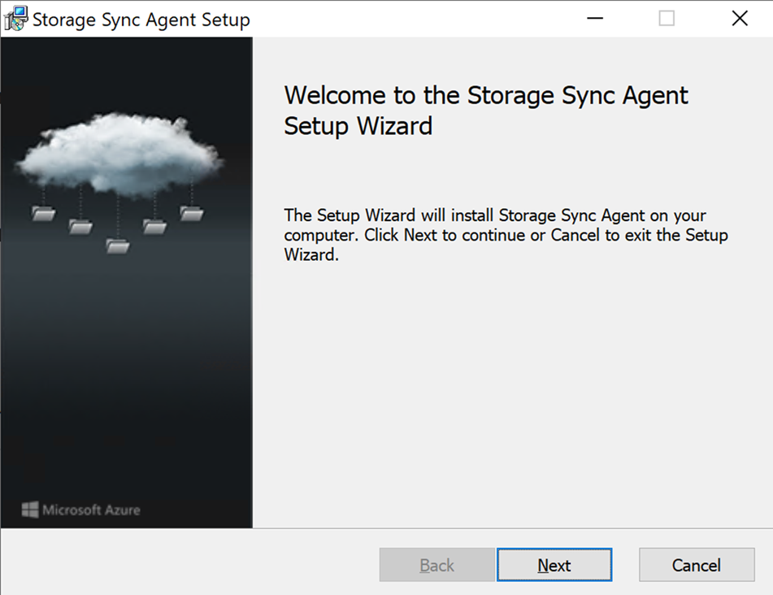

3. After you review the license agreement, select the checkbox to accept it. Then select **Next**.

   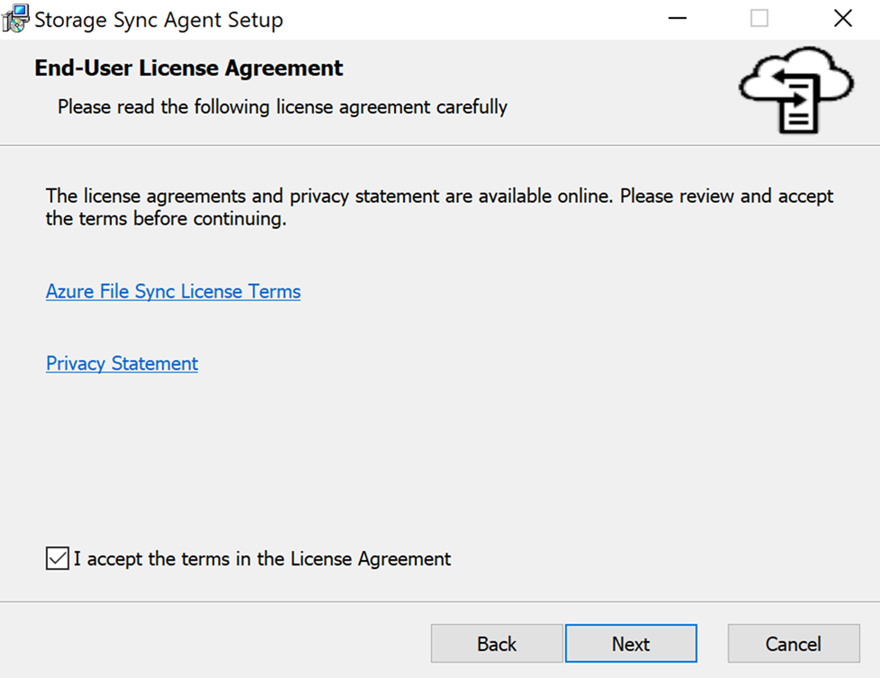

4. The installation path of the storage sync agent is filled in by default. You can change it to a location of your choice. However, we recommend that you leave the default path (**C:\Program Files\Azure\StorageSyncAgent**) to simplify troubleshooting and server maintenance. Select **Next** to proceed.

   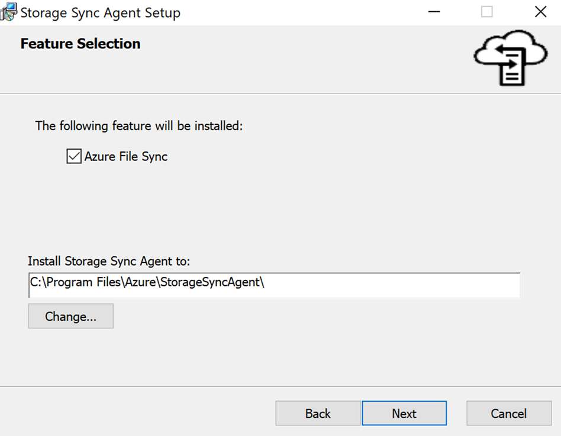

5. Select the proxy setting, and then select **Next**.

   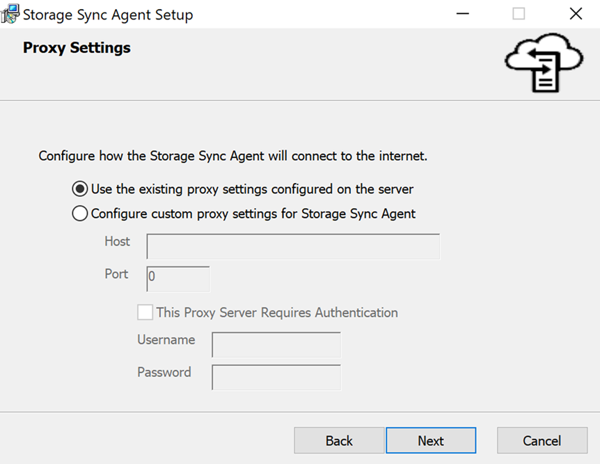

6. Choose whether you want to use Microsoft Update to update the File Sync Agent, and then select **Next**.

   We recommend that you enable Microsoft Update, to keep Azure File Sync up to date. All updates to the Azure File Sync agent, including feature updates and hotfixes, occur from Microsoft Update. We also recommend installing the latest update to Azure File Sync. For more information, see [Azure File Sync update policy](file-sync-planning.md#azure-file-sync-agent-update-policy).

    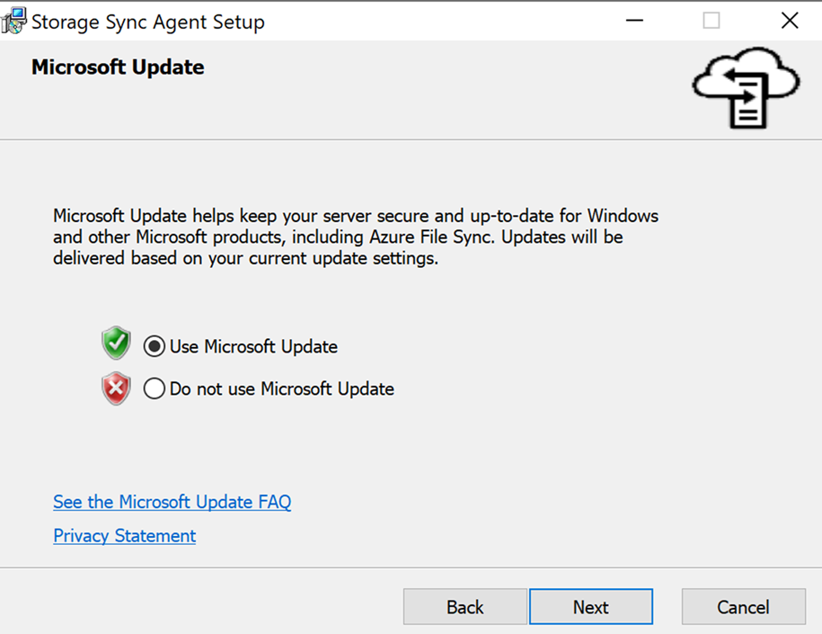

7. Select the options for automatically updating the agent and data collection for troubleshooting, as required. Then select **Install**.

    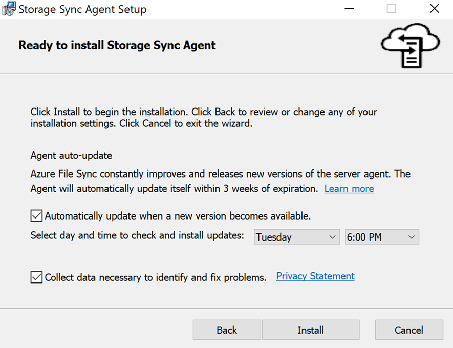

8. When the installation finishes, select **Finish** to close the wizard.

    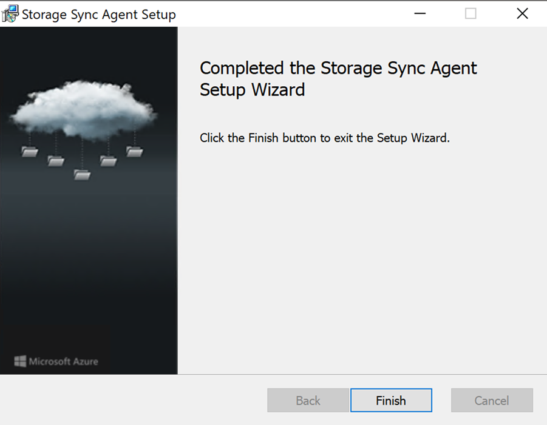

When the Azure File Sync agent installation is finished, the **Server Registration** dialog automatically opens. You must have a storage sync service before you register. The next section in this article covers how to create a storage sync service.

# [PowerShell](#tab/azure-powershell)

Run the following PowerShell code to download the appropriate version of the Azure File Sync agent for your OS and install it on your system:

```powershell
# Gather the OS version.
$osver = [System.Environment]::OSVersion.Version

# Download the appropriate version of the Azure File Sync agent for your OS.
if ($osver.Equals([System.Version]::new(10, 0, 20348, 0))) {
    Invoke-WebRequest `
        -Uri https://aka.ms/afs/agent/Server2022 `
        -OutFile "StorageSyncAgent.msi" 
} elseif ($osver.Equals([System.Version]::new(10, 0, 17763, 0))) {
    Invoke-WebRequest `
        -Uri https://aka.ms/afs/agent/Server2019 `
        -OutFile "StorageSyncAgent.msi" 
} elseif ($osver.Equals([System.Version]::new(10, 0, 14393, 0))) {
    Invoke-WebRequest `
        -Uri https://aka.ms/afs/agent/Server2016 `
        -OutFile "StorageSyncAgent.msi" 
} elseif ($osver.Equals([System.Version]::new(6, 3, 9600, 0))) {
    Invoke-WebRequest `
        -Uri https://aka.ms/afs/agent/Server2012R2 `
        -OutFile "StorageSyncAgent.msi" 
} else {
    throw [System.PlatformNotSupportedException]::new("Azure File Sync is only supported on Windows Server 2012 R2, Windows Server 2016, Windows Server 2019 and Windows Server 2022")
}

# Install the .msi file. Start-Process is used for PowerShell blocks until the operation is complete.
# Note that the installer currently forces all PowerShell sessions closed - this is a known issue.
Start-Process -FilePath "StorageSyncAgent.msi" -ArgumentList "/quiet" -Wait

# Note that this cmdlet will need to be run in a new session based on the previous comment.
# You can remove the temp folder that contains the .msi file and the .exe installer.
Remove-Item -Path ".\StorageSyncAgent.msi" -Recurse -Force
```

# [Azure CLI](#tab/azure-cli)

Follow the instructions for the Azure portal or PowerShell.

---

## Register Windows Server with a storage sync service

Registering your Windows Server with a storage sync service establishes a trust relationship between your server (or cluster) and the storage sync service. A server can be registered with only one storage sync service. That server can sync with other servers and Azure file shares associated with the same storage sync service.

> [!NOTE]
> Server registration uses your Azure credentials to create a trust relationship between the storage sync service and your Windows Server. Subsequently, the server creates and uses its own identity. This identity is valid as long as the server stays registered and the current shared access signature (SAS) token is valid. A new SAS token can't be issued to the server after the server is unregistered. Unregistering a server removes the server's ability to access your Azure file shares, and it stops any sync.

The administrator who registers the server must be a member of the management role [Azure File Sync Administrator](/azure/role-based-access-control/built-in-roles/storage#azure-file-sync-administrator), Owner, or Contributor for the storage sync service. This role can be configured under **Access Control (IAM)** in the Azure portal for the storage sync service.

It's also possible to differentiate administrators who can register servers from administrators who can also configure sync in a storage sync service. To do this differentiation, create a custom role where you list the administrators who are only allowed to register servers. Give your custom role the following permissions:

- `Microsoft.StorageSync/storageSyncServices/registeredServers/write`
- `Microsoft.StorageSync/storageSyncServices/read`
- `Microsoft.StorageSync/storageSyncServices/workflows/read`
- `Microsoft.StorageSync/storageSyncServices/workflows/operations/read`

# [Portal](#tab/azure-portal)

1. The **Server Registration** dialog should open automatically after you install the Azure File Sync agent. If it doesn't, you can open it manually from its file location: `C:\Program Files\Azure\StorageSyncAgent\ServerRegistration.exe`. In the dialog, choose your Azure environment from the listed options.

   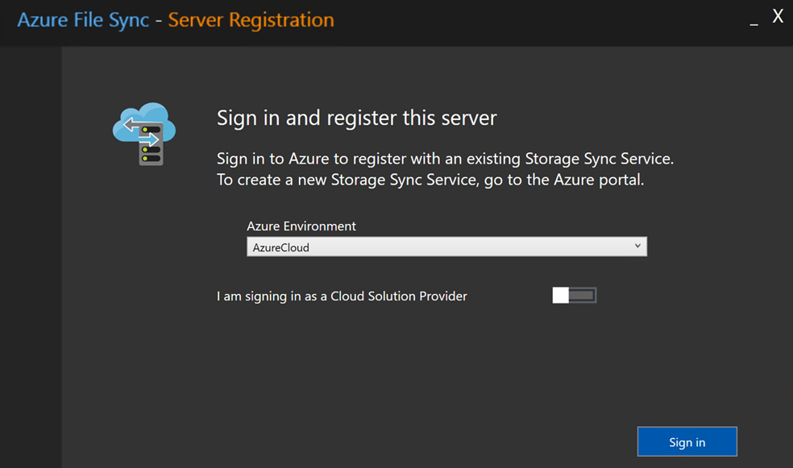

1. If you're a Cloud Solution Provider, turn on the toggle for **I am signing in as a Cloud Solution Provider** and enter the **Tenant ID**. Then select **Sign in**.

   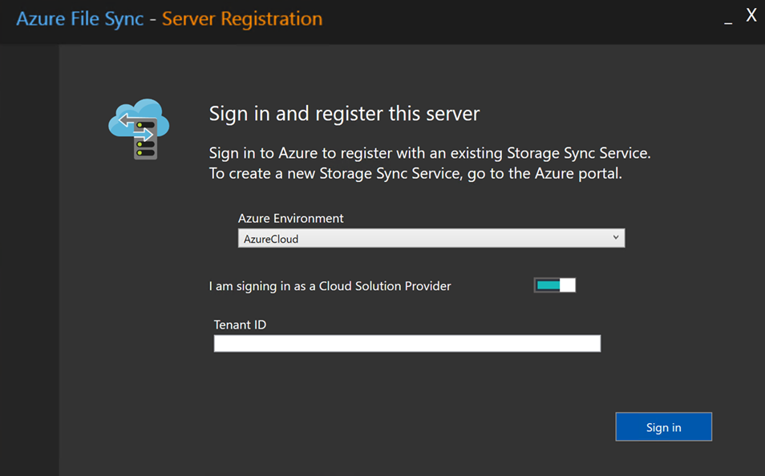

1. After you sign in, enter the following information:

   - **Azure Subscription**: The subscription that contains the storage sync service (as described earlier in [Deploy a storage sync service](#deploy-a-storage-sync-service)).
   - **Resource Group**: The resource group that contains the storage sync service.
   - **Storage Sync Service**: The name of the storage sync service with which you want to register.

   

1. Select **Register** to complete the server registration. As part of the registration process, you're prompted for an additional sign-in.

# [PowerShell](#tab/azure-powershell)

```powershell
$registeredServer = Register-AzStorageSyncServer -ParentObject $storageSync
```

# [Azure CLI](#tab/azure-cli)

Follow the instructions for the Azure portal or PowerShell.

---

## Create a sync group and a cloud endpoint

A *sync group* defines the sync topology for a set of files. Endpoints within a sync group stay in sync with each other. A sync group must contain:

- One or more *server endpoints*. A server endpoint represents a path on a registered server. A server can have server endpoints in multiple sync groups. You can create as many sync groups as you need to appropriately describe your desired sync topology.
- One *cloud endpoint*. A cloud endpoint is a pointer to an Azure file share. All server endpoints will sync with a cloud endpoint, making the cloud endpoint the hub. The storage account for the Azure file share must be located in the same region as the storage sync service.

The entirety of the Azure file share will be synced, with one exception: A special folder, comparable to the hidden "System Volume Information" folder on an NTFS volume, will be provisioned. This directory is called ".SystemShareInformation". It contains important sync metadata that won't sync to other endpoints. Don't use or delete it!

> [!IMPORTANT]
> You can make changes to any cloud endpoint or server endpoint in the sync group and have your files synced to the other endpoints in the sync group. If you make a change to the cloud endpoint (Azure file share) directly, changes first need to be discovered by an Azure File Sync change detection job. A change detection job is initiated for a cloud endpoint only once every 24 hours. For more information, see [Azure Files frequently asked questions](../files/storage-files-faq.md?toc=/azure/storage/filesync/toc.json#afs-change-detection).

The administrator who creates the cloud endpoint must be a member of the management role [Azure File Sync Administrator](/azure/role-based-access-control/built-in-roles/storage#azure-file-sync-administrator) or Owner for the storage account that contains the Azure file share that the cloud endpoint is pointing to. Configure this under **Access Control (IAM)** in the Azure portal for the storage account.

# [Portal](#tab/azure-portal)

To create a sync group, in the [Azure portal](https://portal.azure.com/), go to your storage sync service, and then select **+ Create a sync group**:

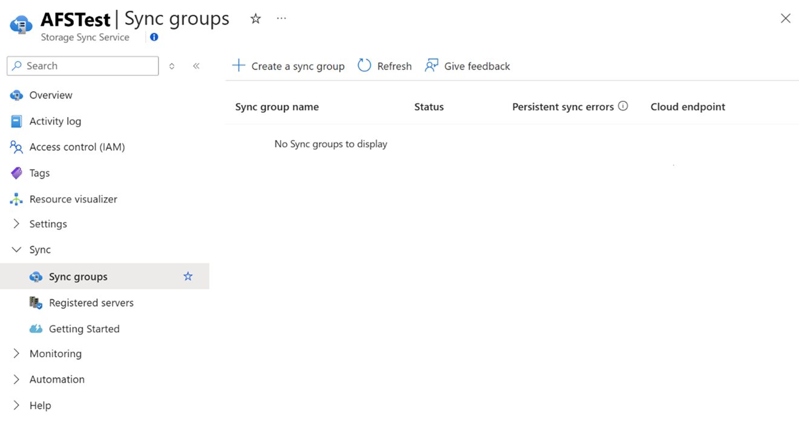

In the pane that opens, enter the following information to create a sync group with a cloud endpoint:

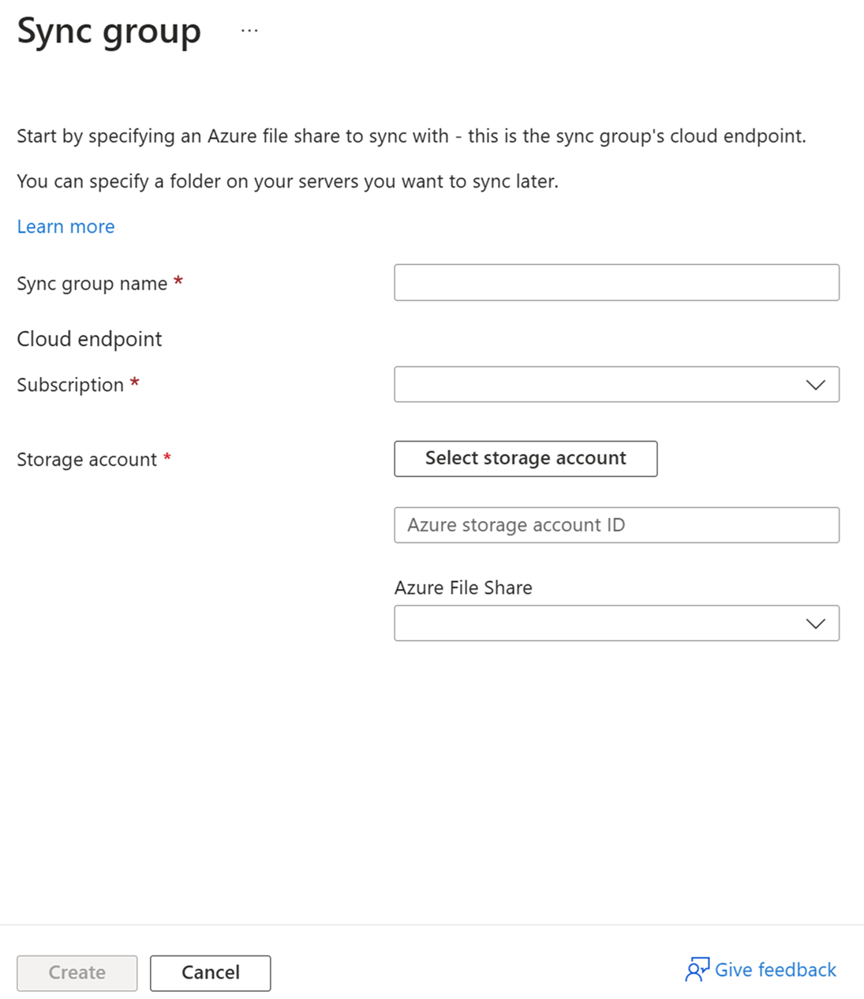

- **Sync group name**: The name of the sync group to be created. This name must be unique within the storage sync service, but can be any name that is logical for you.
- **Subscription**: The subscription where you deployed the storage sync service in [Deploy the storage sync service](#deploy-the-storage-sync-service).
- **Storage account**: If you select **Select storage account**, another pane appears in which you can select the storage account that has the Azure file share that you want to sync with.
- **Azure file share**: The name of the Azure file share with which you want to sync.

Post creation, you should see a Healthy status on the Sync Groups page.
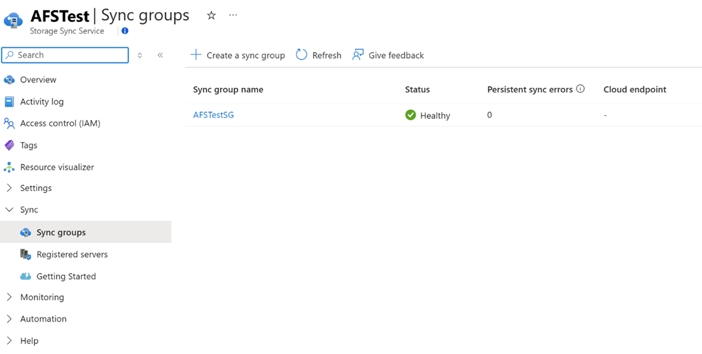

A cloud endpoint is automatically created with a sync group. Select the recently created sync group. You should be able to view a cloud endpoint. If you don't see a cloud endpoint, then cloud endpoint creation might have failed due to insufficient permissions. To troubleshoot this, try creating a cloud endpoint and see [Cloud Endpoint Creation Troubleshooting](/troubleshoot/azure/azure-storage/files/file-sync/file-sync-troubleshoot-sync-group-management#cloud-endpoint-creation-errors).

Select the Sync Group name, and then select **+ Add Cloud Endpoint** to add a cloud endpoint to the sync group.
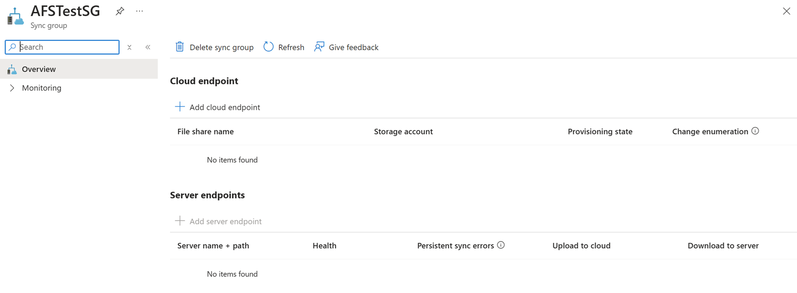

In the pane that opens, enter the subscription, storage account, and file share with which you want to sync.
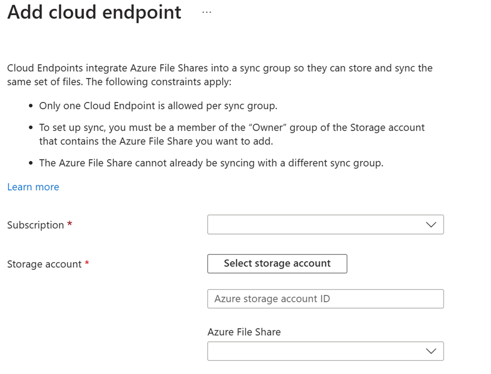

# [PowerShell](#tab/azure-powershell)

To create the sync group, execute the following PowerShell. Replace `<my-sync-group>` with the desired name of the sync group.

```powershell
$syncGroupName = "<my-sync-group>"
$syncGroup = New-AzStorageSyncGroup -ParentObject $storageSync -Name $syncGroupName
```

After you successfully create the sync group, you can create your cloud endpoint. Be sure to replace `<my-storage-account>` and `<my-file-share>` with the expected values.

```powershell
# Get or create a storage account with desired name
$storageAccountName = "<my-storage-account>"
$storageAccount = Get-AzStorageAccount -ResourceGroupName $resourceGroup | Where-Object {
    $_.StorageAccountName -eq $storageAccountName
}

if ($storageAccount -eq $null) {
    $storageAccount = New-AzStorageAccount `
        -Name $storageAccountName `
        -ResourceGroupName $resourceGroup `
        -Location $region `
        -SkuName Standard_LRS `
        -Kind StorageV2 `
        -EnableHttpsTrafficOnly:$true
}

# Get or create an Azure file share within the desired storage account
$fileShareName = "<my-file-share>"
$fileShare = Get-AzStorageShare -Context $storageAccount.Context | Where-Object {
    $_.Name -eq $fileShareName -and $_.IsSnapshot -eq $false
}

if ($fileShare -eq $null) {
    $fileShare = New-AzStorageShare -Context $storageAccount.Context -Name $fileShareName
}

# Create the cloud endpoint
New-AzStorageSyncCloudEndpoint `
    -Name $fileShare.Name `
    -ParentObject $syncGroup `
    -StorageAccountResourceId $storageAccount.Id `
    -AzureFileShareName $fileShare.Name
```

# [Azure CLI](#tab/azure-cli)

Use the [az storagesync sync-group](/cli/azure/storagesync/sync-group#az-storagesync-sync-group-create) command to create a new sync group.  To default a resource group for all CLI commands, use [az configure](/cli/azure/reference-index#az-configure).

```azurecli
az storagesync sync-group create --resource-group myResourceGroupName \
                                 --name myNewSyncGroupName \
                                 --storage-sync-service myStorageSyncServiceName \
```

Use the [az storagesync sync-group cloud-endpoint](/cli/azure/storagesync/sync-group/cloud-endpoint#az-storagesync-sync-group-cloud-endpoint-create) command to create a new cloud endpoint.

```azurecli
az storagesync sync-group cloud-endpoint create --resource-group myResourceGroup \
                                                --storage-sync-service myStorageSyncServiceName \
                                                --sync-group-name mySyncGroupName \
                                                --name myNewCloudEndpointName \
                                                --storage-account mystorageaccountname \
                                                --azure-file-share-name azure-file-share-name
```

---

## Create a server endpoint

A server endpoint represents a specific location on a registered server, such as a folder on a server volume. A server endpoint is subject to the following conditions:

- A server endpoint must be a path on a registered server (rather than a mounted share). Network attached storage (NAS) isn't supported.
- Although the server endpoint can be on the system volume, server endpoints on the system volume can't use cloud tiering.
- Changing the path or drive letter after you established a server endpoint on a volume isn't supported. Make sure you're using a final path on your registered server.
- A registered server can support multiple server endpoints. However, a sync group can only have one server endpoint per registered server at any given time. Other server endpoints within the sync group must be on different registered servers.

[!INCLUDE [storage-files-sync-create-server-endpoint](../../../includes/storage-files-sync-create-server-endpoint.md)]

## Optional: Configure firewall and virtual network settings

### Portal

If you'd like to configure Azure File Sync to work with firewall and virtual network settings, do the following:

1. In the Azure portal, go to the storage account you want to secure.

2. On the service menu, under **Security + networking**, select **Networking**.

3. Under Public network access, select **Enabled from selected virtual networks and IP addresses**.

4. Make sure your server's IP address or virtual network is listed under the **Address range** section.

5. Make sure **Allow Azure services on the trusted services list to access this storage account** is checked.

6. Select **Save** to save your settings.

    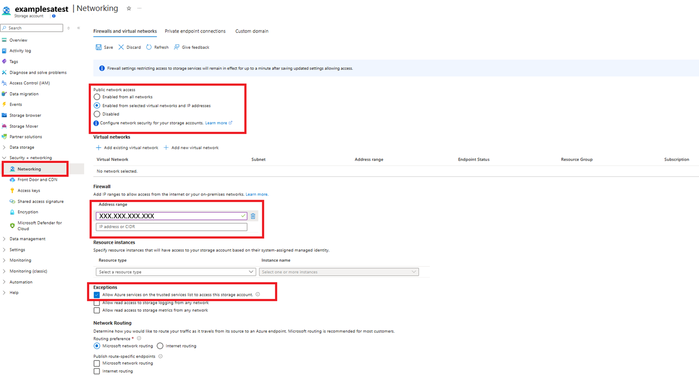

## Optional: Self-service restore through Previous Versions and VSS (Volume Shadow Copy Service)

Previous Versions is a Windows feature that allows you to utilize server-side VSS snapshots of a volume to present restorable versions of a file to an SMB client.
This enables a powerful scenario, commonly referred to as self-service restore, directly for information workers instead of depending on the restore from an IT admin.

VSS snapshots and Previous Versions work independently of Azure File Sync. However, cloud tiering must be set to a compatible mode. Many Azure File Sync server endpoints can exist on the same volume. You have to make the following PowerShell call per volume that has even one server endpoint where you plan to or are using cloud tiering.

```powershell
Import-Module '<SyncAgentInstallPath>\StorageSync.Management.ServerCmdlets.dll'
Enable-StorageSyncSelfServiceRestore [-DriveLetter] <string> [[-Force]] 
```

VSS snapshots are taken of an entire volume. 
By default, up to 64 snapshots can exist for a given volume, as long as there's enough space to store the snapshots. VSS handles this automatically. The default snapshot schedule takes two snapshots per day, Monday through Friday. That schedule is configurable via a Windows Scheduled Task. The above PowerShell cmdlet does two things:

1. It configures Azure File Sync's cloud tiering on the specified volume to be compatible with previous versions and guarantees that a file can be restored from a previous version, even if it was tiered to the cloud on the server.
1. It enables the default VSS schedule. You can then decide to modify it later.

> [!NOTE]
>
> - If you use the  -Force parameter, and VSS is currently enabled, then it will overwrite the current VSS snapshot schedule and replace it with the default schedule. Ensure you save your custom configuration before running the cmdlet.
> - If you're using this cmdlet on a cluster node, you must also run it on all the other nodes in the cluster.

To see if self-service restore compatibility is enabled, you can run the following cmdlet:

```powershell
Get-StorageSyncSelfServiceRestore [[-Driveletter] <string>]
```

It will list all volumes on the server as well as the number of cloud tiering compatible days for each. This number is automatically calculated based on the maximum possible snapshots per volume and the default snapshot schedule. So by default, all previous versions presented to an information worker can be used to restore from. The same is true if you change the default schedule to take more snapshots.

However, if you change the schedule in a way that will result in an available snapshot on the volume that is older than the compatible days value, then users won't be able to use this older snapshot (previous version) to restore from.

> [!NOTE]
> Enabling self-service restore can have an impact on your Azure storage consumption and bill. This impact is limited to files currently tiered on the server. Enabling this feature ensures that there is a file version available in the cloud that can be referenced via a previous versions (VSS snapshot) entry.
>
> If you disable the feature, the Azure storage consumption will slowly decline until the compatible days window has passed. There is no way to speed this up.

The default maximum number of VSS snapshots per volume (64) as well as the default schedule to take them, result in a maximum of 45 days of previous versions an information worker can restore from, depending on how many VSS snapshots you can store on your volume.

If a maximum of 64 VSS snapshots per volume isn't the correct setting for you, then [change that value via a registry key](/windows/win32/backup/registry-keys-for-backup-and-restore#maxshadowcopies).

For the new limit to take effect, you need to re-run the cmdlet to enable previous version compatibility on every volume it was previously enabled, with the -Force flag to take the new maximum number of VSS snapshots per volume into account. This will result in a newly calculated number of compatible days. This change will only take effect on newly tiered files and will overwrite any customizations on the VSS schedule you might have made.

VSS snapshots by default can consume up to 10% of the volume space. To adjust the amount of storage that can be used for VSS snapshots, use the [vssadmin resize shadowstorage](/previous-versions/windows/it-pro/windows-server-2012-R2-and-2012/cc788050(v=ws.11)) command.

<a id="proactive-recall"></a>

## Optional: Proactively recall new and changed files from an Azure file share

Azure File Sync has a mode that allows globally distributed companies to have the server cache in a remote region pre-populated even before local users access any files. When enabled on a server endpoint, this mode will cause the server to recall files that have been created or changed in the Azure file share.

### Scenario

A globally distributed company has branch offices in the US and in India. In the morning (US time), information workers create a new folder and new files for a brand new project and work all day on it. Azure File Sync will sync folder and files to the Azure file share (cloud endpoint).

Information workers in India will continue working on the project in their timezone. When they arrive in the morning, the local Azure File Sync enabled server in India needs to have these new files available locally, such that the India team can efficiently work off of a local cache. Enabling this mode prevents the initial file access from being slower because of on-demand recall and enables the server to proactively recall the files as soon as they're changed or created in the Azure file share.

> [!IMPORTANT]
> Tracking changes in the Azure file share that closely on the server can increase your egress traffic and bill from Azure. If files recalled to the server aren't actually needed locally, then unnecessary recall to the server isn't recommended. Only use this mode when you know pre-populating the cache on a server with recent changes in the cloud will have a positive effect on users or applications using the files on that server.

### Enable a server endpoint to proactively recall what changed in an Azure file share

# [Portal](#tab/proactive-portal)

1. In the [Azure portal](https://portal.azure.com/), go to your storage sync service, select the correct sync group, and then identify the server endpoint for which you want to closely track changes in the Azure file share (cloud endpoint).

1. In the cloud tiering section, find the **Azure file share download** topic. You'll see the currently selected mode, and you can change it to track Azure file share changes more closely and proactively recall them to the server.

:::image type="content" source="media/storage-sync-files-deployment-guide/proactive-download.png" alt-text="An image showing the Azure file share download behavior for a server endpoint currently in effect and a button to open a menu that allows you to change it.":::

# [PowerShell](#tab/proactive-powershell)

You can modify server endpoint properties in PowerShell through the [Set-AzStorageSyncServerEndpoint](/powershell/module/az.storagesync/set-azstoragesyncserverendpoint) cmdlet.

```powershell
# Optional parameter. Default: "UpdateLocallyCachedFiles", alternative behavior: "DownloadNewAndModifiedFiles"
$recallBehavior = "DownloadNewAndModifiedFiles"

Set-AzStorageSyncServerEndpoint -InputObject <PSServerEndpoint> -LocalCacheMode $recallBehavior
```

---

## Optional: SMB over QUIC on a server endpoint

Although the Azure file share (cloud endpoint) is a full SMB endpoint capable of direct access from the cloud or on-premises, customers that desire accessing the file share data cloud-side often deploy an Azure File Sync server endpoint on a Windows Server instance hosted on an Azure VM. 

The most common reason to have an additional server endpoint rather than accessing the Azure file share directly is that changes made directly on the Azure file share can take up to 24 hours or longer to be discovered by Azure File Sync, while changes made on a server endpoint are discovered nearly immediately and synced to all other server and cloud endpoints.

This configuration is extremely common in environments where a substantial portion of users are remote. Traditionally, accessing any file share with SMB over the public internet, including both file shares hosted on Windows File Server or on Azure Files directly, can be difficult because many organizations and ISPs block port 445. You can work around this limitation with [private endpoints and VPNs](file-sync-networking-overview.md#private-endpoints), however Windows Server 2022 Azure Edition provides an additional access strategy: SMB over the QUIC transport protocol.

SMB over QUIC communicates over port 443, which most organizations and ISPs have open to support HTTPS traffic. Using SMB over QUIC greatly simplifies the networking required to access a file share hosted on an Azure File Sync server endpoint for clients using Windows 11 or greater. To learn more about how to setup and configure SMB over QUIC on Windows Server Azure Edition, see [SMB over QUIC for Windows File Server](/windows-server/storage/file-server/smb-over-quic).

## Onboarding with Azure File Sync

The recommended steps to onboard on Azure File Sync for the first time with zero downtime while preserving full file fidelity and access control list (ACL) are as follows:

1. Deploy a storage sync service.

1. Create a sync group.

1. Install Azure File Sync agent on the server with the full data set.

1. Register that server and create a server endpoint on the share.

1. Let sync do the full upload to the Azure file share (cloud endpoint).

1. After the initial upload is complete, install Azure File Sync agent on each of the remaining servers.

1. Create new file shares on each of the remaining servers.

1. Create server endpoints on new file shares with cloud tiering policy, if desired. (This step requires additional storage to be available for the initial setup.)

1. Let Azure File Sync agent do a rapid restore of the full namespace without the actual data transfer. After the full namespace sync, sync engine will fill the local disk space based on the cloud tiering policy for the server endpoint.

1. Ensure sync completes and test your topology as desired.

1. Redirect users and applications to this new share.

1. You can optionally delete any duplicate shares on the servers.

If you don't have extra storage for initial onboarding and would like to attach to the existing shares, you can pre-seed the data in the Azure file shares using another data transfer tool instead of using the storage sync service to upload the data. The pre-seeding approach is only suggested if you can accept downtime and absolutely guarantee no data changes on the server shares during the initial onboarding process.

1. Ensure that data on any of the servers can't change during the onboarding process.

1. Pre-seed Azure file shares with the server data using any data transfer tool over SMB, such as Robocopy, or AzCopy over REST. If using Robocopy, make sure you mount the Azure file share(s) using the storage account access key; don't use a domain identity. If using AzCopy, be sure to set the appropriate switches to preserve ACL timestamps and attributes.

1. Create Azure File Sync topology with the desired server endpoints pointing to the existing shares.

1. Let sync finish reconciliation process on all endpoints.

1. After reconciliation is complete, you can open shares for changes.

Currently, pre-seeding has a few limitations:

- Data changes on the server before the sync topology is fully up and running can cause conflicts on the server endpoints.
- After the cloud endpoint is created, Azure File Sync runs a process to detect the files in the cloud before starting the initial sync. The time it takes to complete this process varies depending on factors like network speed, available bandwidth, and the number of files and folders. For the rough estimation in the preview release, the detection process runs approximately at 10 files/sec. Even if pre-seeding runs fast, the overall time to get a fully running system can be significantly longer when data is pre-seeded in the cloud.

## Migrate a DFS Replication (DFS-R) deployment to Azure File Sync

To migrate a DFS-R deployment to Azure File Sync:

1. Create a sync group to represent the DFS-R topology you're replacing.

1. Start on the server that has the full set of data in your DFS-R topology to migrate. Install Azure File Sync on that server.

1. Register that server and create a server endpoint for the first server to be migrated. Don't enable cloud tiering.

1. Let all of the data sync to your Azure file share (cloud endpoint).

1. Install and register the Azure File Sync agent on each of the remaining DFS-R servers.

1. Disable DFS-R.

1. Create a server endpoint on each of the DFS-R servers. Don't enable cloud tiering.

1. Ensure sync completes and test your topology as desired.

1. Retire DFS-R.

1. You may now enable cloud tiering on any server endpoint as desired.

For more information, see [Azure File Sync interop with Distributed File System (DFS)](file-sync-planning.md#distributed-file-system-dfs).

## Related content

- [Create an Azure File Sync server endpoint](file-sync-server-endpoint-create.md)
- [Manage registered servers with Azure File Sync](file-sync-server-registration.md)
- [Monitor Azure File Sync](file-sync-monitoring.md)
